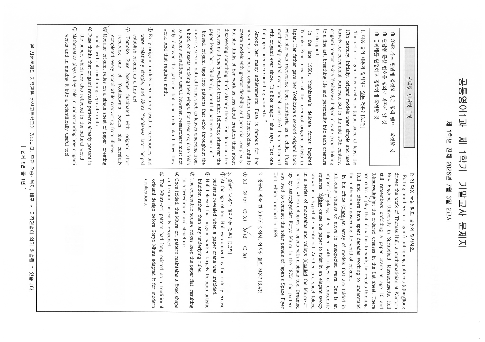
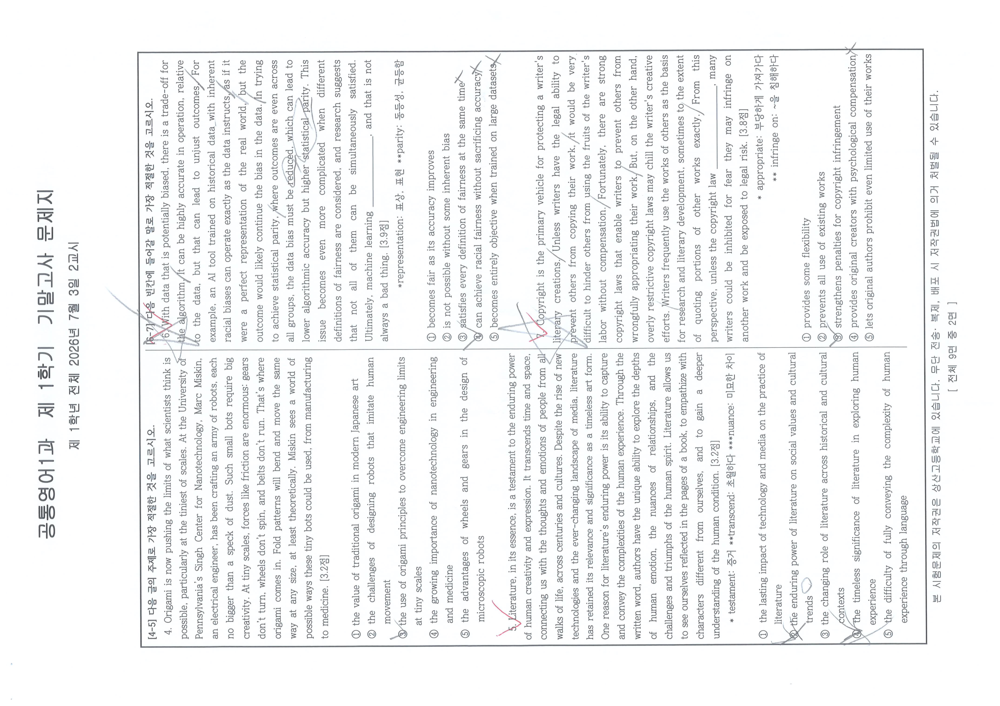
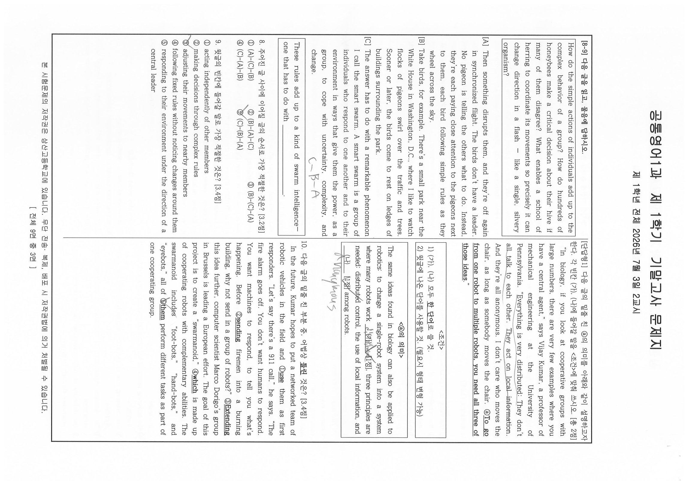
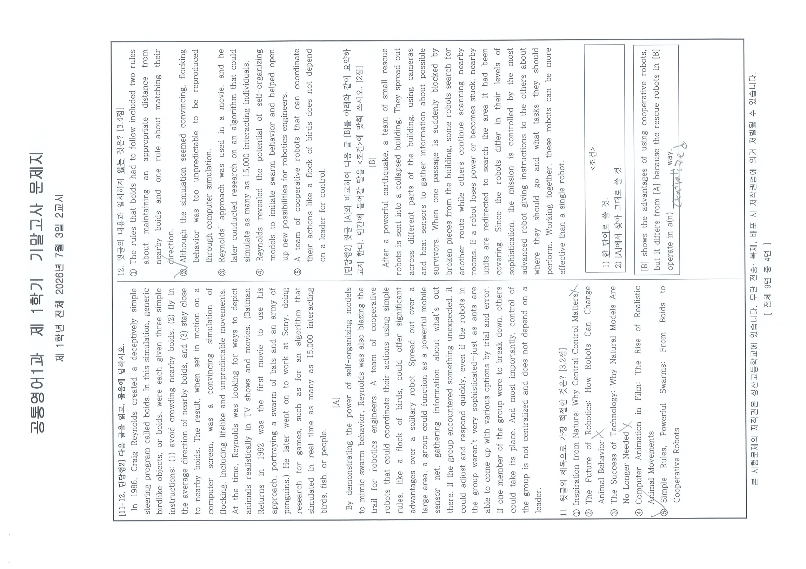
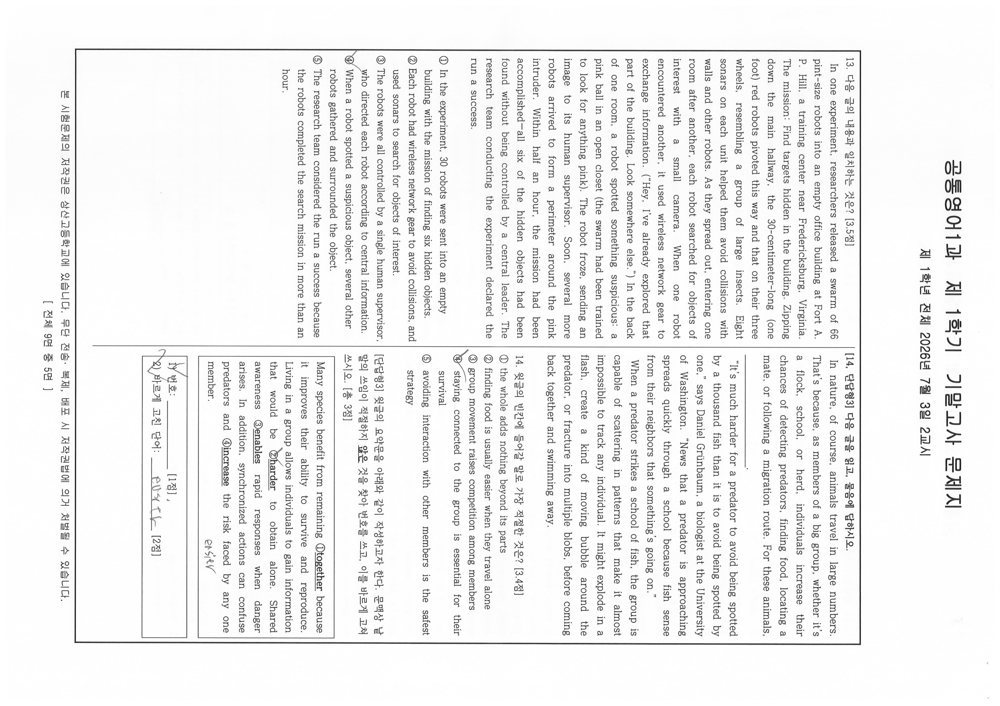
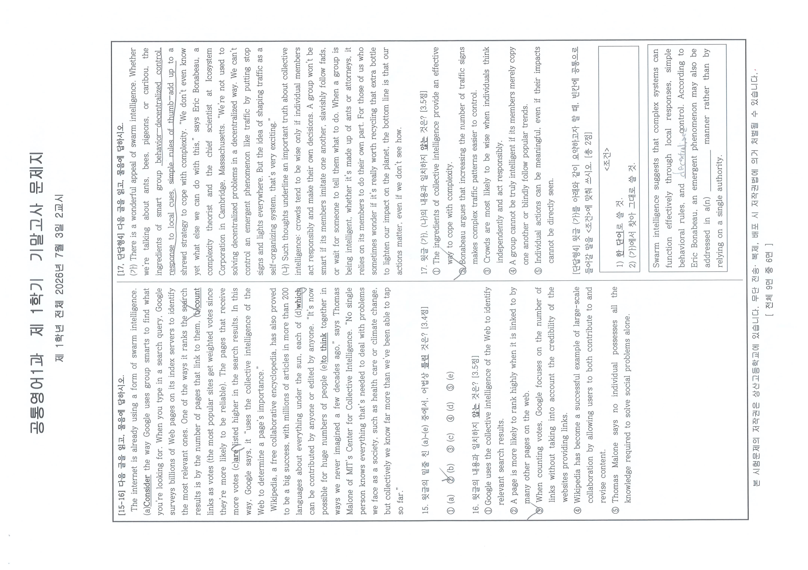
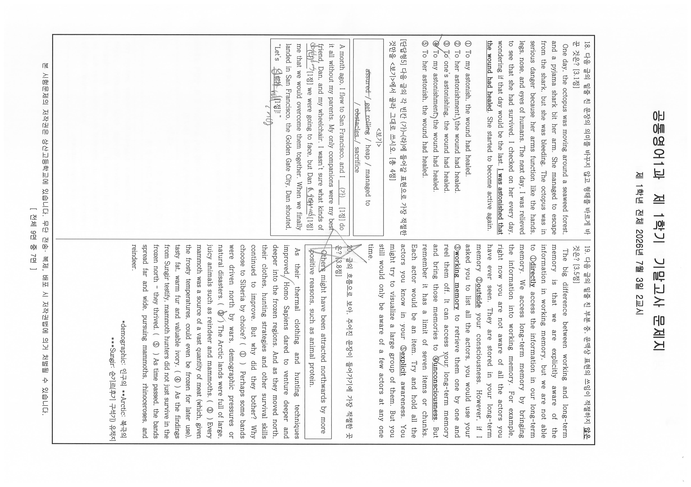
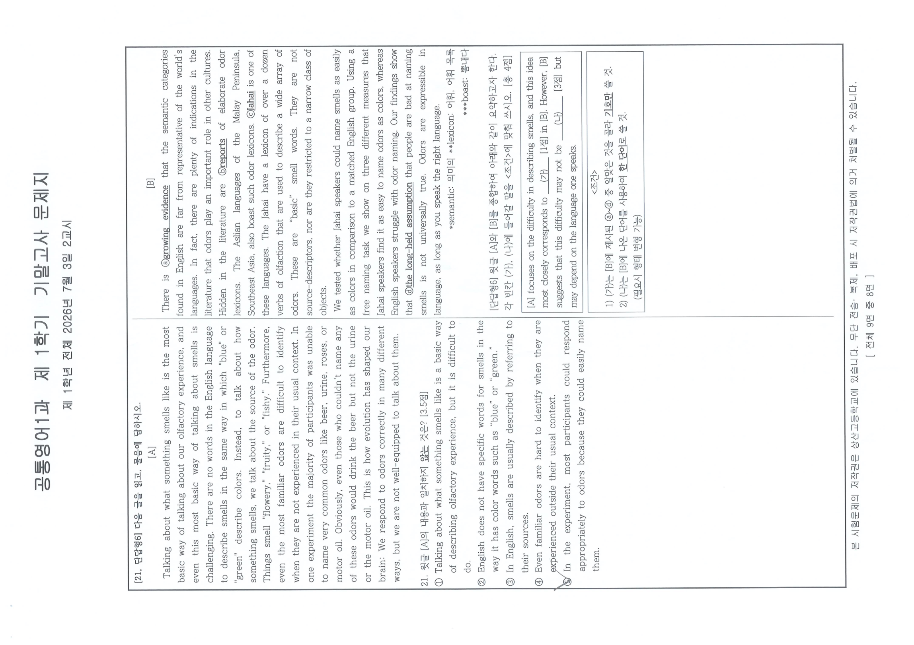
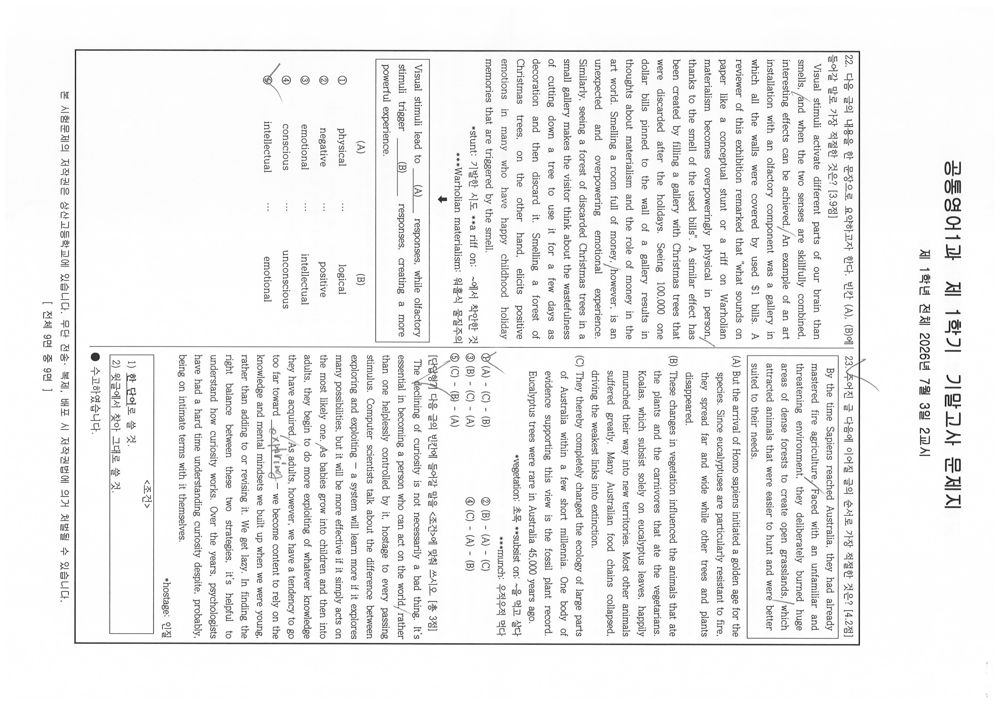

# EX-english-20261F — 1학년 1학기 공통영어1 기말고사 문제지 (2026학년도)

- 원본: `origin_data/EX-english-20261F/1학년1학기_공통영어1_기말.pdf` (9,452,499 B / sha256[:16] `b93a6273d644355a` / 10쪽 / 텍스트 레이어 0)
- variant: `student` — 학생 응시본. 다수 문항 선택지에 연필 체크(✓)·동그라미가 관측된다.
  **본 전사는 인쇄 문면만을 대상으로 한다.** 학생 필기(선택지 표시, 여백 메모, 답안 손글씨)는
  전사하지 않으며, 필기 유무만 factual하게 언급한다. 인쇄인지 필기인지 식별 불가능한 경우는
  추측하지 않고 `verify_log.tsv`에 `unreadable` 행으로 남긴다.
- 렌더: PyMuPDF dpi=160, 전 10쪽 → `corpus/_images/EX-english-20261F/p01.png`~`p10.png`
  (**분모 기준본, 회전 미보정**). 판독은 임베드 원본(4299×3035 jpeg, 계산 실효 dpi=300)을
  쪽별 실측 회전각으로 정립한 `corpus/_images/EX-english-20261F/native/p01.png`~`p10.png`로 수행했다.
- **지문 전사 방식**: 인용 산문 지문은 `corpus/_README.md` §2-a **P-지문 예외**를 적용한다
  (이미지 링크 + 구조 사실). 학교가 작성한 문면 — 발문·선택지·`<조건>` 박스·배점 표기·어휘 주석 —
  은 축자 전사한다. 근거와 사유는 §2-a에 기록되어 있다.
- **분류 판단 없음** — 유형ID·변형축·함정·Tier는 이 문서에 한 글자도 기재하지 않았다
  (1차 정제 = 전사만, CLAUDE.md 원칙 1).

## 인쇄 선언 (p01 = PDF 물리쪽 1번째, 표지, 원문 그대로)

```
2026학년도 1학기

    ( 1 )학년  ( 공통영어1 )과 기말고사 문제지

◑ 총( 9 )쪽, 선택형( 23 )문항, 서답형( 7 )문항
◑ 서답(서술) 답안 작성 : OMR 카드 뒷면
◑ 고사반영 비율 : 중간고사( 30 )%, 기말고사( 30 )%, 수행평가( 40 )%

유의사항
1) 문제지를 받은 후 문제지 쪽수, 인쇄 상태, 문항 수(선택형, 서답형)를 확인하시오.
2) 해당 답안지에 학번, 이름, (교과명)을 쓰고 정확히 표기하시오.
3) OMR 카드 작성 시 카드가 훼손되지 않도록 주의하시오.(불이익을 받을 수 있음)
4) 문항에 따라 배점이 다르니, 각 물음의 끝에 표시된 배점을 참고하시오.
5) 서답형(서술형) 답안지 작성 관련 사항
   ① 답안 작성 지시사항에 따라 해당 답안지에 작성
   ② 필기구 : 검정색과 청색 펜으로만 작성(미준수 시 불이익을 받을 수 있음)

※ 시험이 시작되기 전까지 표지를 넘기지 마시오.

상 산 고 등 학 교
```

표지 관측 사실 — 같은 과목 중간고사본(`EX-english-20261M`)과 다른 점:
- 문항 갈래 명칭이 표지에서 **"서답형"** 으로 인쇄되어 있다(중간본은 "서술형").
- 서답 답안 작성처가 **"OMR 카드 뒷면"** 이다(중간본은 "별도의 답안지").
- 유의사항 1)·2)의 밑줄 위치, 5)-② "검정색과 청색"은 중간본과 동일하다.
표지는 완결 판독(하단 절단 없음, 쪽 번호 표기 없음 — 표지이므로 정상).

## 본문 쪽 머리·꼬리 (전 9쪽 공통, 원문 그대로)

```
공통영어1과  제 1학기  기말고사 문제지
제 1학년 전체  2026년 7월 3일 2교시
```
꼬리: `본 시험문제의 저작권은 상산고등학교에 있습니다. 무단 전송·복제, 배포 시 저작권법에 의거 처벌될 수 있습니다.`
그 아래 우측에 `[ 전체 9면 중 N면 ]`.

## 지면 구조에 대한 사실 기록 (판단 아님 — 관측 사실만)

- PDF 10쪽 전건이 임베드 이미지 정확히 1개(4299×3035 px, jpeg)로 구성되며, `page.rotation`
  메타데이터는 전건 `0`이나 실제 콘텐츠는 90도 회전된 상태로 스캔되어 있다(메타데이터로
  회전을 판정할 수 없음 — 육안 확인). 실효 dpi = `round(4299 × 72 / 1033.4)` = **300**.
- **회전각은 물리 홀수쪽(1,3,5,7,9) `-90` / 짝수쪽(2,4,6,8,10) `+90` 교대형**이다
  (`PIL.Image.rotate(각, expand=True)`). 유닛별 재실측 지시(C-A1-3)에 따라 p01·p02를
  두 각도로 각각 렌더해 대조 확정했고, 결과적으로 같은 과목 중간본과 같은 교대형이다.
- 정립 후 각 쪽은 좌·우 2단 구성의 지면 1장이며 분할·크롭이 필요 없다.
  판독 시 4분할(가로 54% · 세로 55%, 겹침 포함) 임시 크롭을 보조로 썼으나 산출물이 아니다.
- **PDF 물리 쪽 순서와 인쇄 쪽 번호가 일치한다**(역순 아님):
  p01=표지 · p02=1면 · p03=2면 · p04=3면 · p05=4면 · p06=5면 · p07=6면 · p08=7면 ·
  p09=8면 · p10=9면. 인쇄 선언 "총 9쪽"은 본문 9면을 가리키며 표지를 포함하지 않는다
  (렌더 이미지 10장 = 표지 1 + 본문 9).

## 선택형 안내 (p02 좌단 상단, 원문 그대로)

```
선택형, 단답형 문항

◑ OMR 카드 뒷면에 검정색 혹은 청색 펜으로 작성할 것.
◑ 단답형 문항 번호를 임의로 바꾸지 말 것.
◑ 글씨체를 단정하고 명확하게 작성할 것.
```

관측: 표지는 갈래를 **"서답형"**, 이 안내 박스는 **"단답형"** 으로 인쇄한다. 두 표기가
같은 시험지 안에 공존하며, 어느 쪽이 옳은지는 판단하지 않고 문면 그대로 기록한다(원칙 1).

## 문항 전사 (인쇄 문면만, 원문 그대로)

### 1. [3.3점] — 완결 (p02, 인쇄 1면 좌단)
다음 글의 내용과 일치하지 <u>않는</u> 것은?

**지문 — P-지문 예외 적용** (문면은 이미지 축에 보존)


- 지면 위치: p02 좌단(인쇄 1면). 단일 문항 전용 지문이다.
- 단락 수: 4단락 / 대략 어휘 수: 약 260어
- 첫 5어: `The art of origami has`
- 마지막 5어: `And that requires math.`
- 빈칸·밑줄: 없음
- 소재 사실: 일본 종이접기(origami)의 역사 — 17세기 이래 의례용에서 20세기 중반 Akira Yoshizawa가 예술로 격상, 그의 영향을 받은 Tomoko Fuse(디프테리아 회복기에 부친이 준 Yoshizawa의 두 번째 책), Fuse의 모듈러 종이접기와 "창작이 아니라 이미 있는 것의 발견"이라는 자기 진술, 자연의 패턴(잎눈·곤충 날개 접힘)과의 공명, 과학적 활용에는 수학이 필요하다는 마무리
- 판독 상태: 전 문장 판독 가능, `unreadable` 없음

① Early origami models were mainly used in ceremonies and were relatively simple, and Akira Yoshizawa later helped establish origami as a fine art.
② Tomoko Fuse became fascinated with origami after receiving one of Yoshizawa's books; she carefully completed every model while recovering from illness.
③ Modular origami relies on a single sheet of paper, creating models without combining separate units.
④ Fuse thinks that origami reveals patterns already present in the paper, which are also reflected in the natural world.
⑤ Mathematics plays a key role in understanding how origami works and in making it into a scientifically useful tool.

> ③ 번호에 필기 표시 — 응시본 필기.

### 2. [3.4점] — 완결 (p02, 인쇄 1면 우단)
윗글의 밑줄 친 (a)~(e) 중에서, 어법상 <u>틀린</u> 것은?

**지문 — P-지문 예외 적용** (문면은 이미지 축에 보존)


- 지문 머리(원문): `[2-3] 다음 글을 읽고, 물음에 답하시오.`
- 지면 위치: p02 우단(인쇄 1면). **선택형 2번과 3번이 공유**한다.
- 단락 수: 2단락 / 대략 어휘 수: 약 200어
- 첫 5어: `Putting numbers to origami's intriguing`
- 마지막 5어: `Unit, which launched in 1995.`
- 밑줄 대상 5곳(어법 판단 지점, 인쇄 그대로):
  - (a) `has` — `Putting numbers to origami's intriguing patterns (a)has long driven the work of Thomas Hull…`
  - (b) `marveling` — `Hull still remembers unfolding a paper crane at age 10 and (b)marveling at the ordered creases…`
  - (c) `are` — `In his office (c)are an array of models that are folded in intriguing shapes…`
  - (d) `they` — `…folded with ridges of concentric squares, (d)they cause the paper to twist in an elegant swoop…`
  - (e) `called` — `Another is a sheet folded in a series of mountains and valleys (e)called the Miura-ori pattern…`
- 소재 사실: 수학자 Thomas Hull(Western New England University)의 종이접기 수학 연구, 동심 정사각 능선의 hyperbolic paraboloid, 천체물리학자 Koryo Miura가 1970년대에 고안하고 1995년 일본 Space Flyer Unit 태양전지판 압축에 쓰인 Miura-ori 패턴
- 판독 상태: 전 문장 판독 가능, `unreadable` 없음

① (a)　② (b)　③ (c)　④ (d)　⑤ (e)

> ④ 번호에 필기 표시, 지문 밑줄 (a)·(b)·(c)·(d)에 동그라미·체크 필기 — 응시본 필기.
> 선택지는 1행 배치로 인쇄되어 있다.

### 3. [3.3점] — 완결 (p02, 인쇄 1면 우단)
윗글의 내용과 일치하는 것은?

(지문은 선택형 2번과 공유한다 — 위 「2.」 항목의 P-지문 구조 기록을 참조.)

① At the age of ten, Hull was amazed by the orderly crease patterns revealed when a paper crane was unfolded.
② Hull believed that origami worked largely through artistic intuition rather than any underlying rules.
③ The concentric square ridges keep the paper flat, resulting in a two-dimensional structure.
④ Once folded, the Miura-ori pattern maintains a fixed shape and cannot be easily reopened.
⑤ The Miura-ori pattern had long existed as a traditional origami design before Koryo Miura adapted it for modern applications.

> ① 번호에 필기 표시 — 응시본 필기.

### 4. [3.2점] — 완결 (p03, 인쇄 2면 좌단)
(공통 발문) 다음 글의 주제로 가장 적절한 것을 고르시오.

**지문 — P-지문 예외 적용** (문면은 이미지 축에 보존)


- 지문 머리(원문): `[4-5] 다음 글의 주제로 가장 적절한 것을 고르시오.` — 4번과 5번의 **공통 발문**이며, 두 문항은 각자 별개의 지문을 가진다(지문 공유 아님).
- 지면 위치: p03 좌단 상부(인쇄 2면)
- 단락 수: 1단락 / 대략 어휘 수: 약 120어
- 첫 5어: `Origami is now pushing the`
- 마지막 5어: `from manufacturing to medicine.`
- 빈칸·밑줄: 없음
- 소재 사실: University of Pennsylvania Singh Center for Nanotechnology의 전기공학자 Marc Miskin이 만드는 먼지 크기 로봇 — 미세 규모에서 마찰이 지배해 기어·바퀴·벨트가 작동하지 않으므로 접힘 패턴을 쓴다는 논지, 제조에서 의료까지의 활용 전망
- 어휘 주석: 없음
- 판독 상태: 전 문장 판독 가능, `unreadable` 없음

① the value of traditional origami in modern Japanese art
② the challenges of designing robots that imitate human movement
③ the use of origami principles to overcome engineering limits at tiny scales
④ the growing importance of nanotechnology in engineering and medicine
⑤ the advantages of wheels and gears in the design of microscopic robots

> 배점 표기는 문항 머리가 아니라 **지문 마지막 문장 뒤**에 인쇄되어 있다(`… to medicine. [3.2점]`).
> 4번과 5번 모두 같은 방식이다. ③ 번호에 필기 표시 — 응시본 필기.

### 5. [3.2점] — 완결 (p03, 인쇄 2면 좌단)
(공통 발문) 다음 글의 주제로 가장 적절한 것을 고르시오.

**지문 — P-지문 예외 적용** (문면은 이미지 축에 보존)


- 지면 위치: p03 좌단 하부(인쇄 2면). 4번 지문과 별개의 독립 지문이다.
- 단락 수: 1단락 / 대략 어휘 수: 약 150어
- 첫 5어: `Literature, in its essence, is`
- 마지막 5어: `understanding of the human condition.`
- 빈칸·밑줄: 없음
- 소재 사실: 문학이 시간·공간을 초월해 인간 경험의 복잡성을 담아내며, 새 기술과 매체 변화에도 시대를 초월한 예술 형식으로 남는다는 논지
- 어휘 주석(인쇄 원문): `* testament: 증거  **transcend: 초월하다  ***nuance: 미묘한 차이`
- 판독 상태: 전 문장 판독 가능, `unreadable` 없음

① the lasting impact of technology and media on the practice of literature
② the enduring power of literature on social values and cultural trends
③ the changing role of literature across historical and cultural contexts
④ the timeless significance of literature in exploring human experience
⑤ the difficulty of fully conveying the complexity of human experience through language

> 배점 표기는 지문 마지막 문장 뒤에 인쇄되어 있다(`… of the human condition. [3.2점]`).
> ②·④ 번호에 필기 표시(② 위에 가위표, ④ 위에 체크) — 응시본 필기.

### 6. [3.9점] — 완결 (p03, 인쇄 2면 우단)
(공통 발문) 다음 빈칸에 들어갈 말로 가장 적절한 것을 고르시오.

**지문 — P-지문 예외 적용** (문면은 이미지 축에 보존)


- 지문 머리(원문): `[6-7] 다음 빈칸에 들어갈 말로 가장 적절한 것을 고르시오.` — 6번과 7번의 **공통 발문**이며, 두 문항은 각자 별개의 지문을 가진다(지문 공유 아님).
- 지면 위치: p03 우단 상부(인쇄 2면)
- 단락 수: 1단락 / 대략 어휘 수: 약 160어
- 첫 5어: `With data that is potentially`
- 마지막 5어: `and that is not always a bad thing.`
- 빈칸: 1개 — 마지막에서 두 번째 문장 `Ultimately, machine learning ＿＿＿＿＿＿＿, and that is not always a bad thing.`
- 소재 사실: 편향된 데이터로 학습한 알고리즘의 정확도와 통계적 균등성(statistical parity) 사이의 트레이드오프, 공정성 정의들이 동시에 만족될 수 없다는 연구 언급
- 어휘 주석(인쇄 원문): `*representation: 표상, 표현  **parity: 동등성, 균등함`
- 판독 상태: 전 문장 판독 가능, `unreadable` 없음

① becomes fair as its accuracy improves
② is not possible without some inherent bias
③ satisfies every definition of fairness at the same time
④ can achieve racial fairness without sacrificing accuracy
⑤ becomes entirely objective when trained on large datasets

> 배점 표기는 지문 마지막 문장 뒤에 인쇄되어 있다(`… always a bad thing. [3.9점]`).
> ②에 체크, ③·④·⑤에 가위표, 지문 본문에 다수의 사선·동그라미 — 응시본 필기.

### 7. [3.8점] — 완결 (p03, 인쇄 2면 우단)
(공통 발문) 다음 빈칸에 들어갈 말로 가장 적절한 것을 고르시오.

**지문 — P-지문 예외 적용** (문면은 이미지 축에 보존)


- 지면 위치: p03 우단 하부(인쇄 2면). 6번 지문과 별개의 독립 지문이다.
- 단락 수: 1단락 / 대략 어휘 수: 약 150어
- 첫 5어: `Copyright is the primary vehicle`
- 마지막 5어: `and be exposed to legal risk.`
- 빈칸: 1개 — 마지막 문장 `From this perspective, unless the copyright law ＿＿＿＿＿＿＿, many writers could be inhibited…`
- 소재 사실: 저작권이 작가의 창작을 보호하는 기본 수단이라는 전제와, 과도하게 제한적인 저작권법이 오히려 창작을 위축시킬 수 있다는 대비. 작가들이 연구·문학적 전개를 위해 타인의 저작을 정확히 인용하기도 한다는 서술
- 어휘 주석(인쇄 원문): `* appropriate: 부당하게 가져가다  ** infringe on: ~을 침해하다`
- 판독 상태: 전 문장 판독 가능, `unreadable` 없음

① provides some flexibility
② prevents all use of existing works
③ strengthens penalties for copyright infringement
④ provides original creators with psychological compensation
⑤ lets original authors prohibit even limited use of their works

> 배점 표기는 지문 마지막 문장 뒤에 인쇄되어 있다(`… exposed to legal risk. [3.8점]`).
> ③에 체크, ④에 가위표, 지문 본문에 다수의 사선 — 응시본 필기.

### 8. [3.2점] — 완결 (p04, 인쇄 3면 좌단)
(공통 발문) **[8-9] 다음 글을 읽고, 물음에 답하시오.**

**지문 — P-지문 예외 적용** (문면은 이미지 축에 보존)


- 지면 위치: p04 좌단(인쇄 3면). 8번과 9번이 한 지문을 공유하며 공통 발문이 1회 인쇄되어 있다.
- 구성: ① 테두리 박스 안의 주어진 글 1단락 → ② `[A]`·`[B]`·`[C]` 세 단락(각 3~6문장) → ③ 테두리 박스 안의 마무리 글 1문장(빈칸 포함). 전체 대략 어휘 수 약 240어
- 주어진 글 첫 5어: `How do the simple actions`
- 주어진 글 마지막 5어: `like a single, silvery organism?`
- `[A]` 첫 5어: `Then something disrupts them, and`
- `[B]` 첫 5어: `Take birds, for example. There's`
- `[C]` 첫 5어: `The answer has to do`
- 마무리 박스 원문(빈칸 포함): `These rules add up to a kind of swarm intelligence— one that has to do with ＿＿＿＿＿＿＿＿.`
- 빈칸: 1개 — 마무리 박스 마지막 어구(9번의 대상)
- 소재 사실: 개체의 단순한 행동이 집단의 복잡한 행동으로 합산되는 현상(꿀벌의 벌집 결정, 청어 떼의 방향 전환, 워싱턴 D.C. 공원의 비둘기 떼)을 `smart swarm`이라는 용어로 설명한다
- 판독 상태: 전 문장 판독 가능, `unreadable` 없음

주어진 글 사이에 이어질 글의 순서로 가장 적절한 것은?
① (A)-(C)-(B)  ② (B)-(A)-(C)  ③ (B)-(C)-(A)  ④ (C)-(A)-(B)  ⑤ (C)-(B)-(A)

> 배점 표기는 발문 줄 끝에 인쇄되어 있다(`… 가장 적절한 것은? [3.2점]`).
> ⑤에 동그라미, `[C]` 단락 아래 여백에 `C-B-A` 필기 — 응시본 필기.

### 9. [3.4점] — 완결 (p04, 인쇄 3면 좌단)
윗글의 빈칸에 들어갈 말로 가장 적절한 것은?

- 지문: 8번과 동일(위 8번의 P-지문 기술 참조). 빈칸은 마무리 박스의 마지막 어구다.

① acting independently of other members
② making decisions through complex rules
③ adjusting their movements to nearby members
④ following fixed rules without noticing changes around them
⑤ responding to their environment under the direction of a central leader

> 배점 표기는 발문 줄 끝에 인쇄되어 있다(`… 가장 적절한 것은? [3.4점]`).
> ③에 동그라미, ②에 사선 — 응시본 필기.

### 10. [3.4점] — 완결 (p04, 인쇄 3면 우단)
다음 글의 밑줄 친 부분 중, 어법상 **틀린** 것은?

**지문 — P-지문 예외 적용** (문면은 이미지 축에 보존)


- 지면 위치: p04 우단 하부(인쇄 3면). 8~9번 지문 및 단답형1 지문과 별개의 독립 지문이다.
- 단락 수: 1단락 / 대략 어휘 수: 약 130어
- 첫 5어: `In the future, Kumar hopes`
- 마지막 5어: `part of one cooperating group.`
- 밑줄 5곳(인쇄 원문 그대로): ①`use` ②`sending` ③`Extending` ④`which` ⑤`them`
- 소재 사실: Kumar가 네트워크로 연결된 로봇 차량 팀을 초동 대응 요원으로 투입하려는 구상, 이어서 Marco Dorigo 연구진의 `swarmanoid`(foot-bots·hand-bots·eyebots로 구성) 유럽 프로젝트 서술
- 판독 상태: 전 문장 판독 가능, `unreadable` 없음

> 선택지는 지문 내 밑줄 번호 ①~⑤ 자체이며 별도 선택지 줄은 인쇄되지 않았다.
> ⑤ 앞에 동그라미, `includes` 위에 사선 — 응시본 필기.

### 11. [3.2점] — 완결 (p05, 인쇄 4면 좌단)
(공통 발문) **[11-12, 단답형2] 다음 글을 읽고, 물음에 답하시오.**

**지문 [A] — P-지문 예외 적용** (문면은 이미지 축에 보존)


- 지면 위치: p05 좌단(인쇄 4면). 11번·12번·단답형2가 이 지문을 공유하며 공통 발문이 1회 인쇄되어 있다.
- 구성: 2단락. 첫 단락과 둘째 단락 사이 중앙에 `[A]` 라벨이 한 줄로 인쇄되어 있다(단답형2가 이 라벨을 지시 대상으로 쓴다).
- 대략 어휘 수: 약 260어
- 첫 5어: `In 1986, Craig Reynolds created`
- 마지막 5어: `not depend on a leader.`
- 빈칸: 없음
- 소재 사실: 1986년 Craig Reynolds의 `boids` 조종 프로그램(세 가지 단순 규칙: 근접 회피·평균 방향 정렬·근접 유지)과 그 군집 시뮬레이션 결과, 1992년 `Batman Returns`에서의 최초 영화 적용, 이후 Sony에서 15,000 개체 실시간 시뮬레이션 알고리즘 연구. 이어서 자기조직화 모델이 로봇공학에 연 가능성(이동 센서망·신속 대응·구성원 대체 가능·비중앙집중 제어) 서술
- 판독 상태: 전 문장 판독 가능, `unreadable` 없음

윗글의 제목으로 가장 적절한 것은?
① Inspiration from Nature: Why Central Control Matters
② The Future of Robotics: How Robots Can Change Animal Behavior
③ The Success of Technology: Why Natural Models Are No Longer Needed
④ Computer Animation in Film: The Rise of Realistic Animal Movements
⑤ Simple Rules, Powerful Swarms: From Boids to Cooperative Robots

> 배점 표기는 발문 줄 끝에 인쇄되어 있다(`… 가장 적절한 것은? [3.2점]`).
> ⑤에 동그라미, ①·②·③에 가위표 — 응시본 필기.

### 12. [3.4점] — 완결 (p05, 인쇄 4면 우단)
윗글의 내용과 일치하지 **않는** 것은?

- 지문: 11번과 동일한 [A]다(위 11번의 P-지문 기술 참조).

① The rules that boids had to follow included two rules about maintaining an appropriate distance from nearby boids and one rule about matching their direction.
② Although the simulation seemed convincing, flocking behavior was too unpredictable to be reproduced through computer simulation.
③ Reynolds' approach was used in a movie, and he later conducted research on an algorithm that could simulate as many as 15,000 interacting individuals.
④ Reynolds revealed the potential of self-organizing models to imitate swarm behavior and helped open up new possibilities for robotics engineers.
⑤ A team of cooperative robots that can coordinate their actions like a flock of birds does not depend on a leader for control.

> 배점 표기는 발문 줄 끝에 인쇄되어 있다(`… 않는 것은? [3.4점]`).
> ②에 체크 — 응시본 필기.

### 13. [3.5점] — 완결 (p06, 인쇄 5면 좌단)
다음 글의 내용과 일치하는 것은?

**지문 — P-지문 예외 적용** (문면은 이미지 축에 보존)


- 지면 위치: p06 좌단 전면(인쇄 5면). 단독 지문이다.
- 단락 수: 1단락 / 대략 어휘 수: 약 230어
- 첫 5어: `In one experiment, researchers released`
- 마지막 5어: `declared the run a success.`
- 빈칸: 없음
- 소재 사실: Virginia주 Fredericksburg 인근 훈련장 Fort A. P. Hill의 빈 사무동에 66대의 소형 로봇을 투입해 숨긴 표적을 찾게 한 실험. 30cm 길이·세 바퀴·개체당 소나 8개로 충돌 회피, 소형 카메라로 탐색, 무선 네트워크로 정보 교환, 분홍 물체 발견 시 정지·영상 전송 후 다른 로봇들이 포위. 30분 내 여섯 개 은닉물 전부를 중앙 지휘 없이 발견
- 판독 상태: 전 문장 판독 가능, `unreadable` 없음

① In the experiment, 30 robots were sent into an empty building with the mission of finding six hidden objects.
② Each robot had wireless network gear to avoid collisions, and used sonars to search for objects of interest.
③ The robots were all controlled by a single human supervisor, who directed each robot according to central information.
④ When a robot spotted a suspicious object, several other robots gathered and surrounded the object.
⑤ The research team considered the run a success because the robots completed the search mission in more than an hour.

> 배점 표기는 발문 줄 끝에 인쇄되어 있다(`… 일치하는 것은? [3.5점]`).
> ④에 체크 — 응시본 필기.

### 14. [3.4점] — 완결 (p06, 인쇄 5면 우단)
(공통 발문) **[14, 단답형3] 다음 글을 읽고, 물음에 답하시오.**

**지문 — P-지문 예외 적용** (문면은 이미지 축에 보존)


- 지면 위치: p06 우단(인쇄 5면). 14번과 단답형3이 이 지문을 공유하며 공통 발문이 1회 인쇄되어 있다.
- 단락 수: 3단락 / 대략 어휘 수: 약 200어
- 첫 5어: `In nature, of course, animals`
- 마지막 5어: `together and swimming away.`
- 빈칸: 1개 — 1단락 마지막 문장 `For these animals, ＿＿＿＿＿＿＿＿＿.`(밑줄만 인쇄되고 문장이 거기서 끝난다)
- 소재 사실: 동물이 큰 무리로 이동하는 이유(포식자 탐지·먹이 탐색·짝 찾기·이동 경로 추종 확률 상승). University of Washington 생물학자 Daniel Grünbaum 인용 — 물고기 천 마리에게 들키지 않기가 한 마리보다 훨씬 어렵고, 이웃의 반응으로 포식자 접근 소식이 빠르게 퍼진다. 이어서 포식자 공격 시 물고기 떼가 흩어지는 양상(순간 폭발·포식자 주위 이동 거품·복수의 덩어리로 분열 후 재결합) 서술
- 판독 상태: 전 문장 판독 가능, `unreadable` 없음

윗글의 빈칸에 들어갈 말로 가장 적절한 것은?
① the whole adds nothing beyond its parts
② finding food is usually easier when they travel alone
③ group movement raises competition among members
④ staying connected to the group is essential for their survival
⑤ avoiding interaction with other members is the safest strategy

> 배점 표기는 발문 줄 끝에 인쇄되어 있다(`… 가장 적절한 것은? [3.4점]`).
> ④에 동그라미 — 응시본 필기.

### 15. [3.4점] — 완결 (p07, 인쇄 6면 좌단)
(공통 발문) **[15-16] 다음 글을 읽고, 물음에 답하시오.**

**지문 — P-지문 예외 적용** (문면은 이미지 축에 보존)


- 지면 위치: p07 좌단(인쇄 6면). 15번과 16번이 이 지문을 공유하며 공통 발문이 1회 인쇄되어 있다.
- 단락 수: 2단락 / 대략 어휘 수: 약 230어
- 첫 5어: `The internet is already using`
- 마지막 5어: `able to tap so far."`
- 밑줄 5곳(인쇄 원문 그대로): (a)`Consider` (b)`count` (c)`are` (d)`which` (e)`to think`
- 빈칸: 없음
- 소재 사실: 인터넷이 이미 군집 지능의 한 형태를 쓴다는 전제 — Google이 색인 서버의 수십억 웹페이지를 훑어 관련성을 판정하고, 링크 수를 표로 세되 인기 사이트의 표에는 가중치를 준다는 설명. 이어서 Wikipedia가 200개 넘는 언어의 수백만 항목을 누구나 기여·편집하는 방식으로 성공했다는 서술과, MIT Center for Collective Intelligence의 Thomas Malone 인용
- 판독 상태: 전 문장 판독 가능, `unreadable` 없음

윗글의 밑줄 친 (a)~(e) 중에서, 어법상 **틀린** 것은?
① (a)  ② (b)  ③ (c)  ④ (d)  ⑤ (e)

> 배점 표기는 발문 줄 끝에 인쇄되어 있다(`… 틀린 것은? [3.4점]`).
> ②에 동그라미, 지문의 (b)`count`·(c)`are`·(d)`which` 위에 필기 표시 — 응시본 필기.

### 16. [3.5점] — 완결 (p07, 인쇄 6면 좌단)
윗글의 내용과 일치하지 **않는** 것은?

- 지문: 15번과 동일(위 15번의 P-지문 기술 참조).

① Google uses the collective intelligence of the Web to identify relevant search results.
② A page is more likely to rank highly when it is linked to by many other pages on the web.
③ When counting votes, Google focuses on the number of links without taking into account the credibility of the websites providing links.
④ Wikipedia has become a successful example of large-scale collaboration by allowing users to both contribute to and revise content.
⑤ Thomas Malone says no individual possesses all the knowledge required to solve social problems alone.

> 배점 표기는 발문 줄 끝에 인쇄되어 있다(`… 않는 것은? [3.5점]`).
> ③에 동그라미 — 응시본 필기.

### 17. [3.5점] — 완결 (p07, 인쇄 6면 우단)
(공통 발문) **[17, 단답형4] 다음 글을 읽고, 물음에 답하시오.**

**지문 — P-지문 예외 적용** (문면은 이미지 축에 보존)


- 지면 위치: p07 우단(인쇄 6면). 17번과 단답형4가 이 지문을 공유하며 공통 발문이 1회 인쇄되어 있다.
- 구성: 2단락. 각 단락 앞에 `(가)`·`(나)` 라벨이 인쇄되어 있다(단답형4가 `(가)`를 지시 대상으로 쓴다).
- 대략 어휘 수: 약 280어
- `(가)` 첫 5어: `There is a wonderful appeal`
- `(가)` 마지막 5어: `system, that's very exciting."`
- `(나)` 첫 5어: `Such thoughts underline an important`
- `(나)` 마지막 5어: `if we don't see how.`
- 빈칸: 없음
- 소재 사실: `(가)` 개미·벌·비둘기·순록 어느 쪽이든 똑똑한 집단 행동의 구성 요소(분산 제어·국소 신호에 대한 반응·단순한 경험칙)가 복잡성 대응 전략으로 합산된다는 서술과, Massachusetts주 Cambridge의 Icosystem Corporation 수석 과학자 Eric Bonabeau 인용(교통 같은 창발 현상은 정지 표지·신호등을 늘려서는 통제할 수 없고 자기조직화 체계로 형성하는 편이 흥미롭다). `(나)` 군중이 현명해지려면 구성원이 스스로 판단하고 책임 있게 행동해야 하며, 서로 모방하거나 유행을 좇으면 집단은 똑똑해지지 않는다는 정리와, 재활용 병 하나의 효과를 의심하는 사람들에게 개인의 행동이 보이지 않아도 유의미하다는 결론
- 판독 상태: 전 문장 판독 가능, `unreadable` 없음

윗글 (가), (나)의 내용과 일치하지 **않는** 것은?
① The ingredients of collective intelligence provide an effective way to cope with complexity.
② Bonabeau argues that increasing the number of traffic signs makes complex traffic patterns easier to control.
③ Crowds are most likely to be wise when individuals think independently and act responsibly.
④ A group cannot be truly intelligent if its members merely copy one another or blindly follow popular trends.
⑤ Individual actions can be meaningful, even if their impacts cannot be directly seen.

> 배점 표기는 발문 줄 끝에 인쇄되어 있다(`… 않는 것은? [3.5점]`).
> ②에 체크, (가) 단락의 `behavior—decentralized control, response to local cues, simple rules of thumb` 구간에 밑줄 필기 — 응시본 필기.

### 18. [3.1점] — 완결 (p08, 인쇄 7면 좌단)
다음 글의 밑줄 친 문장의 의미를 바꾸지 않고 형태를 바르게 바꾼 것은?

**지문 — P-지문 예외 적용** (문면은 이미지 축에 보존)


- 지면 위치: p08 좌단 상부(인쇄 7면). 단독 지문이다.
- 단락 수: 1단락 / 대략 어휘 수: 약 90어
- 첫 5어: `One day, the octopus was`
- 마지막 5어: `to become active again.`
- 밑줄 1곳(인쇄 원문 그대로): `I was astonished that the wound had healed`
- 빈칸: 없음
- 소재 사실: 해조 숲을 돌아다니던 문어가 pyjama shark에게 팔을 물려 출혈한 뒤, 화자가 매일 상태를 확인하다 상처가 아문 것을 보고 놀랐다는 관찰 기록
- 판독 상태: 전 문장 판독 가능, `unreadable` 없음

① To my astonish, the wound had healed.
② To her astonishment, the wound had healed.
③ To one's astonishing, the wound had healed.
④ To my astonishment, the wound had healed.
⑤ To her astonish, the wound had healed.

> 배점 표기는 발문 줄 끝에 인쇄되어 있다(`… 바꾼 것은? [3.1점]`). 발문이 두 줄에 걸쳐 인쇄되어 배점은 둘째 줄 끝에 있다.
> ④에 체크, ②·④의 `,` 위에 필기 표시 — 응시본 필기.

### 19. [3.5점] — 완결 (p08, 인쇄 7면 우단)
다음 글의 밑줄 친 부분 중, 문맥상 표현의 쓰임이 적절하지 **않은** 것은?

**지문 — P-지문 예외 적용** (문면은 이미지 축에 보존)


- 지면 위치: p08 우단 상부(인쇄 7면). 단독 지문이다.
- 단락 수: 1단락 / 대략 어휘 수: 약 200어
- 첫 5어: `The big difference between working`
- 마지막 5어: `actors at any one time.`
- 밑줄 5곳(인쇄 원문 그대로): ①`directly` ②`outside` ③`working memory` ④`unconsciousness` ⑤`explicit`
- 빈칸: 없음
- 소재 사실: 작업기억과 장기기억의 차이 — 작업기억의 정보는 명시적으로 인식하지만 장기기억은 직접 접근할 수 없고 작업기억으로 끌어와야 한다는 설명. 지금까지 본 모든 배우를 예로 들어, 작업기억의 용량 한계가 7개 항목 내외라는 서술로 마무리
- 판독 상태: 전 문장 판독 가능, `unreadable` 없음

> 선택지는 지문 내 밑줄 번호 ①~⑤ 자체이며 별도 선택지 줄은 인쇄되지 않았다.
> ④에 체크 — 응시본 필기.

### 20. [3.8점] — 완결 (p08, 인쇄 7면 우단)
글의 흐름으로 보아, 주어진 문장이 들어가기에 가장 적절한 곳은?

**주어진 문장 박스** (인쇄 원문 축자 전사)
Others might have been attracted northwards by more positive reasons, such as animal protein.

**지문 — P-지문 예외 적용** (문면은 이미지 축에 보존)


- 지면 위치: p08 우단 하부(인쇄 7면). 19번 지문과 별개의 독립 지문이다.
- 단락 수: 1단락 / 대략 어휘 수: 약 180어
- 첫 5어: `As their thermal clothing and`
- 마지막 5어: `rhinoceroses, and reindeer.`
- 삽입 위치 표시: ( ① )~( ⑤ ) 다섯 곳이 지문 중간에 인쇄되어 있다
- 빈칸: 없음
- 소재 사실: 방한 의복과 사냥 기술이 개선되면서 호모 사피엔스가 동토 지역으로 더 깊이 진출한 과정, 북상 동기(전쟁·인구 압력·자연재해 등 밀어낸 요인과 순록·매머드 같은 대형 동물이라는 끌어당긴 요인), 매머드 한 마리가 제공한 고기·지방·모피·상아, Sungir 유적의 증거
- 어휘 주석(인쇄 원문): `*demographic: 인구의  **Arctic: 북극의  ***Sungir: 순기르(후기 구석기) 유적지`
- 판독 상태: 전 문장 판독 가능, `unreadable` 없음

> 선택지는 지문 내 삽입 위치 표시 ( ① )~( ⑤ ) 자체이며 별도 선택지 줄은 인쇄되지 않았다.
> 배점 표기는 발문 둘째 줄 끝에 인쇄되어 있다(`… 가장 적절한 곳은? [3.8점]`).
> ②에 체크, 발문·주어진 문장 박스 위에 큰 별표 필기 — 응시본 필기.

### 21. [3.5점] — 완결 (p09, 인쇄 8면 좌단)
(공통 발문) **[21, 단답형6] 다음 글을 읽고, 물음에 답하시오.**

**지문 [A] — P-지문 예외 적용** (문면은 이미지 축에 보존)


- 지면 위치: p09 좌단(인쇄 8면). 지문 상단 중앙에 `[A]` 라벨이 한 줄로 인쇄되어 있다. 21번과 단답형6이 [A]·[B] 두 지문을 공유하며 공통 발문이 1회 인쇄되어 있다.
- 단락 수: 1단락 / 대략 어휘 수: 약 200어
- 첫 5어: `Talking about what something smells`
- 마지막 5어: `equipped to talk about them.`
- 빈칸: 없음
- 소재 사실: 후각 경험을 말로 옮기기가 어렵다는 논지 — 영어에는 `blue`·`green`처럼 냄새 자체를 가리키는 낱말이 없어 냄새의 출처(`flowery`·`fruity`·`fishy`)로 말한다는 설명, 익숙한 냄새도 평소 맥락을 벗어나면 식별이 어렵다는 실험(맥주·소변·장미·기계유의 이름을 대부분 대지 못했으나 마실 것과 아닌 것은 구별했다), 진화가 냄새에 올바로 반응하게는 했으나 말하게는 하지 못했다는 결론
- 판독 상태: 전 문장 판독 가능, `unreadable` 없음

윗글 [A]의 내용과 일치하지 **않는** 것은?
① Talking about what something smells like is a basic way of describing olfactory experience, but it is difficult to do.
② English does not have specific words for smells in the way it has color words such as "blue" or "green."
③ In English, smells are usually described by referring to their sources.
④ Even familiar odors are hard to identify when they are experienced outside their usual context.
⑤ In the experiment, most participants could respond appropriately to odors because they could easily name them.

> 배점 표기는 발문 줄 끝에 인쇄되어 있다(`… 않는 것은? [3.5점]`).
> ⑤에 체크 — 응시본 필기.

### 22. [3.9점] — 완결 (p10, 인쇄 9면 좌단)
다음 글의 내용을 한 문장으로 요약하고자 한다. 빈칸 (A), (B)에 들어갈 말로 가장 적절한 것은?

**지문 — P-지문 예외 적용** (문면은 이미지 축에 보존)


- 지면 위치: p10 좌단(인쇄 9면). 단독 지문이다.
- 단락 수: 1단락 / 대략 어휘 수: 약 220어
- 첫 5어: `Visual stimuli activate different parts`
- 마지막 5어: `triggered by the smell.`
- 빈칸: 없음(지문 자체에는 빈칸이 없고, 아래 요약문 박스에 (A)·(B) 2개)
- 소재 사실: 시각 자극과 후각 자극이 뇌의 다른 부위를 활성화하며 두 감각이 결합될 때 흥미로운 효과가 난다는 논지 — 벽 전체를 사용된 1달러 지폐로 덮은 갤러리 설치와 그 평자의 논평, 명절 후 버려진 크리스마스 트리로 채운 갤러리. 10만 장의 지폐를 보는 것은 물질주의와 예술계에서 돈의 역할에 대한 사고를 낳지만 돈 냄새를 맡는 것은 예기치 못한 압도적 정서 경험이고, 버려진 트리 숲도 보기와 냄새 맡기가 서로 다른 반응을 낳는다는 대비
- 어휘 주석(인쇄 원문): `*stunt: 기발한 시도  **a riff on: ~에서 착안한 것  ***Warholian materialism: 워홀식 물질주의`
- 판독 상태: 전 문장 판독 가능, `unreadable` 없음

**요약문 박스** (인쇄 원문 축자 전사 — 지문 아래 아래쪽 화살표 `↓`와 함께 인쇄)
Visual stimuli lead to ＿＿(A)＿＿ responses, while olfactory stimuli trigger ＿＿(B)＿＿ responses, creating a more powerful experience.

선택지 (인쇄 원문 2열 표 형태: (A) … (B))
① physical … logical
② negative … positive
③ emotional … intellectual
④ conscious … unconscious
⑤ intellectual … emotional

> 배점 표기는 발문 둘째 줄 끝에 인쇄되어 있다(`… 가장 적절한 것은? [3.9점]`).
> ⑤에 체크, 지문 본문에 다수의 사선 — 응시본 필기.

### 23. [4.2점] — 완결 (p10, 인쇄 9면 우단)
주어진 글 다음에 이어질 글의 순서로 가장 적절한 것은?

**주어진 글 박스 — P-지문 예외 적용** (문면은 이미지 축에 보존)


- 지면 위치: p10 우단 상부(인쇄 9면). 22번 지문과 별개의 독립 지문이다.
- 구성: 테두리 박스 안의 주어진 글 1단락 → `(A)`·`(B)`·`(C)` 세 단락. 전체 대략 어휘 수 약 210어
- 주어진 글 첫 5어: `By the time Sapiens reached`
- 주어진 글 마지막 5어: `better suited to their needs.`
- `(A)` 첫 5어: `But the arrival of Homo`
- `(B)` 첫 5어: `These changes in vegetation influenced`
- `(C)` 첫 5어: `They thereby completely changed the`
- 빈칸: 없음
- 소재 사실: 사피엔스가 호주에 도달했을 때 이미 화전 농업을 익혀, 낯설고 위협적인 환경에서 밀림을 태워 초지를 만들고 사냥하기 쉬운 동물을 끌어들였다는 서술. 이어 유칼립투스의 내화성으로 인한 확산, 초식·육식 동물의 연쇄 영향(코알라의 확산과 다수 동물의 피해·먹이사슬 붕괴), 4만 5천 년 전 화석 식물 기록이라는 증거
- 어휘 주석(인쇄 원문): `*vegetation: 초목  **subsist on: ~을 먹고 살다  ***munch: 우적우적 먹다`
- 판독 상태: 전 문장 판독 가능, `unreadable` 없음

① (A) - (C) - (B)  ② (B) - (A) - (C)  ③ (B) - (C) - (A)  ④ (C) - (A) - (B)  ⑤ (C) - (B) - (A)

> 배점 표기는 발문 줄 끝에 인쇄되어 있다(`… 가장 적절한 것은? [4.2점]`).
> ①에 체크, 발문 위와 ⑤ 옆에 필기 표시, 주어진 글 본문에 다수의 사선 — 응시본 필기.

## 서답형

> 표지 인쇄 선언은 「서답형( 7 )문항」, 본문 안내 박스와 각 문항 머리 인쇄는 「단답형」이다. 두 표기를 모두 관측 사실로 기록하고 어느 쪽이 옳은지는 판단하지 않는다(원칙 1). 이 절 제목은 표지 선언 표기를 따랐다.
> 지면 배치상 서답 문항은 선택형 사이에 끼워 인쇄되어 있다(단답형1@인쇄3면, 2@4면, 3@5면, 4@6면, 5@7면, 6@8면, 7@9면). 전사문은 선택형 1~23을 먼저 싣고 이 전환줄 뒤에 서답 1~7을 순서대로 실었으며, 각 문항 머리에 인쇄 위치를 병기했다.
### [단답형1] [총 2점] — 완결 (p04, 인쇄 3면 우단 상부)
다음 글의 밑줄 친 ⓐ의 의미를 아래와 같이 설명하고자 한다. 각 빈칸 (가), (나)에 들어갈 말을 <조건>에 맞춰 쓰시오.

**지문 — P-지문 예외 적용** (문면은 이미지 축에 보존)


- 지면 위치: p04 우단 상부(인쇄 3면). 8~9번 지문 및 10번 지문과 별개의 독립 지문이다.
- 단락 수: 1단락(전체가 큰따옴표로 묶인 인용 발화 + 서술) / 대략 어휘 수: 약 90어
- 첫 5어: `"In biology, if you look`
- 마지막 5어: `all three of those ideas."`
- 밑줄 ⓐ(인쇄 원문 그대로): `To go from one robot to multiple robots, you need all three of those ideas.`
- 소재 사실: University of Pennsylvania 기계공학 교수 Vijay Kumar의 발언 인용 — 큰 규모의 협력 집단에는 중앙 통제자가 거의 없고, 모든 것이 분산되어 있으며, 서로 전부 대화하지 않고 국소 정보로 움직이며, 익명이라는 세 가지 관찰
- 판독 상태: 전 문장 판독 가능, `unreadable` 없음

**<조건>** (인쇄 원문 축자 전사)
1) (가), (나) 모두 **한 단어**로 쓸 것.
2) 윗글에 나온 단어를 사용할 것. (필요시 형태 변형 가능)

**<ⓐ의 의미>** (인쇄 원문 축자 전사)
The same ideas found in biology can also be applied to robotics: to change a single-robot system into a system where many robots work ＿＿(가)＿＿ [1점], three principles are needed: distributed control, the use of local information, and ＿＿(나)＿＿ [1점] among robots.

> 총점 2점 = (가) 1점 + (나) 1점.
> (가) 칸에 필기, (나) 칸 아래 여백에 `Anonymous` 필기 — 응시본 필기.

### [단답형2] [2점] — 완결 (p05, 인쇄 4면 우단 하부)
윗글 [A]와 비교하여 다음 글 [B]를 아래와 같이 요약하고자 한다. 빈칸에 들어갈 말을 <조건>에 맞춰 쓰시오.

**지문 [B] — P-지문 예외 적용** (문면은 이미지 축에 보존)


- 지면 위치: p05 우단 하부(인쇄 4면). 지문 상단 중앙에 `[B]` 라벨이 한 줄로 인쇄되어 있다.
- [A]는 11·12번과 공유하는 지문이다(선택형 11번의 P-지문 기술 참조).
- 단락 수: 1단락 / 대략 어휘 수: 약 150어
- 첫 5어: `After a powerful earthquake, a`
- 마지막 5어: `effective than a single robot.`
- 빈칸: 없음(지문 자체에는 빈칸이 없고, 아래 요약문 박스에 1개)
- 소재 사실: 지진 후 붕괴 건물에 투입된 소형 구조 로봇 팀 — 카메라·열 센서로 생존자 정보 수집, 통로가 막히면 일부는 우회로 탐색, 동력을 잃거나 갇힌 로봇의 담당 구역은 인근 개체로 재배정. 다만 로봇들의 정교함 수준이 달라 **가장 진보된 로봇이 나머지에게 지시를 내리는 방식**으로 임무가 통제된다는 서술로 끝난다
- 판독 상태: 전 문장 판독 가능, `unreadable` 없음

**<조건>** (인쇄 원문 축자 전사)
1) **한 단어**로 쓸 것.
2) [A]에서 찾아 그대로 쓸 것.

**요약문 박스** (인쇄 원문 축자 전사)
[B] shows the advantages of using cooperative robots, but it differs from [A] because the rescue robots in [B] operate in a(n) ＿＿＿＿＿＿＿ way.

> 배점 표기는 발문 줄 끝에 인쇄되어 있다(`… <조건>에 맞춰 쓰시오. [2점]`). 부분배점 표기는 인쇄되지 않았다.
> 빈칸 아래 여백에 `Centralized` 필기 — 응시본 필기.

### [단답형3] [총 3점] — 완결 (p06, 인쇄 5면 우단 하부)
윗글의 요약문을 아래와 같이 작성하고자 한다. 문맥상 낱말의 쓰임이 적절하지 **않은** 것을 찾아 번호를 쓰고, 이를 바르게 고쳐 쓰시오.

- 지문: 선택형 14번과 공유한다(공통 발문 `[14, 단답형3]` 1회 인쇄). 지문 기술은 14번 항목의 P-지문 기술을 참조한다.

**요약문 박스** (인쇄 원문 축자 전사 — 밑줄 번호 포함)
Many species benefit from remaining ①<u>together</u> because it improves their ability to survive and reproduce. Living in a group allows individuals to gain information that would be ②<u>harder</u> to obtain alone. Shared awareness ③<u>enables</u> rapid responses when danger arises. In addition, synchronized actions can confuse predators and ④<u>increase</u> the risk faced by any one member.

**답안란 박스** (인쇄 원문 축자 전사)
1) 번호: ＿＿＿＿＿＿ [1점]
2) 바르게 고친 단어: ＿＿＿＿＿＿ [2점]

> 총점 3점 = 번호 1점 + 고친 단어 2점.
> 답안란 1)에 체크 표시, 2)에 필기, 요약문 박스 오른쪽 여백에 `easier` 필기 — 응시본 필기.

### [단답형4] [2점] — 완결 (p07, 인쇄 6면 우단 하부)
윗글 (가)를 아래와 같이 요약하고자 할 때, 빈칸에 공통으로 들어갈 말을 <조건>에 맞춰 쓰시오.

- 지문: 선택형 17번과 공유한다(공통 발문 `[17, 단답형4]` 1회 인쇄). 지문 기술은 17번 항목의 P-지문 기술을 참조한다.

**<조건>** (인쇄 원문 축자 전사)
1) **한 단어**로 쓸 것.
2) (가)에서 찾아 그대로 쓸 것.

**요약문 박스** (인쇄 원문 축자 전사)
Swarm intelligence suggests that complex systems can function effectively through local responses, simple behavioral rules, and ＿＿＿＿＿＿ control. According to Eric Bonabeau, an emergent phenomenon may also be addressed in a(n) ＿＿＿＿＿＿ manner rather than by relying on a single authority.

> 총점 2점. 빈칸은 2개이나 「공통으로 들어갈 말」 1개를 요구하며, 부분배점 표기는 인쇄되지 않았다.
> 첫 빈칸에 `decentralized` 필기 — 응시본 필기.

### [단답형5] [4점] — 완결 (p08, 인쇄 7면 좌단 하부)
다음 글의 각 빈칸 (가)~(라)에 들어갈 표현으로 가장 적절한 것만을 <보기>에서 골라 그대로 쓰시오. [총 4점]

**<보기>** (인쇄 원문 축자 전사)
assured / get rolling / heap / managed to / obstacles / sacrifice

**지문 박스 — P-지문 예외 적용** (문면은 이미지 축에 보존)


- 지면 위치: p08 좌단 하부(인쇄 7면). 선택형 18번 지문과 별개의 독립 지문이다.
- 단락 수: 1단락 / 대략 어휘 수: 약 80어
- 첫 5어: `A month ago, I flew`
- 마지막 5어: `Dan shouted, "Let's ＿＿＿＿!"`
- 빈칸 4개(인쇄된 위치와 형태 그대로):
  - (가) `… and I ＿＿(가)＿＿ do it all without my parents.`
  - (나) `I wasn't sure what kinds of ＿＿(나)＿＿ we were going to face, …`
  - (다) `… but Dan ＿＿(다)＿＿ me that we would overcome them together.`
  - (라) `… Dan shouted, "Let's ＿＿(라)＿＿!"`
- 소재 사실: 화자가 한 달 전 부모 없이 절친 Dan과 휠체어만 동반해 샌프란시스코로 비행했던 경험담
- 판독 상태: 전 문장 판독 가능, `unreadable` 없음

> 총점 4점 = (가)·(나)·(다)·(라) 각 1점(각 빈칸 뒤에 `[1점]`이 인쇄되어 있다).
> <보기>의 `assured`·`get rolling`·`obstacles`에 취소선/밑줄 필기, 각 빈칸에 필기 — 응시본 필기.

### [단답형6] [총 4점] — 완결 (p09, 인쇄 8면 우단 하부)
윗글 [A]와 [B]를 종합하여 아래와 같이 요약하고자 한다. 각 빈칸 (가), (나)에 들어갈 말을 <조건>에 맞춰 쓰시오. [총 4점]

- 지문 [A]: 선택형 21번과 공유한다(공통 발문 `[21, 단답형6]` 1회 인쇄). [A] 기술은 21번 항목의 P-지문 기술을 참조한다.

**지문 [B] — P-지문 예외 적용** (문면은 이미지 축에 보존)


- 지면 위치: p09 우단 상부(인쇄 8면). 지문 상단 중앙에 `[B]` 라벨이 한 줄로 인쇄되어 있다.
- 단락 수: 2단락 / 대략 어휘 수: 약 210어
- 첫 5어: `There is ⓐgrowing evidence that`
- 마지막 5어: `you speak the right language.`
- 밑줄 4곳(인쇄 원문 그대로): ⓐ`growing evidence` ⓑ`reports` ⓒ`Jahai` ⓓ`the long-held assumption`
- 빈칸: 없음(지문 자체에는 빈칸이 없고, 아래 요약문 박스에 2개)
- 소재 사실: 영어의 의미 범주가 세계 언어를 대표하지 못한다는 증거 — 말레이 반도·동남아시아의 Aslian 어족이 정교한 냄새 어휘를 갖고 있으며, 그중 Jahai어는 출처 서술어가 아닌 열두 개 넘는 기본 후각 동사를 보유한다. Jahai 화자와 영어 화자를 대조한 자유 명명 과제 세 가지 지표에서 Jahai 화자는 냄새를 색만큼 쉽게 명명했고, 사람이 냄새를 잘 못 부른다는 통념이 보편적이지 않음을 보였다는 결론
- 어휘 주석(인쇄 원문): `*semantic: 의미의  **lexicon: 어휘, 어휘 목록  ***boast: 뽐내다`
- 판독 상태: 전 문장 판독 가능, `unreadable` 없음

**요약문 박스** (인쇄 원문 축자 전사)
[A] focuses on the difficulty in describing smells, and this idea most closely corresponds to ＿＿(가)＿＿ [1점] in [B]. However, [B] suggests that this difficulty may not be ＿＿(나)＿＿ [3점] but may depend on the language one speaks.

**<조건>** (인쇄 원문 축자 전사)
1) (가)는 [B]에 제시된 ⓐ~ⓓ 중 알맞은 것을 골라 **기호만** 쓸 것.
2) (나)는 [B]에 나온 단어를 사용하여 **한 단어**로 쓸 것. (필요시 형태 변형 가능)

> 총점 4점 = (가) 1점 + (나) 3점(각 빈칸 뒤에 `[1점]`·`[3점]`이 인쇄되어 있다).
> 필기 없음.

### [단답형7] [3점] — 완결 (p10, 인쇄 9면 우단 하부)
다음 글의 빈칸에 들어갈 말을 <조건>에 맞춰 쓰시오. [총 3점]

**지문 — P-지문 예외 적용** (문면은 이미지 축에 보존)


- 지면 위치: p10 우단 하부(인쇄 9면). 선택형 23번 지문과 별개의 독립 지문이다.
- 단락 수: 1단락 / 대략 어휘 수: 약 200어
- 첫 5어: `The declining of curiosity is`
- 마지막 5어: `intimate terms with it themselves.`
- 빈칸: 1개 — `As adults, however, we have a tendency to go too far toward ＿＿＿＿＿＿ — we become content to rely on the knowledge and mental mindsets we built up when we were young, …`
- 소재 사실: 호기심의 감소가 반드시 나쁘지만은 않다는 논지 — 컴퓨터과학의 exploring 대 exploiting 대비를 빌려, 아기에서 성인으로 자라며 축적한 지식을 더 많이 활용(exploit)하게 되지만 성인은 한쪽으로 지나치게 기울어 기존 지식과 사고틀에 안주한다는 서술. 두 전략의 균형을 찾으려면 호기심의 작동 방식을 이해해야 한다는 마무리
- 어휘 주석(인쇄 원문): `*hostage: 인질`
- 판독 상태: 전 문장 판독 가능, `unreadable` 없음

**<조건>** (인쇄 원문 축자 전사)
1) **한 단어**로 쓸 것.
2) 윗글에서 찾아 그대로 쓸 것.

> 총점 3점. 부분배점 표기는 인쇄되지 않았다.
> 빈칸에 `exploring` 필기(취소선 있음) — 응시본 필기.

## 판독 상태 총괄

- 선택형 합계 80.0점 (실측 자체 열거: 3.3+3.4+3.3+3.2+3.2+3.9+3.8+3.2+3.4+3.4+3.2+3.4+3.5+3.4+3.4+3.5+3.5+3.1+3.5+3.8+3.5+3.9+4.2 = 80.0)
- 서답형 합계 20.0점 (실측 자체 열거: 2+2+3+2+4+4+3 = 20.0)
- 선택형 80.0 + 서답형 20.0 = 100.0
- 문항 수: 선택형 23 + 서답형 7 = 30. 표지 인쇄 선언 「선택형( 23 )문항, 서답형( 7 )문항」과 차 0
- 판독 실패: `unreadable` 0건. 절단·미발견 0건
- 지문 전사 방식: 이 유닛은 전 지문에 `corpus/_README.md` §2-a **P-지문 예외**를 적용했다(이미지 링크 + 구조 사실). 발문·선택지·`<조건>` 박스·`<보기>` 박스·요약문 박스·답안란 박스·어휘 주석·배점 표기는 축자 전사했다. `scope: full`(부분 적용 아님 — 원칙 11-a)
- 지면 배치: 서답형이 선택형 사이에 끼워 인쇄되어 있고, 여러 문항이 지문을 공유한다(공통 발문 인쇄: `[4-5]`, `[6-7]`, `[8-9]`, `[11-12, 단답형2]`, `[14, 단답형3]`, `[15-16]`, `[17, 단답형4]`, `[21, 단답형6]`)
- 최하단 종료 표기: `● 수고하였습니다.` (p10 우단 최하단)
- 꼬리말: 전 본문 쪽에 `[ 전체 9면 중 N면 ]` 인쇄, 그 위에 `본 시험문제의 저작권은 상산고등학교에 있습니다. 무단 전송·복제, 배포 시 저작권법에 의거 처벌될 수 있습니다.`
