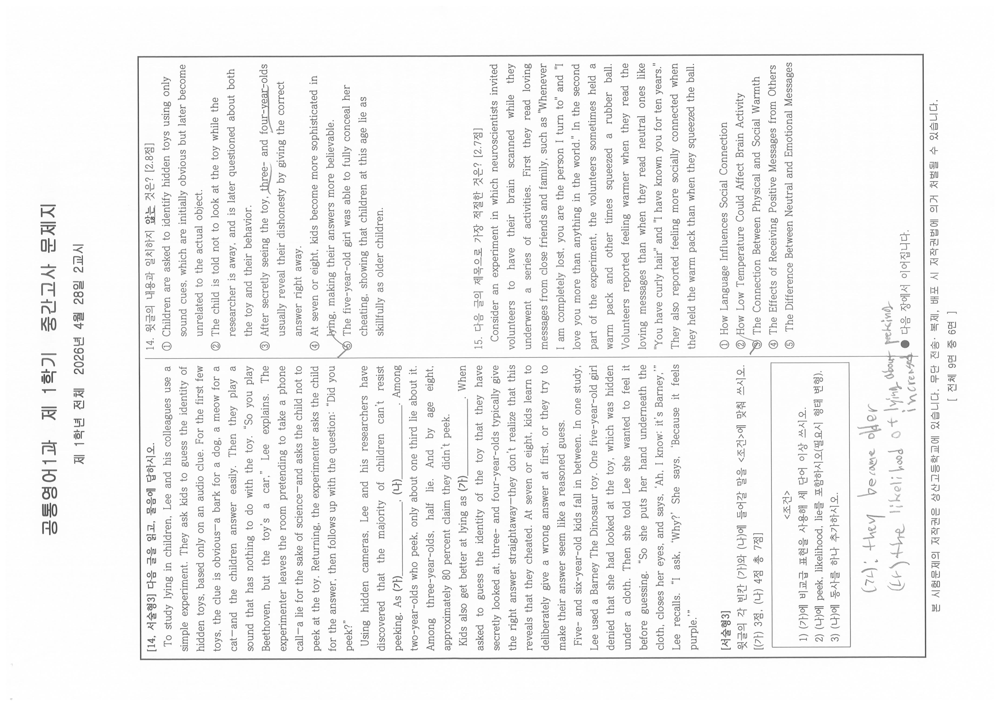
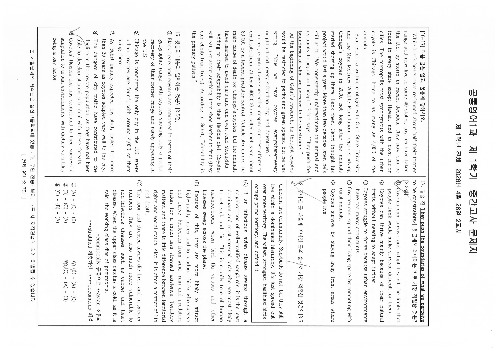
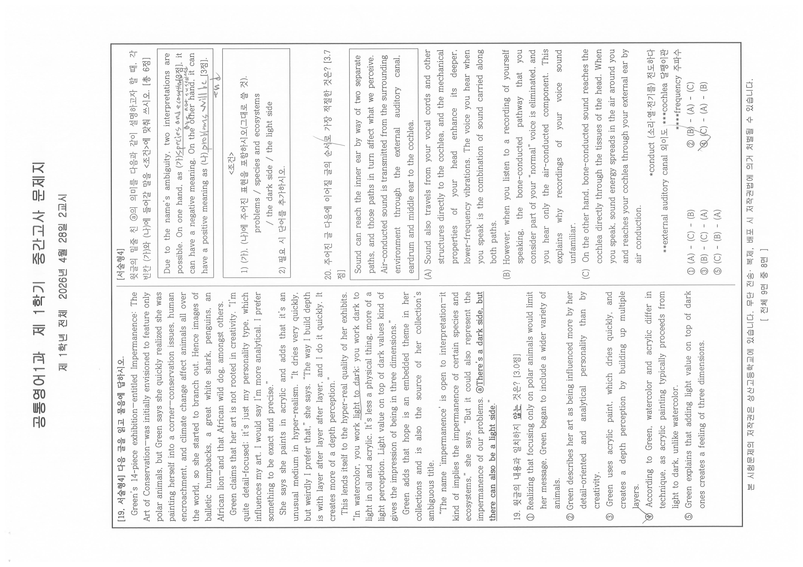
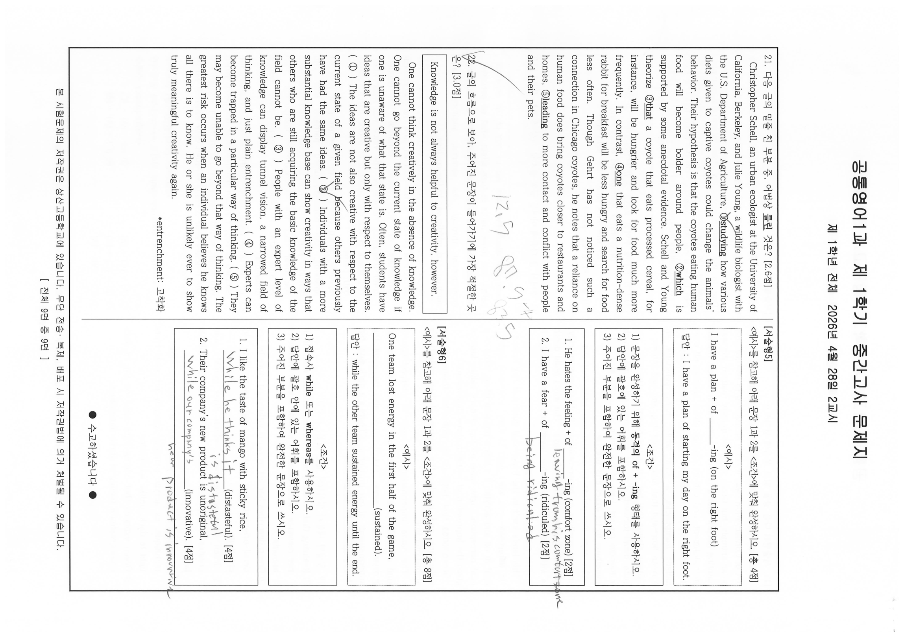

# EX-english-20261M — 1학년 1학기 공통영어1 중간고사 문제지 (2026학년도)

- 원본: `origin_data/EX-english-20261M/1학년1학기_공통영어1_중간.pdf` (9,516,193 B / sha256[:16] `bb92de835c800dd1` / 10쪽 / 텍스트 레이어 0)
- variant: `student` — 학생 응시본. 다수 문항 선택지에 연필 체크(✓)·동그라미가 관측된다.
  **본 전사는 인쇄 문면만을 대상으로 한다.** 학생 필기(선택지 표시, 여백 메모, 답안 손글씨)는
  전사하지 않으며, 필기 유무만 factual하게 언급한다. 인쇄인지 필기인지 식별 불가능한 경우는
  추측하지 않고 `verify_log.tsv`에 `unreadable` 행으로 남긴다.
- 렌더: PyMuPDF dpi=160, 전 10쪽 → `corpus/_images/EX-english-20261M/p01.png`~`p10.png`
  (**분모 기준본, 회전 미보정**). 판독은 임베드 원본(4299×3035 jpeg, 계산 실효 dpi=300)을
  쪽별 실측 회전각으로 정립한 `corpus/_images/EX-english-20261M/native/p01.png`~`p10.png`로 수행했다.
- **분류 판단 없음** — 유형ID·변형축·함정·Tier는 이 문서에 한 글자도 기재하지 않았다
  (1차 정제 = 전사만, CLAUDE.md 원칙 1).

## 인쇄 선언 (p01 = PDF 물리쪽 1번째, 표지, 원문 그대로)

```
2026학년도 1학기

    ( 1 )학년  ( 공통영어1 )과 중간고사 문제지

◑ 총( 9 )쪽, 선택형( 22 )문항, 서술형( 6 )문항
◑ 서답(서술) 답안 작성 : 별도의 답안지
◑ 고사반영 비율 : 중간고사( 30 )%, 기말고사( 30 )%, 수행평가( 40 )%

유의사항
1) 문제지를 받은 후 문제지 쪽수, 인쇄 상태, 문항 수(선택형, 서답형)를 확인하시오.
2) 해당 답안지에 학번, 이름, (교과명)을 쓰고 정확히 표기하시오.
3) OMR 카드 작성 시 카드가 훼손되지 않도록 주의하시오.(불이익을 받을 수 있음)
4) 문항에 따라 배점이 다르니, 각 물음의 끝에 표시된 배점을 참고하시오.
5) 서답형(서술형) 답안지 작성 관련 사항
   ① 답안 작성 지시사항에 따라 해당 답안지에 작성
   ② 필기구 : 검정색과 청색 펜으로만 작성(미준수 시 불이익을 받을 수 있음)

※ 시험이 시작되기 전까지 표지를 넘기지 마시오.

상 산 고 등 학 교
```

표지 문면에서 **문항 갈래 명칭이 "서술형"으로 인쇄**되어 있다(`EX-history-20261M`의 "서답형"과
다른 표기). 유의사항 5)-② 필기구도 "검정색과 청색"으로, 한국사본("검정색펜으로만")과 다르다.
표지는 완결 판독(하단 절단 없음, 쪽 번호 표기 없음 — 표지이므로 정상).

## 본문 쪽 머리·꼬리 (전 9쪽 공통, 원문 그대로)

```
공통영어1과  제 1학기  중간고사 문제지
제 1학년 전체  2026년 4월 28일 2교시
```
꼬리: `본 시험문제의 저작권은 상산고등학교에 있습니다. 무단 전송·복제, 배포 시 저작권법에 의거 처벌될 수 있습니다.`
그 아래 우측에 `[ 전체 9면 중 N면 ]`.

## 지면 구조에 대한 사실 기록 (판단 아님 — 관측 사실만)

- PDF 10쪽 전건이 임베드 이미지 정확히 1개(4299×3035 px, jpeg)로 구성되며, `page.rotation`
  메타데이터는 전건 `0`이나 실제 콘텐츠는 90도 회전된 상태로 스캔되어 있다(메타데이터로
  회전을 판정할 수 없음 — 육안 확인). 실효 dpi = `round(4299 × 72 / 1033.4)` = **300**.
- **회전각은 물리 홀수쪽(1,3,5,7,9) `-90` / 짝수쪽(2,4,6,8,10) `+90` 교대형**이다
  (`PIL.Image.rotate(각, expand=True)`, 전 10쪽 육안 대조 확정).
  `EX-social-20261{M,F}`와 같은 교대형이고, `EX-history-20261M`(전 쪽 고정 `-90`)과는 다르다.
  회전각은 유닛마다 재실측해야 한다는 PRD 지시대로 별도 확인했다.
- 정립 후 각 쪽은 좌·우 2단 구성의 지면 1장이며 분할·크롭이 필요 없다.
  판독 시 좌/우 단을 상·하로 겹쳐 나눈 임시 크롭을 보조로 썼으나 산출물이 아니다.
- **PDF 물리 쪽 순서와 인쇄 쪽 번호가 일치한다**(역순 아님):
  p01=표지 · p02=1면 · p03=2면 · p04=3면 · p05=4면 · p06=5면 · p07=6면 · p08=7면 ·
  p09=8면 · p10=9면. 인쇄 선언 "총 9쪽"은 본문 9면을 가리키며 표지를 포함하지 않는다
  (렌더 이미지 10장 = 표지 1 + 본문 9).
- 각 본문 쪽 하단 좌측에 `● 뒷 장에서 이어집니다.`가 인쇄되어 있다(마지막 면 제외 — 아래 참조).

## 선택형 안내 (p02 좌단 상단, 원문 그대로)

```
선택형 문항, 서술형 문항

◑ 서술형 문항 번호를 임의로 바꾸지 말 것.
◑ 서술형 답안지에 검정색 혹은 청색 펜으로 작성할 것.
◑ 글씨체를 단정하고 명확하게 작성할 것.
```

## 문항 전사 (인쇄 문면만, 원문 그대로)

### 1. [2.1점] — 완결 (p02, 인쇄 1면 좌단)
다음 글의 주제로 가장 적절한 것은?

The history of humankind is filled with skilled and practiced liars. Many are criminals who spin lies and weave deceptive tales to gain unjust rewards. Some are politicians who lie to gain power, or to cling to it. Sometimes people lie to boost their image, while others lie to cover up bad behavior. Even the academic science community—a world largely devoted to the pursuit of truth—has been shown to contain a number of deceivers. But the lies of impostors, swindlers, and boasting politicians are just a sample of the untruths that have characterized human behavior for thousands of years. Lying, it turns out, is something that most of us are very skilled at. We lie with ease, in ways big and small, to strangers, co-workers, friends, and loved ones. Our capacity for lying is as fundamental to us as our need to trust others. Being deceitful is part of our nature, so much so that we might say that to lie is human.

① the widespread and universal occurrence of lying across all humans
② the necessity of reducing dishonesty through social systems
③ the use of deception by criminals and politicians for personal gain
④ the existence of deception within academic communities
⑤ the negative effects of dishonesty on social trust

### 2. [2.1점] — 완결 (p02, 인쇄 1면 좌·우단)
다음 글의 주제로 가장 적절한 것은?

Until recently, urban wildlife was mostly ignored in scientific research. This is partly because such species are considered pests unworthy of our attention—or not wildlife at all. However, according to Seth Magle—director of the Urban Wildlife Institute at Chicago's Lincoln Park Zoo—we live on a planet that's rapidly urbanizing. It would therefore be unwise to ignore animals that move into urban landscapes. Magle adds that while much of urban ecology focuses on how to minimize conflicts with these animals, we forget that many of our encounters with wildlife are delightful. For Magle, "Another part of coexisting with animals has to do with celebrating these moments."

① the focus on rural wildlife in scientific research
② the role of urban wildlife in reducing conflicts among people in cities
③ the importance of paying attention to urban wildlife and the joy it brings
④ the need for further scientific research to control urban wildlife populations
⑤ the limitations of urban ecology in reducing conflict and promoting coexistence

### 3. [2.4점] — 완결 (p02, 인쇄 1면 우단)
밑줄 친 **That**이 다음 글에서 의미하는 바로 가장 적절한 것은?

Stare into the eyes of *The Watcher*, British artist Sophie Green's portrait of an African wild dog, and you'll see there's something reflected. A triangular outline of a distant mountain perhaps, or maybe a termite mound on the savanna. Something the animal is looking at, in any case, that draws and locks your own gaze. And by the time it does, you realize that the animal is actually now looking at you.

The effect is striking: a strangely intimate moment with one of the planet's most beleaguered mammals emerging from the shadows. But of course, it's not really an animal; just a very realistic painting of one.

"<u>That</u>'s always been my aim," says Green. "I want my artwork to be a window into another ecosystem. So people can feel they're face to face with the animal, rather than looking through a lens or at just another picture. Most people don't get that experience unless they go on a safari or an expedition. I kind of want my artwork to be that experience for them."

① Creating artwork that describes the animal in an unrealistic way
② Establishing a strong emotional connection between the wild dog and the artist
③ Creating an immersive moment that enables an intimate encounter with the animal
④ Encouraging viewers to make a precise guess on what is reflected in the animal's eyes
⑤ Transforming the artwork into an experience where viewers look at the animal through a lens

(밑줄 대상 `That`은 지문 제3단락 첫머리의 `That`이며, 문두 인용부호 안에 있다. 발문의 굵은 글씨와
지문의 밑줄이 인쇄로 대응한다.)

### 4. [3.1점] — 완결 (p03, 인쇄 2면 좌단)
다음 빈칸에 들어갈 말로 가장 적절한 것은?

Human beings have a tendency of ______________. You would have noticed this in how media outlets build up negative stories far more than they build up positive ones as the former kind sell better. The biggest example of this would be the fact that violence and crime may be at historically low levels, yet media reports often lead people to believe otherwise. Such bias often stops you from taking optimal decisions because your fear paralyzes your sense of curiosity and wonder. Take the case of India, one of the most spectacularly diverse countries in the world, that offers everything to the tourist: mountains, beaches, deserts, jungles, culture and a breathtakingly diverse cuisine. Yet, so many western tourists give it the miss because of reports in the mainstream press about the country's poverty, diseases, hunger, beggars and so on. The fact that India is now among the largest economies of the world with its booming technology industry and a global diaspora that is amongst the largest in the world is totally lost on them, as it does not get that much press.

① creating positive stories in order to achieve optimal outcomes
② attaching more importance to negative happenings than positive ones
③ holding biased views about countries that people usually hesitate to visit
④ preferring news sources that provide positive stories over negative ones
⑤ failing to make optimal decisions about where to travel due to biased media report

(빈칸은 지문 첫 문장 `Human beings have a tendency of` 뒤의 밑줄 1개다.)

### 5. [2.9점] — 완결 (p03, 인쇄 2면 좌·우단)
다음 글의 내용과 일치하지 <u>않는</u> 것은?

A team of researchers with the North Carolina Urban/Suburban Bear Study is captivated by a deep hollow inside a gnarled silver maple tree. Bear N209, a radio-collared female that's among more than a hundred bears being tracked in a study, hibernated there over the winter, despite the constant rush of vehicles mere feet away.

"These bears still surprise me," Colleen Olfenbuttel, the state's black bear biologist, shouts over the din of traffic. She holds a ladder steady as a colleague scrambles inside the tree and measures the den. It's the biggest tree den Olfenbuttel has seen in her 23 years of studying black bears. "They're so much more adaptable than we give them credit for."

Indeed, it's hard to imagine that black bears would take so well to living in Asheville. In this city of about 95,000, nestled in the Blue Ridge Mountains, bears shuffle down residential streets in broad daylight and climb onto people's decks and front porches. Some Asheville residents have embraced their furry neighbors, and nearly every person you talk with has a video of their most recent bear encounter.

The advent of the city bear in Asheville and elsewhere stems from a combination of trends, including changes in land use and the tempting buffets available when living near people. These factors have boosted North America's black bear population to nearly 800,000. At the same time, sprawling cities and suburbs have swallowed up large areas of bear habitat, leaving the animals little choice but to adapt to living with human neighbors.

Unfortunately, humans and bears don't always live in harmony—even in open-minded Asheville, where bears have killed pets and injured at least one person in recent years. In 2020, a mother bear defending her cubs attacked Valerie Patenotte's dog, which later died. "We understand everyone has to coexist," says Patenotte as we stand on her back deck overlooking the distant mountains. "We just want more space from bears."

① Black bears are described as highly adaptable to urban environments, and one female bear even hibernated near constant traffic noise.
② Olfenbuttel has studied black bears for more than two decades, and she believes that they can adapt to city environments much better than people usually think.
③ As black bears have adapted so well to life in Asheville, residents now encounter them in their neighborhoods, with many even recording these encounters on video.
④ The emergence of urban bears in Asheville has driven the abundance of food near residential areas as well as the expansion of cities and suburbs.
⑤ Humans and bears do not always coexist peacefully, and in Asheville, bears have attacked pets and at least one person.

### 6. [2.5점] — 완결 (p04, 인쇄 3면 좌단)
다음 글의 내용과 일치하지 <u>않는</u> 것은?

Two decades ago, DePaulo and her colleagues asked 147 adults to note down every instance they lied or tried to mislead someone during one week. The researchers found that the subjects lied on average one or two times a day. Most of these untruths were harmless, intended to hide one's failings or to protect the feelings of others. Some lies were excuses—one person blamed their failure to take out the garbage on not knowing where it needed to go. Yet other lies—such as a claim of being a diplomat's son—were told to present a false image. While these were minor transgressions, DePaulo and other colleagues observed [in a later study] that most people have, at some point, told one or more "serious lies": hiding an affair from a husband or wife, for example, or making false claims on a college application.

That human beings should universally possess a talent for deceiving one another shouldn't surprise us. Researchers speculate that lying as a behavior arose not long after the emergence of language. The ability to manipulate others without using physical force may have helped us compete for resources—something similar to the evolution of deceptive strategies like camouflage in the animal kingdom. "Lying is so easy compared to other ways of gaining power," notes ethicist Sissela Bok. "It's much easier to lie in order to get somebody's money or wealth than to hit them over the head or rob a bank."

① In the research, most untruths were not intended to harm but rather to hide personal failings or protect others emotionally.
② It was observed that serious lies are uncommon, as most people seldom engage in major deception.
③ Lying is a common trait shared by humans, and researchers think that it developed shortly after language emerged.
④ The ability to deceive others may have helped humans secure resources, similar to the development of deception in animals.
⑤ Lying is presented as an easier way to gain wealth than using violence or committing a crime.

### 7. [2.4점] — 완결 (p04, 인쇄 3면 우단)
윗글의 빈칸에 들어갈 말로 가장 적절한 것은?

(지문 머리에 `[7, 서술형1] 다음 글을 읽고, 물음에 답하시오.`가 인쇄되어 있다 — 이 지문은
선택형 7번과 서술형1이 **공유**한다.)

Much of the knowledge we use to navigate the world comes from what others tell us. Without the implicit trust that we place in human communication, we would be paralyzed as individuals and cease to have social relationships. "We get so much from believing, and there's relatively little harm when we occasionally get duped," says Tim Levine, a psychologist at the University of Alabama. In other words, ______________.

Because we are programmed to trust, we are naturally gullible. "If you say to someone, 'I am a pilot,' they are not sitting there thinking: 'Maybe he's not a pilot. Why would he say he's a pilot?' They don't think that way," says Frank Abagnale, Jr. Now a security consultant, Abagnale's cons as a young man—including forging checks and pretending to be an airline pilot—inspired the 2002 movie *Catch Me If You Can*. "This is why scams work," he says. "When the phone rings and the caller ID says it's the Internal Revenue Service, people automatically believe it is the IRS. They don't realize that someone could manipulate the caller ID."

① scams take advantage of people's lack of confidence in others
② the advantages of trust outweigh the risks of occasional deception
③ social interaction can be sustained without depending on mutual trust
④ our understanding of the world no longer comes from what others tell us
⑤ the occasional harm caused by deception exceeds the benefits of believing others

### 8. [2.9점] — 완결 (p05, 인쇄 4면 좌단)
다음 글의 내용과 일치하지 <u>않는</u> 것은?

Like coyotes and bears, raccoons are expanding throughout North American cities. In Washington, D.C., wildlife researchers Kate Ritzel and Travis Gallo wanted to find out whether raccoons living in the city are bolder and more willing to take risks than those in rural areas. They measured this by observing a raccoon's readiness to investigate an unfamiliar object—in this case, bait buried inside a square of wooden stakes.

The researchers installed more than a hundred automatic cameras throughout the city and rural areas of neighboring Virginia. On a muggy September morning at Fort Totten, Gallo placed the smelly bait—"dead animals in a jar," he called it—while Ritzel strapped a camera to a nearby tree. She would check the videos every two weeks to see which animals had passed through. Her favorite video? A feisty raccoon chasing off a fox.

Months later, Ritzel's data indicated that urban raccoons are bolder and more exploratory than their country cousins, taking more time to investigate unusual objects. City raccoons are also more social, traveling in pairs more often than their rural, more territorial counterparts—suggesting that urban raccoons are adapting their behavior to city life.

① Raccoons are not the only animals that expand throughout North American cities.
② Smelly bait was used in the research as an unfamiliar object, which was buried inside a square of wooden stakes.
③ The researchers set up cameras in both urban and rural areas to monitor passing animals and checked the videos regularly.
④ Urban raccoons are compared with their rural counterparts, with rural raccoons taking more time to investigate unfamiliar objects.
⑤ Rural raccoons are more territorial than urban ones, while urban raccoons are more social and more likely to move in pairs.

### 9. [3.2점] — 완결 (p05, 인쇄 4면 우단)
글의 흐름으로 보아, 주어진 문장이 들어가기에 가장 적절한 곳은?

```
Of course, not all innovations in training and equipment corrupt the game.
```

The difference between a sport and a spectacle is the difference between real basketball and "trampoline basketball," in which players can launch themselves high above the basket and dunk the ball; it is the difference between real wrestling and the version staged by the World Wrestling Federation (WWF), in which wrestlers attack their opponents with folding chairs. ( ① ) Spectacles, by isolating and exaggerating through artifice an attention-grabbing feature of a sport, diminish the value of the natural talents and gifts that the greatest players display. ( ② ) In a game that allowed basketball players to use a trampoline, Michael Jordan's athleticism would no longer stand out. ( ③ ) Some, like baseball gloves and graphite tennis rackets, improve it. ( ④ ) How can we distinguish changes that improve from those that corrupt? ( ⑤ ) The answer depends on the nature of the sport, and on whether the new technology highlights or obscures the talents and skills that distinguish the best players.

  \*spectacle 장관, 볼거리  \*\*artifice 인위적 수단
  \*\*\*athleticism 운동 능력  \*\*\*\*obscure 흐리게 하다

(선택지는 지문 안에 삽입 위치 표시 ① ~ ⑤ 로만 제시되며, 별도 선택지 목록은 인쇄되어 있지 않다.)

### 10. [2.2점] — 완결 (p05, 인쇄 4면 우단)
다음 글의 제목으로 가장 적절한 것은?

Kids get better at lying with age. What drives this increase in lying sophistication is the development of a child's ability to put himself or herself in someone else's shoes. Known as "theory of mind," this is the facility we acquire for understanding the beliefs, intentions, and knowledge of others. Also fundamental to lying is the brain's executive function: the abilities required for planning, making decisions, and self-control. This explains why the two-year-olds who lied and lied well in Lee's experiments performed better on tests of theory of mind and executive function than those who didn't.

① Differences in Morality Between Honest and Dishonest Humans
② Cognitive Abilities Behind the Growing Sophistication of Children's Lies
③ The Impact of Emotional Changes on Children's Increase in Lying Behavior
④ The Role of Social Relationship in the Development of Children's Cognition
⑤ Changes in the Parent-Child Interaction as Children Become Better at Lying

### 11. [2.5점] — 완결 (p06, 인쇄 5면 좌단)
주어진 글 사이에 들어갈 글의 순서로 가장 적절한 것은?

(지문 머리에 `[11, 서술형2] 다음 글을 읽고, 물음에 답하시오.`가 인쇄되어 있다 — 이 지문은
선택형 11번과 서술형2가 **공유**한다. 지면 구성은 「앞 박스 → (A)(B)(C) → 뒤 박스」다.)

```
When zoologist Sarah Benson-Amram first started looking into raccoon behavior and
cognition about a decade ago, she figured such a common species would have been studied
thoroughly. After all, the bushy-tailed omnivores are pop culture icons, jokingly dubbed
trash pandas.
```

(A) After the animals figured out how to get the food, the researchers would switch the buttons and pedals, forcing them to tweak their strategy.
(B) So far, she says, her research has confirmed the raccoon's clever and quick-witted reputation. In an experiment called reversal learning, she presented raccoons with a box equipped with a button or foot pedal that, when pressed, released food.
(C) Instead, Benson-Amram was shocked to find almost nothing in the scientific literature. A few researchers in the early 1900s had tried to study the clever animals, but gave up when their subjects kept breaking out of their cages.

```
Most of the raccoons were able to solve the problem on the first night. To put that into
perspective, only one of six coyotes engaged with the box—and not until the 44th night
of testing.
```

① (A)-(C)-(B)　② (B)-(C)-(A)　③ (B)-(A)-(C)
④ (C)-(A)-(B)　⑤ (C)-(B)-(A)

(선택지는 2행 배열로 인쇄되어 있다 — 1행에 ①②③, 2행에 ④⑤.)

### 12. [2.9점] — 완결 (p06, 인쇄 5면 우단)
윗글의 밑줄 친 부분 중 어법상 <u>틀린</u> 것은?

(지문 머리에 `[12-13] 다음 글을 읽고, 물음에 답하시오.`가 인쇄되어 있다 — 이 지문은
선택형 12번과 13번이 **공유**한다.)

Researchers are now learning that we are prone to believe some lies even when they're clearly contradicted by evidence. These insights suggest that our skill at deceiving others—combined with our vulnerability to being deceived—(a)<u>is</u> especially consequential in the age of social media. Research has shown, for example, that we are especially prone to accepting lies that (b)<u>affirm</u> our worldview. False news stories thrive on the internet and in social media because of this vulnerability, and disproving them does not tend to lessen their power. This is because people assess the evidence (c)<u>presented</u> to them through a framework of preexisting beliefs and prejudices, says George Lakoff, a cognitive linguist at the University of California, Berkeley. "If a fact comes in (d)<u>that</u> doesn't fit into your frame, you'll either not notice it, or ignore it, or ridicule it, or be puzzled by it—or attack it if it's threatening." What then might be the best way to impede the rapid advance of untruths into our collective lives? The answer isn't clear. Technology has opened up a new frontier for deceit, (e)<u>adds</u> a 21st-century twist to the age-old conflict between our lying and trusting selves.

① (a)　② (b)　③ (c)　④ (d)　⑤ (e)

### 13. [2.2점] — 완결 (p06, 인쇄 5면 우단)
윗글의 내용과 일치하는 것은?

(지문은 선택형 12번과 공유한다 — 위 「12.」 항목의 지문 전사를 참조.)

① Contradictory evidence to false information prevents people from believing it.
② False news struggles to spread online because users critically evaluate information.
③ Preexisting beliefs and biases shape how people assess the information presented to them.
④ People readily accept facts that conflict with their existing worldview.
⑤ Technology has made it harder for deceit to occur by increasing accuracy of information.

> **여기부터 지문 전사 방식이 바뀐다 (260909, `scope` 명시 — 원칙 11-a).** p07 이후의 인용 산문 지문은
> `corpus/_README.md` §2-a **P-지문 예외**에 따라 전문 재생산 대신 이미지 링크 + 구조 사실로 적는다.
> p02~p06(선택형 1~13, 서술형1·2)은 예외 신설 이전에 전문 전사된 상태이며, 소급 적용 여부는 별건 결정 대상이다.
> 학교가 작성한 문면(발문·선택지·`<조건>` 박스·배점)은 앞뒤 모두 축자 전사로 동일하다.

### 14. [2.8점] — 완결 (p07, 인쇄 6면 우단)
윗글의 내용과 일치하지 <u>않는</u> 것은?

**지문 — P-지문 예외 적용** (문면은 이미지 축에 보존)


- 지문 머리(원문): `[14, 서술형3] 다음 글을 읽고, 물음에 답하시오.`
- 지면 위치: p07 좌단 전체(인쇄 6면). 선택형 14번과 **서술형3이 공유**한다.
- 단락 수: 4단락 / 대략 어휘 수: 약 300어
- 첫 5어: `To study lying in children`
- 마지막 5어: `Because it feels purple.`
- 빈칸(인쇄된 그대로):
  - 2단락 중간 — `As (가)＿＿＿＿, (나)＿＿＿＿.`
  - 3단락 첫 문장 — `Kids also get better at lying as (가)＿＿＿＿.`
  - **관측**: 라벨 `(가)`가 2단락·3단락에 각각 인쇄되어 **문면에 두 번 나타난다.** 서술형3 발문은 `(가)와 (나)` 둘만 요구한다. 인쇄 문면 그대로 기록하며 오탈 여부는 판단하지 않는다(원칙 1).
- 소재 사실: 아동 거짓말 연구 실험 절차(숨긴 장난감 · 소리 단서 · 실험자 퇴실 · "Did you peek?" · 몰래카메라), 연령별 수치(2세 중 약 1/3, 3세 중 절반, 8세 약 80%), 3~4세와 7~8세의 응답 방식 차이, 5세 여아 Barney 사례
- 판독 상태: 전 문장 판독 가능, `unreadable` 없음

① Children are asked to identify hidden toys using only sound cues, which are initially obvious but later become unrelated to the actual object.
② The child is told not to look at the toy while the researcher is away, and is later questioned about both the toy and their behavior.
③ After secretly seeing the toy, three- and four-year-olds usually reveal their dishonesty by giving the correct answer right away.
④ At seven or eight, kids become more sophisticated in lying, making their answers more believable.
⑤ The five-year-old girl was able to fully conceal her cheating, showing that children at this age lie as skillfully as older children.

(선택지 ③에 `three-`·`four-year-`, ④에 `lying` 밑줄, ⑤ 번호에 필기 표시 — 응시본 필기이며 인쇄 문면이 아니다.)

### 15. [2.7점] — 완결 (p07, 인쇄 6면 우단)
다음 글의 제목으로 가장 적절한 것은?

**지문 — P-지문 예외 적용** (문면은 이미지 축에 보존)


- 지면 위치: p07 우단 하부(인쇄 6면). 14번 지문과 별개의 독립 지문이며 다른 문항과 공유하지 않는다.
- 단락 수: 1단락 / 대략 어휘 수: 약 130어
- 첫 5어: `Consider an experiment in which`
- 마지막 5어: `than when they squeezed the ball.`
- 빈칸: 없음
- 소재 사실: 뇌 스캔 실험 — ① 가까운 친구·가족의 애정 어린 메시지 읽기 ② 따뜻한 팩을 쥐는 조건과 고무공을 쥐는 조건 비교. 보고된 결과는 애정 메시지 조건에서 더 따뜻하게 느꼈고, 따뜻한 팩 조건에서 사회적으로 더 연결되었다고 느꼈다는 것.
- 판독 상태: 전 문장 판독 가능, `unreadable` 없음

① How Language Influences Social Connection
② How Low Temperature Could Affect Brain Activity
③ The Connection Between Physical and Social Warmth
④ The Effects of Receiving Positive Messages from Others
⑤ The Difference Between Neutral and Emotional Messages

(③ 번호에 필기 표시 — 응시본 필기.)

> **지면 사실(p07)**: 우단 최하단에 `● 다음 장에서 이어집니다.` 가 인쇄돼 있다.

### 16. [2.5점] — 완결 (p08, 인쇄 7면 좌단)
윗글의 내용과 일치하는 것은?

**지문 — P-지문 예외 적용** (문면은 이미지 축에 보존)


- 지문 머리(원문): `[16-17] 다음 글을 읽고, 물음에 답하시오.`
- 지면 위치: p08 좌단 상부~중부(인쇄 7면). **선택형 16번과 17번이 공유**한다.
- 단락 수: 5단락 / 대략 어휘 수: 약 330어
- 첫 5어: `While black bears have reclaimed`
- 마지막 5어: `Variability is the primary pattern.`
- 빈칸: 없음
- 밑줄: 2단락 끝 문장에 `They push the boundaries of what we perceive to be constraints` — 17번의 밑줄 대상이며 17번 발문에 그대로 재인쇄되어 있다.
- 소재 사실: 미국 코요테의 도시 적응 — 흑곰과의 서식 범위 대비, 하와이를 제외한 전 주 분포, 시카고 개체 약 4,000, Ohio State University·Max McGraw Wildlife Foundation 소속 Stan Gehrt의 2000년 이후 연구, 연간 포살 40만 이상(연방 포식자 관리 약 8만), 차량 충돌이 시카고 코요테 주 사인이나 신호등 인지, 잡식성 식성과 `Variability` 진술
- 판독 상태: 전 문장 판독 가능, `unreadable` 없음

① Black bears and coyotes are compared in terms of their geographic range, with coyotes showing only a partial recovery of their former range and rarely appearing in the U.S.
② Chicago is considered the only city in the U.S. where urban coyotes are found, with around 4,000 of them living there.
③ As Gehrt initially expected, his study lasted for more than 20 years as coyotes adapted very well to the city.
④ The dangers of city traffic have contributed to the decline in the coyote population, as they have not been able to develop strategies to deal with these threats.
⑤ Coyotes' flexible diet has contributed to their successful adaptation to urban environments, with dietary variability being a key factor.

(⑤ 번호에 필기 표시, ④ `decline` 밑줄 — 응시본 필기.)

### 17. [2.8점] — 완결 (p08, 인쇄 7면 우단)
밑줄 친 <u>They push the boundaries of what we perceive to be constraints</u>가 윗글에서 의미하는 바로 가장 적절한 것은?

(지문은 선택형 16번과 공유한다 — 위 「16.」 항목의 P-지문 구조 기록을 참조.)

① Coyotes can survive and adapt beyond the limits that people think would make survival difficult for them.
② Coyotes can thrive mainly because of their natural traits, without needing to adapt further.
③ Coyotes struggle to thrive because urban environments have too many constraints.
④ Coyotes can expand their living space by competing with rural animals.
⑤ Coyotes survive by staying away from areas where people live.

(① 번호에 필기 표시 — 응시본 필기.)

### 18. [3.5점] — 완결 (p08, 인쇄 7면 우단)
주어진 글 다음에 이어질 글의 순서로 가장 적절한 것은?

**지문 — P-지문 예외 적용** (문면은 이미지 축에 보존)


- 지면 위치: p08 우단 하부(인쇄 7면). 16·17번 지문과 무관한 독립 지문이다.
- 구성: **주어진 글 박스 1개 + 배열 대상 단락 (A)·(B)·(C) 3개** (순서 배열 형식)
- 대략 어휘 수: 주어진 글 약 40어, (A) 약 60어, (B) 약 75어, (C) 약 55어
- 주어진 글 — 첫 5어 `Chickens live communally. Songbirds do` / 마지막 5어 `occupy prime territory, and defend it.`
- (A) — 첫 5어 `If an infectious avian disease` / 마지막 5어 `illnesses sweep across the planet.`
- (B) — 첫 5어 `Because of this, they are` / 마지막 5어 `a matter of life and death.`
- (C) — 첫 5어 `The poor and stressed always` / 마지막 5어 `working class dies of pneumonia.`
- 소재 사실: 조류의 우열 위계와 세력권이 짝짓기·스트레스·질병 취약성에 미치는 영향, 인간 사회로의 유비
- 어휘 주석(인쇄 원문): `*communally 공동으로  **avian 조류의  ***stratified 계층화된  ****pneumonia 폐렴`
- 판독 상태: 전 문장 판독 가능, `unreadable` 없음

① (A) - (C) - (B)　② (B) - (A) - (C)
③ (B) - (C) - (A)　④ (C) - (A) - (B)
⑤ (C) - (B) - (A)

(④ 번호에 필기 표시 — 응시본 필기. 선택지는 2열 배치로 인쇄되어 있다. ※ 18번)

### 19. [3.0점] — 완결 (p09, 인쇄 8면 좌단)
윗글의 내용과 일치하지 <u>않는</u> 것은?

**지문 — P-지문 예외 적용** (문면은 이미지 축에 보존)


- 지문 머리(원문): `[19, 서술형4] 다음 글을 읽고 물음에 답하시오.`
- 지면 위치: p09 좌단 전체(인쇄 8면). **선택형 19번과 서술형4가 공유**한다.
- 단락 수: 6단락 / 대략 어휘 수: 약 300어
- 첫 5어: `Green's 14-piece exhibition—entitled Impermanence:`
- 마지막 5어: `there can also be a light side.`
- 빈칸: 없음
- 밑줄·기호: 5단락에 `light to dark` 밑줄, 마지막 단락에 `ⓐThere's a dark side, but there can also be a light side` — 기호 `ⓐ`는 서술형4의 지시 대상이다.
- 소재 사실: 화가 Green의 14점 전시 `Impermanence: The Art of Conservation` — 극지 동물만 다루려던 당초 구상에서 확장한 경위, 창의성이 아니라 세밀·분석적 성향에 기인한다는 본인 진술, 아크릴 물감의 속건성과 겹칠(layer)로 만드는 깊이감, 수채와 유화·아크릴의 명암 진행 방향 대비, 전시명 `impermanence`의 이중 해석
- 판독 상태: 전 문장 판독 가능, `unreadable` 없음

① Realizing that focusing only on polar animals would limit her message, Green began to include a wider variety of animals.
② Green describes her art as being influenced more by her detail-oriented and analytical personality than by creativity.
③ Green uses acrylic paint, which dries quickly, and creates a depth perception by building up multiple layers.
④ According to Green, watercolor and acrylic differ in technique, as acrylic painting typically proceeds from light to dark, unlike watercolor.
⑤ Green explains that adding light value on top of dark ones creates a feeling of three dimensions.

(④ 번호에 필기 표시 — 응시본 필기.)

### 20. [3.7점] — 완결 (p09, 인쇄 8면 우단)
주어진 글 다음에 이어질 글의 순서로 가장 적절한 것은?

**지문 — P-지문 예외 적용** (문면은 이미지 축에 보존)


- 지면 위치: p09 우단 하부(인쇄 8면). 19번 지문과 무관한 독립 지문이다.
- 구성: **주어진 글 박스 1개 + 배열 대상 단락 (A)·(B)·(C) 3개** (순서 배열 형식, 18번과 동일 형식)
- 대략 어휘 수: 주어진 글 약 45어, (A) 약 60어, (B) 약 55어, (C) 약 55어
- 주어진 글 — 첫 5어 `Sound can reach the inner` / 마지막 5어 `eardrum and middle ear to the cochlea.`
- (A) — 첫 5어 `Sound also travels from your` / 마지막 5어 `carried along both paths.`
- (B) — 첫 5어 `However, when you listen to` / 마지막 5어 `your voice sound unfamiliar.`
- (C) — 첫 5어 `On the other hand, bone-conducted` / 마지막 5어 `external ear by air conduction.`
- 소재 사실: 소리가 내이에 도달하는 두 경로(공기 전도 / 뼈 전도)와, 녹음된 자기 목소리가 낯설게 들리는 이유
- 어휘 주석(인쇄 원문): `*conduct (소리·열·전기를) 전도하다  **external auditory canal 외이도  ***cochlea 달팽이관  ****frequency 주파수`
- 판독 상태: 전 문장 판독 가능, `unreadable` 없음

① (A) - (C) - (B)　② (B) - (A) - (C)
③ (B) - (C) - (A)　④ (C) - (A) - (B)
⑤ (C) - (B) - (A)

(④ 번호에 필기 표시 — 응시본 필기. 선택지는 2열 배치로 인쇄되어 있다.)

### 21. [2.6점] — 완결 (p10, 인쇄 9면 좌단)
다음 글의 밑줄 친 부분 중, 어법상 <u>틀린</u> 것은?

**지문 — P-지문 예외 적용** (문면은 이미지 축에 보존)


- 지면 위치: p10 좌단 상부(인쇄 9면). 단일 문항 전용 지문이다.
- 단락 수: 1단락 / 대략 어휘 수: 약 140어
- 첫 5어: `Christopher Schell, an urban ecologist`
- 마지막 5어: `with people and their pets.`
- 소재 사실: UC Berkeley 도시생태학자 Christopher Schell과 USDA 야생생물학자 Julie Young의 연구 — 사육 코요테에게 준 먹이가 행동을 바꾸는지, 가공 시리얼과 영양 밀도 높은 먹이의 대비, Gehrt의 시카고 관찰. 16번 지문(코요테)과 소재가 연속되나 **별개 지문으로 인쇄**되어 있다.
- 밑줄 대상 5곳(어법 판단 지점, 인쇄 그대로):
  - ① `studying` — `…, and Julie Young, a wildlife biologist with the U.S. Department of Agriculture, ①studying how various diets…`
  - ② `which` — `…will become bolder around people, ②which is supported by some anecdotal evidence.`
  - ③ `that` — `Schell and Young theorize ③that a coyote that eats processed cereal…`
  - ④ `one` — `In contrast, ④one that eats a nutrition-dense rabbit for breakfast…`
  - ⑤ `leading` — `…brings coyotes closer to restaurants and homes, ⑤leading to more contact and conflict…`
- 판독 상태: 전 문장 판독 가능, `unreadable` 없음

(선택지는 지문 안의 밑줄 ①~⑤ 자체이며 별도 선택지 줄이 인쇄되어 있지 않다. ① 번호에 필기 표시 — 응시본 필기. 지문 아래 여백에 점수 계산으로 보이는 손글씨 숫자가 있으나 전사 대상 아님.)

### 22. [3.0점] — 완결 (p10, 인쇄 9면 좌단)
글의 흐름으로 보아, 주어진 문장이 들어가기에 가장 적절한 곳은?

**주어진 문장(박스, 인쇄 원문)**
```
Knowledge is not always helpful to creativity, however.
```

**지문 — P-지문 예외 적용** (문면은 이미지 축에 보존)


- 지면 위치: p10 좌단 중부~하부(인쇄 9면). 21번 지문과 무관한 독립 지문이다.
- 단락 수: 1단락 / 대략 어휘 수: 약 180어
- 첫 5어: `One cannot think creatively in`
- 마지막 5어: `truly meaningful creativity again.`
- 삽입 위치 표시: 본문 중에 `( ① )` ~ `( ⑤ )` 다섯 곳이 순서대로 인쇄되어 있다.
  - `( ① )` — `…creative but only with respect to themselves.` 뒤
  - `( ② )` — `…others previously have had the same ideas.` 뒤
  - `( ③ )` — `…acquiring the basic knowledge of the field cannot be.` 뒤
  - `( ④ )` — `…tunnel vision, a narrowed field of thinking, and just plain entrenchment.` 뒤
  - `( ⑤ )` — `Experts can become trapped in a particular way of thinking.` 뒤
- 소재 사실: 지식과 창의성의 관계 — 지식 없이는 창의적 사고가 불가능하다는 전제, 전문가의 터널 비전과 고착화 위험
- 어휘 주석(인쇄 원문): `*entrenchment: 고착화`
- 판독 상태: 전 문장 판독 가능, `unreadable` 없음

(② 자리에 필기 표시 — 응시본 필기. 선택지는 지문 안의 `( ① )`~`( ⑤ )` 자체이며 별도 선택지 줄이 인쇄되어 있지 않다.)

> **지면 사실(p10)**: 우단 최하단에 `● 수고하셨습니다 ●` 가 인쇄돼 있다. 이 면이 마지막 면(인쇄 9면)이다.

## 서술형

> **배치 규약**: 이 시험지는 서술형 문항을 선택형 사이에 끼워 인쇄했다(서술형1@인쇄 3면,
> 2@5면, 3@6면, 4@8면, 5·6@9면). 전사문은 선택형 1~22를 먼저 싣고 이 줄에서 한 번만 갈래를
> 전환한 뒤 서술형 1~6을 싣는다. 각 문항 머리에 실제 인쇄 위치를 적어 지면 순서를 복원할 수 있게 했다.
> 지문을 선택형과 공유하는 서술형(1·2·3·4)은 지문을 다시 적지 않고 공유 상대 문항을 지시한다.

### 23.[서술형1] [7점] — 완결 (p04, 인쇄 3면 우단)
윗글의 내용을 아래 한 문장으로 요약하고자 한다. 각 빈칸 (가), (나)에 들어갈 말을 <조건>에 맞춰 쓰시오.

(지문은 선택형 7번과 공유한다 — 지면 머리에 `[7, 서술형1] 다음 글을 읽고, 물음에 답하시오.`로
한 번만 인쇄되어 있다. 위 「7.」 항목의 지문 전사를 참조.)

```
(가)＿＿＿＿＿＿＿＿[3점] enables communication and
social interaction, but it also (나)＿＿＿＿＿＿＿＿[4점],
such as scams involving false caller identification.
```

```
<조건>
1) (가)에 tendency를 포함하시오(그대로 쓸 것).
2) (나)에 5형식 구조를 사용하시오.
3) (나)에 vulnerable을 포함하시오(그대로 쓸 것).
```

> 답안란 두 곳에 손글씨 기재가 있으나 전사 대상 아님. 발문 배점은 `[총 7점]`으로 인쇄되어 있고,
> 빈칸별 부분배점 `[3점]`·`[4점]`이 요약문 안에 함께 인쇄되어 있다 — 3+4=7 내부 정합.

### 24.[서술형2] [8점] — 완결 (p06, 인쇄 5면 좌단)
윗글의 실험 내용을 다음과 같이 요약하고자 할 때, 각 빈칸 (가)와 (나)에 들어갈 말을 <조건>에 맞춰 쓰시오.

(지문은 선택형 11번과 공유한다 — 위 「11.」 항목의 지문 전사를 참조.)

```
When the researchers reversed the rule for obtaining a reward, (가)＿＿＿＿＿＿＿＿[3점] and
develop a new one in order to to get food. (나)＿＿＿＿＿＿＿＿[5점], demonstrating their cleverness.
```

```
<조건>
1) 주어진 표현을 변형 없이 포함하시오.
 (가) had to / their previous strategy
 (나) their behavior  / quickly
2) 필요시 단어를 추가하시오.
```

> 요약문 둘째 줄 `in order to to get food` 의 `to` 중복은 **인쇄 문면 그대로**다 — 300 dpi 확대
> 대조에서 두 `to` 가 본문과 동일 활자·자간으로 인쇄돼 있고 필기가 아님을 확인했다. 원본 오탈
> 여부는 판단하지 않고 관측 사실만 기록한다. 답안란 두 곳에 손글씨 기재가 있으나 전사 대상 아님.
> 발문 배점 `[총 8점]`, 부분배점 `[3점]`·`[5점]` — 3+5=8 내부 정합.

### 25.[서술형3] [7점] — 완결 (p07, 인쇄 6면 좌단 하부)
윗글의 각 빈칸 (가)와 (나)에 들어갈 말을 <조건>에 맞춰 쓰시오. [(가) 3점, (나) 4점 총 7점]

(지문은 선택형 14번과 공유한다 — 지면 머리에 `[14, 서술형3] 다음 글을 읽고, 물음에 답하시오.`로
한 번만 인쇄되어 있다. 위 「14.」 항목의 P-지문 구조 기록을 참조.)

```
<조건>
1) (가)에 비교급 표현을 사용해 세 단어 이상 쓰시오.
2) (나)에 peek, likelihood, lie를 포함하시오(필요시 형태 변형).
3) (나)에 동사를 하나 추가하시오.
```

> 빈칸 라벨 `(가)`가 지문 2단락·3단락에 각각 인쇄돼 문면에 두 번 나타나는 관측은 「14.」 항목에 기록했다.
> 발문 배점 `[총 7점]`, 부분배점 `[3점]`·`[4점]` — 3+4=7 내부 정합.
> `<조건>` 박스 아래 답안 손글씨 2행 있으나 전사 대상 아님.

### 26.[서술형4] [6점] — 완결 (p09, 인쇄 8면 우단 상부)
윗글의 밑줄 친 ⓐ의 의미를 다음과 같이 설명하고자 할 때, 각 빈칸 (가)와 (나)에 들어갈 말을 <조건>에 맞춰 쓰시오. [총 6점]

(지문은 선택형 19번과 공유한다 — 지면 머리에 `[19, 서술형4] 다음 글을 읽고 물음에 답하시오.`로
한 번만 인쇄되어 있다. 위 「19.」 항목의 P-지문 구조 기록을 참조.
밑줄 ⓐ = `There's a dark side, but there can also be a light side` — 지문 마지막 단락.)

```
Due to the name's ambiguity, two interpretations are
possible. On one hand, as (가)＿＿＿＿＿＿＿＿[3점], it
can have a negative meaning. On the other hand, it can
have a positive meaning as (나)＿＿＿＿＿＿＿＿[3점].
```

```
<조건>
1) (가), (나)에 주어진 표현을 포함하시오(그대로 쓸 것).
        problems / species and ecosystems
          / the dark side / the light side
2) 필요 시 단어를 추가하시오.
```

> 발문 배점 `[총 6점]`, 부분배점 `[3점]`·`[3점]` — 3+3=6 내부 정합.
> 빈칸 두 곳에 답안 손글씨 있으나 전사 대상 아님.

### 27.[서술형5] [4점] — 완결 (p10, 인쇄 9면 우단 상부)
<예시>를 참고해 아래 문장 1과 2를 <조건>에 맞춰 완성하시오. [총 4점]

```
<예시>
I have a plan + of ＿＿＿＿-ing (on the right foot)

답안 : I have a plan of starting my day on the right foot.
```

```
<조건>
1) 문장을 완성하기 위해 동격의 of + -ing 형태를 사용하시오.
2) 답안에 괄호에 있는 어휘를 포함하시오.
3) 주어진 부분을 포함하여 완전한 문장으로 쓰시오.
```

```
[서술형5] 1. He hates the feeling + of ＿＿＿＿-ing (comfort zone) [2점]

[서술형5] 2. I have a fear + of ＿＿＿＿＿-ing (ridiculed) [2점]
```

> 문항 번호 `1.`·`2.` 는 인쇄 문면 그대로이며, 앞의 `[서술형5]` 는 갈래를 명시하기 위한 전사 라벨이다(인쇄물에 없음).
> 지문 없음 — 문법 산출형. 발문 배점 `[총 4점]`, 문항별 `[2점]`·`[2점]` — 2+2=4 내부 정합.
> 두 문항 답란에 손글씨 기재가 있으나 전사 대상 아님.

### 28.[서술형6] [8점] — 완결 (p10, 인쇄 9면 우단 하부)
<예시>를 참고해 아래 문장 1과 2를 <조건>에 맞춰 완성하시오. [총 8점]

```
<예시>
One team lost energy in the first half of the game,
＿＿＿＿＿＿＿＿＿＿＿＿＿＿＿＿＿＿(sustained).

답안 : while the other team sustained energy until the end.
```

```
<조건>
1) 접속사 while 또는 whereas를 사용하시오.
2) 답안에 괄호 안에 있는 어휘를 포함하시오.
3) 주어진 부분을 포함하여 완전한 문장으로 쓰시오.
```

```
[서술형6] 1. I like the taste of mango with sticky rice,
＿＿＿＿＿＿＿＿＿＿(distasteful). [4점]

[서술형6] 2. Their company's new product is unoriginal,
＿＿＿＿＿＿＿＿＿＿(innovative). [4점]
```

> 문항 번호 `1.`·`2.` 는 인쇄 문면 그대로이며, 앞의 `[서술형6]` 는 갈래를 명시하기 위한 전사 라벨이다(인쇄물에 없음).
> 지문 없음 — 문법 산출형. 발문 배점 `[총 8점]`, 문항별 `[4점]`·`[4점]` — 4+4=8 내부 정합.
> 두 문항 답란에 손글씨 기재가 있으나 전사 대상 아님.

## 판독 상태 총괄

- 선택형 합계 60.0점 (실측 자체 열거: 2.1+2.1+2.4+3.1+2.9+2.5+2.4+2.9+3.2+2.2+2.5+2.9+2.2+2.8+2.7+2.5+2.8+3.5+3.0+3.7+2.6+3.0 = 60.0)
- 서답 합계 40.0점 (7+8+7+6+4+8 = 40.0)
- 총점 100.0점 = 60.0 + 40.0
- 인쇄된 선언과 대조: 표지 `◑ 총( 9 )쪽, 선택형( 22 )문항, 서술형( 6 )문항` — 전사 문항 수 선택형 22 · 서답 6, **일치**
- 면 수 대조: 표지 1면(p01) + 본문 9면(p02~p10) = 렌더 10쪽. 본문 각 면 꼬리말 `[ 전체 9면 중 N면 ]`이 1~9로 연속, **누락·중복 없음**
- `unreadable` 행: 0건 — 전 면 전 문항 판독 완료
- 전사 방식: p02~p06(선택형 1~13 · 서답 1·2)은 지문 전문 전사, p07~p10(선택형 14~22 · 서답 3~6)은 `corpus/_README.md` §2-a **P-지문 예외**(이미지 링크 + 구조 사실). 사유와 근거는 §2-a에 기록되어 있으며 이 유닛의 `scope`는 문서에 명시된 상태다(원칙 11-a)
- 분류 판단: 없음 — 유형ID·변형축·함정·Tier를 한 글자도 적지 않았다(원칙 1)
