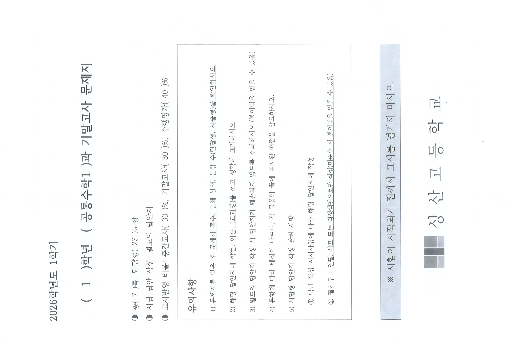
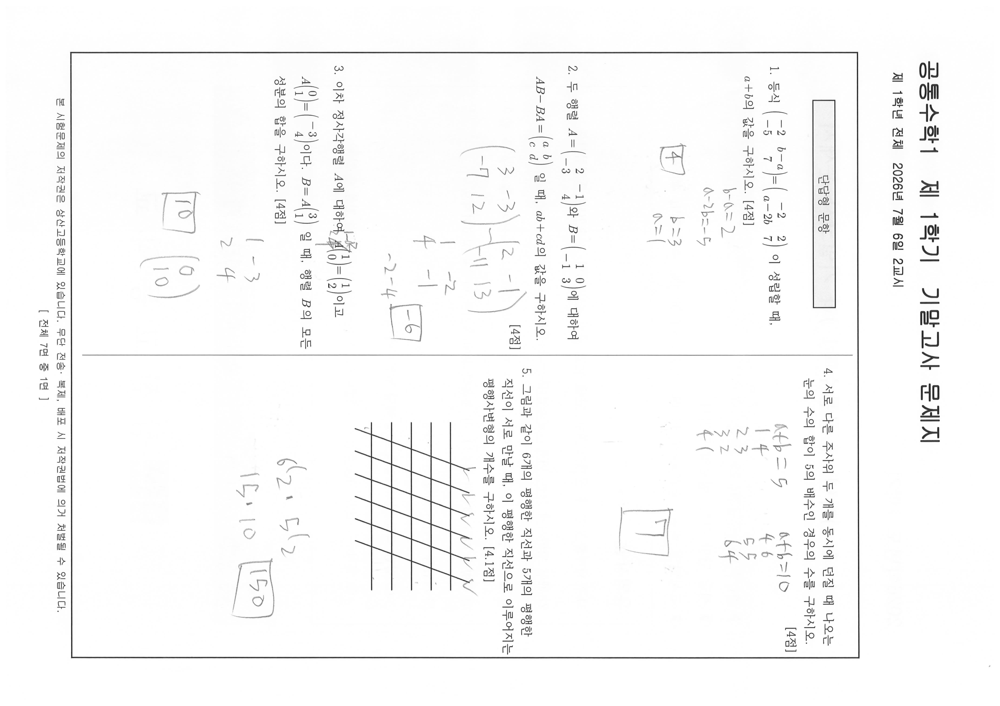
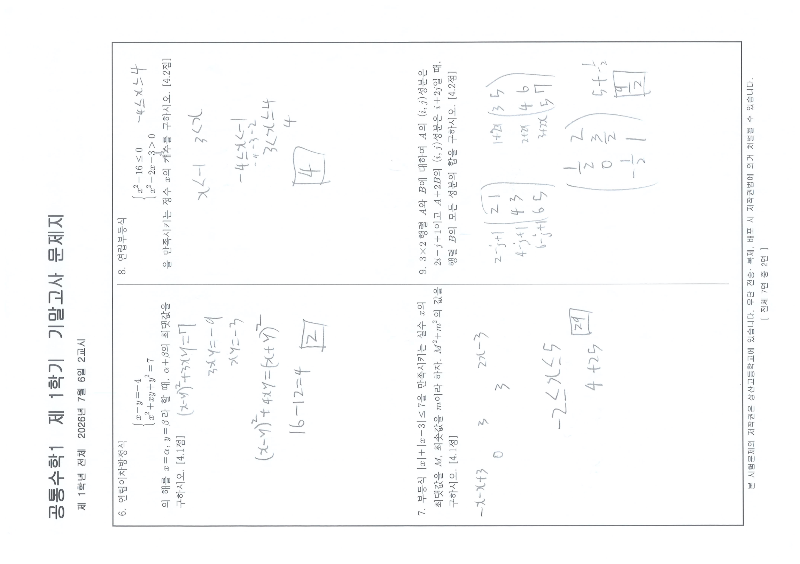
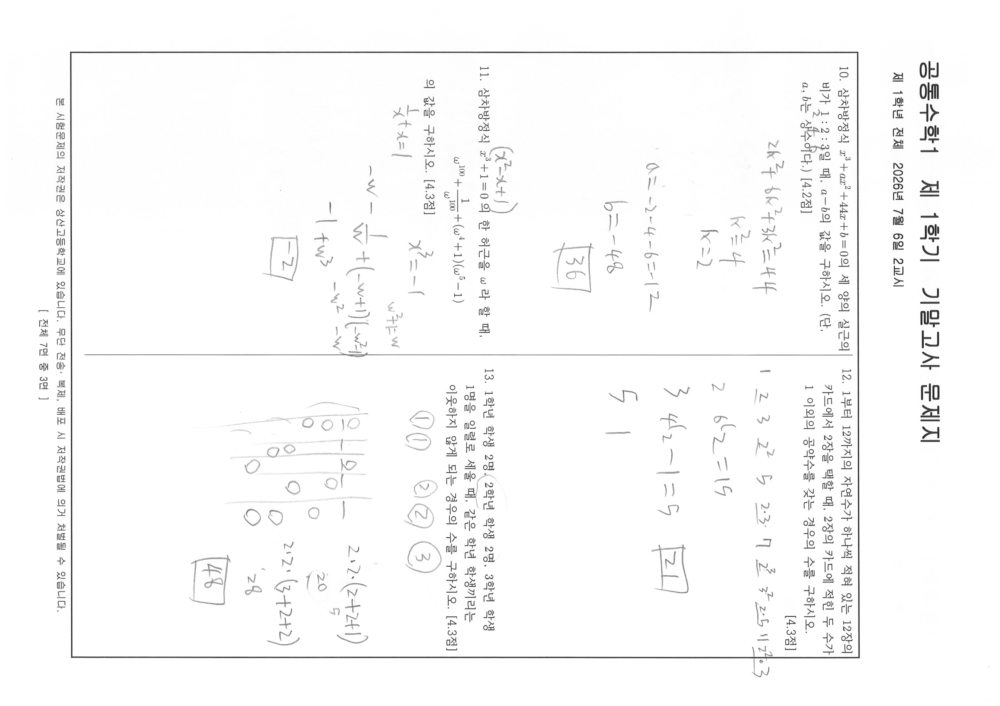
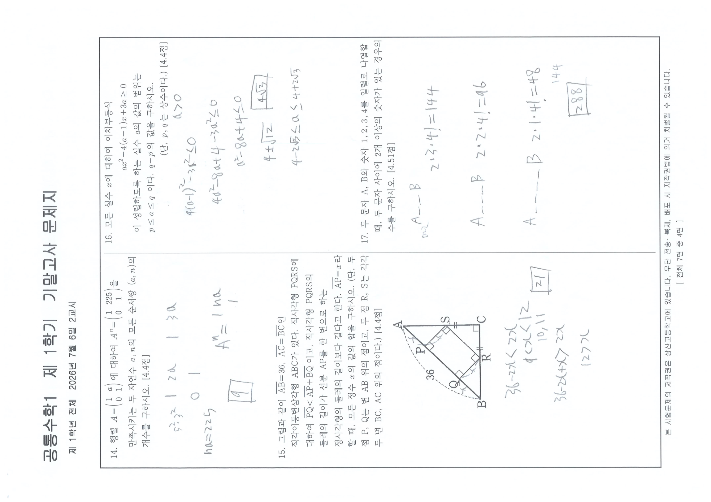
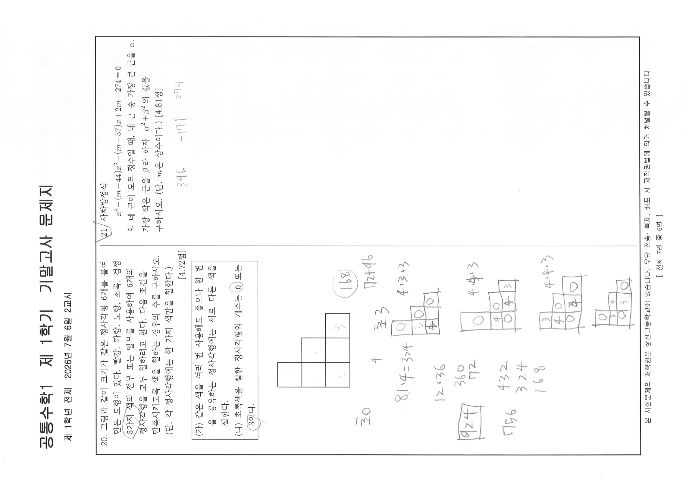
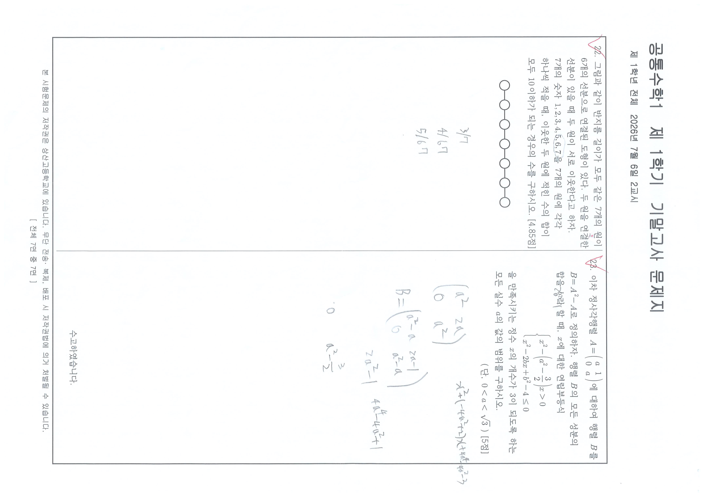

# EX-math1-20261F — 1차 정제 전사본

- 원본: `origin_data/EX-math1-20261F/1학년1학기_공통수학1_기말.pdf`
  - 크기 3,716,828 B · sha256[:16] `6e847b46dc0e8feb` · 8쪽 · 텍스트 레이어 길이 0(전 쪽 0)
- 렌더: 분모 기준본 `corpus/_images/EX-math1-20261F/pNN.png`(PyMuPDF, dpi160, 회전 미보정 8장)
  - 판독용 정립본 `corpus/_images/EX-math1-20261F/native/pNN.png`(임베드 원본 4299×3035 jpeg, 계산 실효dpi=300)
  - 회전각 실측(유닛별 판정, C-A1-3): p01 −90° / p02 +90° / p03 −90° / p04 +90° / p05 −90° / p06 +90° / **p07 +90° / p08 −90°**. p01~p06은 홀·짝 교대이나 **p07·p08에서 교대가 깨진다** — 일정한 상수가 아니다. `page.rotation` 메타데이터는 전 쪽 0을 보고하며 내용 회전과 불일치한다.
  - 물리쪽↔인쇄면(꼬리말 `[ 전체 7면 중 N면 ]` 실측): p01=표지, p02=1면, p03=2면, p04=3면, p05=4면, p06=5면, **p07=7면, p08=6면** — 마지막 두 장이 뒤바뀐 순서로 스캔되어 있다.
- variant: student(응시본) — 풀이 필기가 관측되나 **필기는 전사 대상이 아니다**. 인쇄 문면만 전사하고, 필기가 인쇄 문자를 덮은 자리는 확대 대조로 인쇄 문자를 복원해 적고 필기는 주석줄에 분리 기록한다.
- **수식 표기**: 이 원본은 스캔본(텍스트 레이어 0)이라 HWP 수식 레코드(`⟦EQD:…⟧`)가 존재하지 않는다. 따라서 수식은 유니코드 수학 표기로 적는다(행렬은 `[[a, b], [c, d]]` 꼴, 지수 `x^2`, 첨자 `a_1`, 조합 `C(n, r)`). 원본 조판은 이미지 링크로 병치한다.
- **도표·표·그림 문항**: 도형·격자·표가 인쇄된 문항은 해당 쪽 이미지 링크를 문항 안에 병치하고, 도형의 관측 사실(직선 수·교점 수·표의 행렬 구조)을 별도 주석줄로 적는다.
- **분류 판단 없음**(CLAUDE.md 원칙 1) — 유형ID·변형축·함정·Tier를 한 글자도 적지 않는다.

## 인쇄 선언 (표지, p01 — 축자 전사)



```
2026학년도 1학기

    ( 1 )학년  ( 공통수학1 )과 기말고사 문제지

◑ 총( 7 )쪽, 단답형( 23 )문항
◑ 서답 답안 작성: 별도의 답안지
◑ 고사반영 비율: 중간고사( 30 )%, 기말고사( 30 )%, 수행평가( 40 )%

┌───────────────────────────────────────────────────────────────────┐
│ 유의사항                                                          │
│                                                                   │
│ 1) 문제지를 받은 후 문제지 쪽수, 인쇄 상태, 문항 수(단답형, 서술형)를 확인하시오. │
│                                                                   │
│ 2) 해당 답안지에 학번, 이름, (교과명)을 쓰고 정확히 표기하시오.    │
│                                                                   │
│ 3) 별도의 답안지 작성 시 답안지가 훼손되지 않도록 주의하시오.(불이익을 받을 수 있음) │
│                                                                   │
│ 4) 문항에 따라 배점이 다르니, 각 물음의 끝에 표시된 배점을 참고하시오. │
│                                                                   │
│ 5) 서답형 답안지 작성 관련 사항                                   │
│                                                                   │
│    ① 답안 작성 지시사항에 따라 해당 답안지에 작성                 │
│                                                                   │
│    ② 필기구 : 연필, 샤프 또는 검정색펜으로만 작성(미준수 시 불이익을 받을 수 있음) │
└───────────────────────────────────────────────────────────────────┘

        ※ 시험이 시작되기 전까지 표지를 넘기지 마시오.

                  ■■ 상 산 고 등 학 교
```

> 표지 인쇄 선언에는 **단답형 문항 수만 있고 서술형 칸이 인쇄되어 있지 않다**(`총( 7 )쪽, 단답형( 23 )문항`). 반면 유의사항 1)은 「문항 수(단답형, 서술형)를 확인하시오」, 5)는 「서답형 답안지 작성 관련 사항」이라고 인쇄되어 있다. 두 표기를 모두 관측 사실로 기록하고 어느 쪽이 옳은지는 판단하지 않는다(원칙 1).

## 지면 구조

- 인쇄면 머리: `공통수학1  제 1학기  기말고사 문제지` / `제 1학년 전체  2026년 7월 6일 2교시` (인쇄1면에만 인쇄)
- 각 인쇄면은 2단 조판(좌단·우단)이며, 문항은 좌단 위→아래 다음 우단 위→아래 순으로 배열된다.
- 각 인쇄면 하단 꼬리말: `본 시험문제의 저작권은 상산고등학교에 있습니다. 무단 전송·복제, 배포 시 저작권법에 의거 처벌될 수 있습니다.` + `[ 전체 7면 중 N면 ]`
- 안내 박스: 인쇄1면 좌단 머리에 `단답형 문항` 박스 1회 인쇄.

## 단답형 문항

### 1.

등식 `[[−2, b−a], [−5, 7]] = [[−2, 2], [a−2b, 7]]` 이 성립할 때, `a+b`의 값을 구하시오. [4점]

> 원본 조판(2×2 행렬 두 개의 등식) — 

### 2.

두 행렬 `A = [[2, −1], [−3, 4]]`와 `B = [[1, 0], [−1, 3]]`에 대하여
`AB − BA = [[a, b], [c, d]]` 일 때, `ab+cd`의 값을 구하시오. [4점]

### 3.

이차 정사각행렬 `A`에 대하여 `A[[1], [0]] = [[1], [2]]`이고
`A[[0], [1]] = [[−3], [4]]`이다. `B = A[[3], [1]]` 일 때, 행렬 `B`의 모든 성분의 합을 구하시오. [4점]

> 발문 중 첫 `A` 활자 위에 학생 필기(`1 −3 / 2 4`)가 겹쳐 있으나, 확대 대조로 인쇄 문자는 `A`임을 확인했다 — 응시본 필기.

### 4.

서로 다른 주사위 두 개를 동시에 던질 때 나오는 눈의 수의 합이 5의 배수인 경우의 수를 구하시오. [4점]

### 5.

그림과 같이 6개의 평행한 직선과 5개의 평행한 직선이 서로 만날 때, 이 평행한 직선으로 이루어지는 평행사변형의 개수를 구하시오. [4.1점]

**격자 그림** (인쇄 문면 — 이미지 병치)


> 인쇄된 그림은 수평 방향 평행선 5개와 우상향 사선 평행선 6개가 서로 교차하는 격자다. 발문의 「6개」가 사선, 「5개」가 수평선에 대응한다. 그림 위에 학생이 사선 6개의 위쪽 끝마다 체크 표시를 덧썼다 — 응시본 필기.

### 6.

연립이차방정식
```
⎧ x − y = −4
⎨
⎩ x^2 + xy + y^2 = 7
```
의 해를 `x = α`, `y = β`라 할 때, `α+β`의 최댓값을 구하시오. [4.1점]

> 두 식은 원본에서 좌측 중괄호 하나로 묶인 연립 조판이다 — 

### 7.

부등식 `|x| + |x−3| ≤ 7`을 만족시키는 실수 `x`의 최댓값을 `M`, 최솟값을 `m`이라 하자. `M^2 + m^2`의 값을 구하시오. [4.1점]

### 8.

연립부등식
```
⎧ x^2 − 16 ≤ 0
⎨
⎩ x^2 − 2x − 3 > 0
```
을 만족시키는 정수 `x`의 개수를 구하시오. [4.2점]

### 9.

`3×2` 행렬 `A`와 `B`에 대하여 `A`의 `(i, j)`성분은 `2i − j + 1`이고 `A + 2B`의 `(i, j)`성분은 `i + 2j`일 때, 행렬 `B`의 모든 성분의 합을 구하시오. [4.2점]

### 10.

삼차방정식 `x^3 + ax^2 + 44x + b = 0`의 세 양의 실근의 비가 `1 : 2 : 3`일 때, `a − b`의 값을 구하시오. (단, `a`, `b`는 상수이다.) [4.2점]

### 11.

삼차방정식 `x^3 + 1 = 0`의 한 허근을 `ω`라 할 때,
```
ω^100 + 1/(ω^100) + (ω^4 + 1)(ω^5 − 1)
```
의 값을 구하시오. [4.3점]

> 원본 조판에서 둘째 항은 분수 꼴(분자 `1`, 분모 `ω^100`)이다 — 

### 12.

1부터 12까지의 자연수가 하나씩 적혀 있는 12장의 카드에서 2장을 택할 때, 2장의 카드에 적힌 두 수가 1 이외의 공약수를 갖는 경우의 수를 구하시오. [4.3점]

### 13.

1학년 학생 2명, 2학년 학생 2명, 3학년 학생 1명을 일렬로 세울 때, 같은 학년 학생끼리는 이웃하지 않게 되는 경우의 수를 구하시오. [4.3점]

### 14.

행렬 `A = [[1, a], [0, 1]]`에 대하여 `A^n = [[1, 225], [0, 1]]`을 만족시키는 두 자연수 `a`, `n`의 모든 순서쌍 `(a, n)`의 개수를 구하시오. [4.4점]

### 15.

그림과 같이 `AB̄ = 36`, `AC̄ = BC̄`인 직각이등변삼각형 ABC가 있다. 직사각형 PQRS에 대하여 `PQ̄ < AP̄ + BQ̄` 이고, 직사각형 PQRS의 둘레의 길이가 선분 AP를 한 변으로 하는 정사각형의 둘레의 길이보다 길다고 한다. `AP̄ = x`라 할 때, 모든 정수 `x`의 값의 합을 구하시오. (단, 두 점 P, Q는 변 AB 위의 점이고, 두 점 R, S는 각각 두 변 BC, AC 위의 점이다.) [4.4점]

**도형 그림** (인쇄 문면 — 이미지 병치)


> 인쇄된 그림의 관측 사실: 꼭짓점 A가 우상단, B가 좌하단, C가 우하단이고 C에 직각 표시(□)가 있다. 변 AB(우상↔좌하 사선) 위에 P(A쪽)·Q(B쪽) 두 점이 있고, S는 변 AC 위, R는 변 BC 위에 있다. 사각형 PQRS의 네 꼭짓점에 직각 표시가 인쇄되어 있으며, 변 AB 바깥쪽에 파선 호와 함께 길이 `36`이 표기되어 있다. 원본 발문의 선분 표기는 문자 위 오버바(`AB` 위 ‾)이며 전사문에서는 `AB̄` 꼴로 적었다.
> 그림 위에 학생이 P·Q·R·S 주변 변에 등표시(빗금·`=`·`‖`)를 덧썼다 — 응시본 필기.

### 16.

모든 실수 `x`에 대하여 이차부등식
```
ax^2 − 4(a−1)x + 3a ≥ 0
```
이 성립하도록 하는 실수 `a`의 값의 범위는 `p ≤ a ≤ q` 이다. `q − p`의 값을 구하시오.
                                                  (단, `p`, `q`는 상수이다.) [4.4점]

### 17.

두 문자 A, B와 숫자 1, 2, 3, 4를 일렬로 나열할 때, 두 문자 사이에 2개 이상의 숫자가 있는 경우의 수를 구하시오. [4.51점]

> 배점 표기가 소수 둘째 자리(`4.51점`)로 인쇄된 첫 문항이다. 이 시험은 정수·소수 첫째·소수 둘째 표기가 혼재한다 — 관측 사실만 기록하고 판단하지 않는다(원칙 1).

### 18.

다음 연립방정식을 만족시키는 실수 `x`, `y`가 존재하도록 하는 실수 `k`의 최댓값을 구하시오. [4.55점]
```
⎧ x^2 + y^2 + xy = 3
⎨
⎩ x + y + xy = k
```

### 19.

숫자 `0, 1, 2, 3, 4, 5, 6, 7, 8, 9`가 하나씩 적혀 있는 10장의 카드가 있다. 이 10장의 카드 중에서 3장의 카드를 뽑아 왼쪽부터 모두 일렬로 나열하여 만든 세 자리의 자연수를 `N`이라 하자. 다음 조건을 만족시키는 `N`의 개수를 구하시오. [4.56점]

```
┌──────────────────────────┐
│ (가) N은 홀수이다.        │
│ (나) N은 3의 배수이다.    │
└──────────────────────────┘
```

> 인쇄5면(p06)에는 문항이 18·19 두 개만 실려 있고, 좌단 하단·우단 하단은 여백이다.

### 20.

*(인쇄6면 = 물리쪽 p08 좌단)*

그림과 같이 크기가 같은 정사각형 6개를 붙여 만든 도형이 있다. 빨강, 파랑, 노랑, 초록, 검정 5가지 색의 전부 또는 일부를 사용하여 6개의 정사각형을 모두 칠하려고 한다. 다음 조건을 만족시키도록 색을 칠하는 경우의 수를 구하시오. (단, 각 정사각형에는 한 가지 색만을 칠한다.)
                                                              [4.72점]

```
┌────────────────────────────────────────────────┐
│ (가) 같은 색을 여러 번 사용해도 좋으나 한 변    │
│      을 공유하는 정사각형에는 서로 다른 색을    │
│     칠한다.                                     │
│ (나) 초록색을 칠한 정사각형의 개수는 0 또는     │
│     3이다.                                      │
└────────────────────────────────────────────────┘
```

**도형 그림** (인쇄 문면 — 이미지 병치)


> 인쇄된 도형의 관측 사실: 같은 크기의 정사각형 6개가 계단 모양으로 붙어 있다. 맨 위 1행에 1개(가장 왼쪽 열), 2행에 2개(왼쪽 2열), 3행에 3개(왼쪽 3열)가 놓여 좌측 정렬된 계단형이다.
> 발문 본문과 조건 박스 위에 학생이 `5가지`·`0`·`3`을 동그라미로 표시하고, 도형 칸 안에 색 배정 숫자를 덧썼다 — 응시본 필기.

### 21.

*(인쇄6면 = 물리쪽 p08 우단)*

사차방정식
```
x^4 − (m+44)x^2 − (m−57)x + 2m + 274 = 0
```
의 네 근이 모두 정수일 때, 네 근 중 가장 큰 근을 `α`, 가장 작은 근을 `β`라 하자. `α^2 + β^2`의 값을 구하시오. (단, `m`은 상수이다.) [4.81점]

### 22.

*(인쇄7면 = 물리쪽 p07 좌단)*

그림과 같이 반지름 길이가 모두 같은 7개의 원이 6개의 선분으로 연결된 도형이 있다. 두 원을 연결한 선분이 있을 때 두 원이 서로 이웃한다고 하자. 7개의 숫자 `1, 2, 3, 4, 5, 6, 7`을 7개의 원에 각각 하나씩 적을 때, 이웃한 두 원에 적힌 수의 합이 모두 10 이하가 되는 경우의 수를 구하시오. [4.85점]

**도형 그림** (인쇄 문면 — 이미지 병치)


> 인쇄된 그림의 관측 사실: 같은 크기의 원 7개가 가로 한 줄로 등간격 배치되고, 인접한 원끼리만 짧은 선분으로 연결되어 있다(선분 6개, 분기 없음 — 일렬 사슬 모양).

### 23.

*(인쇄7면 = 물리쪽 p07 우단)*

이차 정사각행렬 `A = [[a, 1], [0, a]]`에 대하여 행렬 `B`를 `B = A^2 − A`로 정의하자. 행렬 `B`의 모든 성분의 합을 `b`라 할 때, `x`에 대한 연립부등식
```
⎧ x^2 − (a^2 − 3/2)x > 0
⎨
⎩ x^2 − 2bx + b^2 − 4 ≤ 0
```
을 만족시키는 정수 `x`의 개수가 3이 되도록 하는 모든 실수 `a`의 값의 범위를 구하시오.
                                                      (단, `0 < a < √3` ) [5점]

> 「합을 `b`라 할 때」의 인쇄 문자 `b` 위에 학생 필기(`2b^2−1`)가 겹쳐 있다. 300dpi 3배 확대 대조로 인쇄 활자가 이탤릭 `b`임을 확인했다 — 필기는 응시본 필기이며 전사 대상이 아니다.
> 인쇄7면 우단 하단에 `수고하였습니다.` 가 인쇄되어 문제지가 끝난다.

## 판독 상태 총괄

- 물리쪽 8장 / 인쇄면 선언 7면. 물리쪽↔인쇄면 대응은 **p01=표지, p02=1면, p03=2면, p04=3면, p05=4면, p06=5면, p07=7면, p08=6면** — 마지막 두 장이 뒤바뀐 순서로 스캔되어 있다(꼬리말 `[ 전체 7면 중 N면 ]` 실측).
- 회전각 실측(유닛별 판정): p01 −90 / p02 +90 / p03 −90 / p04 +90 / p05 −90 / p06 +90 / **p07 +90 / p08 −90**. p01~p06은 홀수 −90·짝수 +90 교대이나 **p07·p08에서 교대가 깨진다**(순서 역전과 함께 급지 방향도 반대). `page.rotation` 메타데이터는 전 쪽 0을 보고하며 내용 회전과 불일치한다.
- 문항 머리 실측 23개(`### 1.` ~ `### 23.`) = 표지 인쇄 선언 `단답형( 23 )문항`. 차 0, `unreadable` 행 0건, 절단·미발견 0.
- **선택형(5지선다) 문항 0개** — 안내 박스는 인쇄1면의 `단답형 문항` 1개뿐이고, 본문 전수에서 선택지 ①~⑤가 인쇄된 문항이 없다. `tools/measure_score_bands.py`는 math 과목을 `body+math0`으로 접어 `no selective`를 출력한다(CLAUDE.md:13).
- **서술형 문항 0개** — 표지 인쇄 선언에 서술형 칸이 없고 본문에도 서술형 절·문항 머리가 없다. 다만 표지 유의사항 1)·5)와 `서답 답안 작성: 별도의 답안지` 줄은 서답형을 전제한 문구다. 두 관측을 병기하고 판단하지 않는다(원칙 1).
- 배점 실측 자체 열거: 1:4, 2:4, 3:4, 4:4, 5:4.1, 6:4.1, 7:4.1, 8:4.2, 9:4.2, 10:4.2, 11:4.3, 12:4.3, 13:4.3, 14:4.4, 15:4.4, 16:4.4, 17:4.51, 18:4.55, 19:4.56, 20:4.72, 21:4.81, 22:4.85, 23:5 = **100.0점** (python 검산 `n=23 sum=100.0`).
- 배점 표기 정밀도가 한 시험 안에서 3종 혼재한다 — 정수(`4점`·`5점`), 소수 첫째(`4.1`~`4.4`), 소수 둘째(`4.51`·`4.55`·`4.56`·`4.72`·`4.81`·`4.85`). 인쇄 문면 그대로 전사했다.
- 도표·그림 문항 4개: 5번(격자 평행선), 15번(직각이등변삼각형+내접 직사각형), 20번(정사각형 6개 계단 도형), 22번(원 7개 사슬). 모두 해당 쪽 이미지 링크를 병치하고 도형의 관측 사실을 주석줄로 적었다.
- 조건 박스(`(가)`/`(나)`) 인쇄 문항 2개: 19번, 20번. 박스 문면은 축자 전사했다.
- 응시본 필기가 인쇄 문자를 덮은 자리 2곳(3번 발문의 `A`, 23번 발문의 `b`)은 300dpi 확대 대조로 인쇄 활자를 복원해 적고 필기는 주석줄에 분리 기록했다. 필기 자체는 전사 대상이 아니다.
