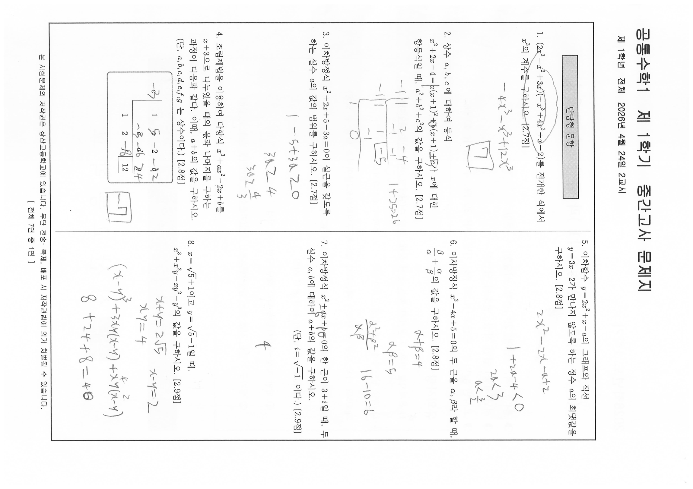
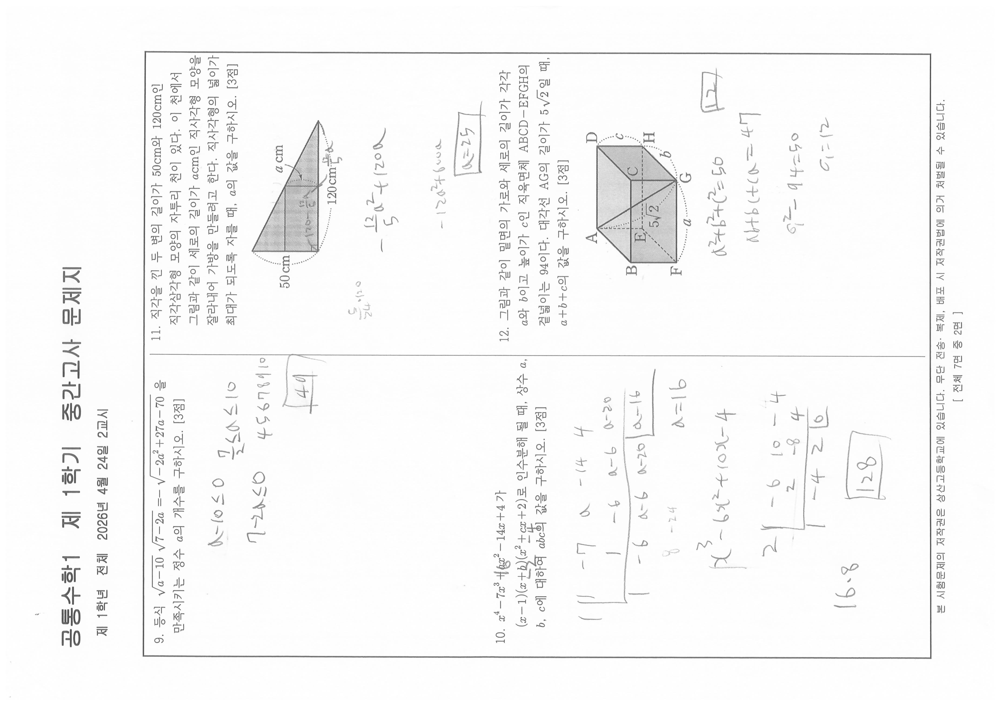

# EX-math1-20261M — 1학년 1학기 공통수학1 중간고사 문제지 (2026학년도)

- 원본: `origin_data/EX-math1-20261M/1학년1학기_공통수학1_중간.pdf` (3,814,686 B / sha256[:16] `624dc273be1161f2` / 8쪽 / 텍스트 레이어 0)
- variant: `student` — 학생 응시본. 다수 문항 여백에 연필 풀이·답 기입이 관측된다.
  **본 전사는 인쇄 문면만을 대상으로 한다.** 학생 필기(풀이 과정, 답 기입, 문면 위 덧쓰기)는
  전사하지 않으며, 필기 유무만 factual하게 언급한다. 인쇄인지 필기인지 식별 불가능한 경우는
  추측하지 않고 `verify_log.tsv`에 `unreadable` 행으로 남긴다.
- 렌더: PyMuPDF dpi=160, 전 8쪽 → `corpus/_images/EX-math1-20261M/p01.png`~`p08.png`
  (**분모 기준본, 회전 미보정**). 판독은 임베드 원본(4299×3035 jpeg, 계산 실효 dpi=300)을
  쪽별 실측 회전각으로 정립한 `corpus/_images/EX-math1-20261M/native/p01.png`~`p08.png`로 수행했다.
- **수식 표기**: 원본이 스캔본(텍스트 레이어 0)이므로 HWP 수식 레코드(`⟦EQD:…⟧`)가 존재하지 않는다.
  판독한 수식은 유니코드 수학 기호로 옮겨 적었고, 지수·첨자·분수는 각각 `x^2`·`a_1`·`β/α` 형태로 표기했다.
  계수·부호·단위는 원문 그대로 보존한다.
- **도표·표 문항**: 조립제법 표 등 도형·표가 포함된 문항은 이미지 링크를 함께 싣는다.
- **분류 판단 없음** — 유형ID·변형축·함정·Tier는 이 문서에 한 글자도 기재하지 않았다
  (1차 정제 = 전사만, CLAUDE.md 원칙 1).

## 인쇄 선언 (p01 = PDF 물리쪽 1번째, 표지, 원문 그대로)

```
2026학년도 1학기

    ( 1 )학년  ( 공통수학1 )과 중간고사 문제지

◑ 총( 7 )쪽, 단답형( 20 )문항, 서술형( 4 )문항
◑ 서답(서술) 답안 작성: 별도의 답안지
◑ 고사반영 비율: 중간고사( 30 )%, 기말고사( 30 )%, 수행평가( 40 )%

유의사항
1) 문제지를 받은 후 문제지 쪽수, 인쇄 상태, 문항 수(단답형, 서술형)를 확인하시오.
2) 해당 답안지에 학번, 이름, (교과명)을 쓰고 정확히 표기하시오.
3) OMR 카드 작성 시 카드가 훼손되지 않도록 주의하시오.(불이익을 받을 수 있음)
4) 문항에 따라 배점이 다르니, 각 물음의 끝에 표시된 배점을 참고하시오.
5) 서답형(서술형) 답안지 작성 관련 사항
   ① 답안 작성 지시사항에 따라 해당 답안지에 작성
   ② 필기구 : 연필, 샤프 또는 검정색펜으로만 작성(미준수 시 불이익을 받을 수 있음)

※ 시험이 시작되기 전까지 표지를 넘기지 마시오.

상 산 고 등 학 교
```

표지 관측 사실 — 같은 학년 타 과목본과 다른 점:
- 문항 갈래가 **단답형 20 + 서술형 4** 이고 5지선다(선택형)가 **없다**. 배점 표기는 문항 끝 `[N.N점]` 형식이다.
- 유의사항 5)-② 필기구가 **"연필, 샤프 또는 검정색펜"** 이다(영어본은 "검정색과 청색 펜").

## 지면 구조 (실측)

- 물리쪽 = 인쇄쪽 순서 일치: `p01` = 표지, `p02` = 인쇄 1면 … `p08` = 인쇄 7면.
- 본문 머리말: `공통수학1  제 1학기  중간고사 문제지` / `제 1학년 전체  2026년 4월 24일 2교시`
- 본문 꼬리말: `본 시험문제의 저작권은 상산고등학교에 있습니다. 무단 전송·복제, 배포 시 저작권법에 의거 처벌될 수 있습니다.` / `[ 전체 7면 중 N면 ]`
- 본문은 2열 조판이며, 각 면 좌단 → 우단 순으로 문항이 배열된다.
- p02 좌단 상단에 갈래 표시 박스 `단답형 문항` 이 1회 인쇄되어 있다.

## 단답형 문항

### 1. [2.7점] — 완결 (p02, 인쇄 1면 좌단)
(2x^3 − x^2 + 3x)(−x^3 + 4x^2 + x − 2)를 전개한 식에서 x^3의 계수를 구하시오.

> 문제 위에 동그라미 필기, 아래 여백에 `−4x^3 − x^3 + 12x^3` 및 답 `7` 필기 — 응시본 필기.

### 2. [2.7점] — 완결 (p02, 인쇄 1면 좌단)
상수 a, b, c 에 대하여 등식
x^2 + 2x − 4 = a(x+1)^2 + b(x+1) + c
가 x에 대한 항등식일 때, a^2 + b^2 + c^2의 값을 구하시오.

> 아래 여백에 조립제법 필기와 `1+25=26` 필기 — 응시본 필기.

### 3. [2.7점] — 완결 (p02, 인쇄 1면 좌단)
이차방정식 x^2 + 2x + 5 − 3a = 0이 실근을 갖도록 하는 실수 a의 값의 범위를 구하시오.

> 아래 여백에 `1 − 5 + 3a ≥ 0`, `3a ≥ 4`, `a ≥ 4/3` 필기 — 응시본 필기.

### 4. [2.8점] — 완결 (p02, 인쇄 1면 좌단)
조립제법을 이용하여 다항식 x^3 + ax^2 − 2x + b를 x + 3으로 나누었을 때의 몫과 나머지를 구하는
과정이 다음과 같다. 이때, a + b의 값을 구하시오. (단, a, b, c, d, e, f, g 는 상수이다.)

**조립제법 표** (인쇄 문면 그대로 — 이미지 병치)


```
 −e │  1    a   −2    b
    │      −c   −d    g
    ─────────────────────
       1    2   −f │  12
```

> 표의 인쇄 문자는 위와 같고, 그 위에 학생이 `−3`(−e 자리)·`5`(a 자리)·`2`(b 자리)·`−3`(−c 자리)·
> `6`(−d 자리)·`24`(g 자리)·`6`(−f 자리)를 덧쓴 필기가 있다 — 응시본 필기. 인쇄 문자와 필기는
> 활자/필체로 구분 가능하며 겹친 칸도 인쇄 문자가 판독된다.
> 우측 여백에 답 `−7` 필기 — 응시본 필기.

### 5. [2.8점] — 완결 (p02, 인쇄 1면 우단)
이차함수 y = 2x^2 + x − a의 그래프와 직선 y = 3x − 2가 만나지 않도록 하는 정수 a의 최댓값을 구하시오.

> 아래 여백에 `2x^2 − 2x − a + 2`, `1 + 2a − 4 < 0`, `2a < 3`, `a < 3/2` 필기 — 응시본 필기.

### 6. [2.8점] — 완결 (p02, 인쇄 1면 우단)
이차방정식 x^2 − 4x + 5 = 0의 두 근을 α, β라 할 때, β/α + α/β의 값을 구하시오.

> 아래 여백에 `α+β=4`, `αβ=5`, `(α^2+β^2)/(αβ)`, `16−10=6` 필기 — 응시본 필기.

### 7. [2.9점] — 완결 (p02, 인쇄 1면 우단)
이차방정식 x^2 + ax + b = 0의 한 근이 3 + i일 때, 두 실수 a, b에 대하여 a + b의 값을 구하시오.
(단, i = √(−1) 이다.)

> 발문 첫 줄의 `ax`·`b` 위에 `6`·`10` 덧쓰기 필기, 아래 여백에 답 `4` 필기 — 응시본 필기.

### 8. [2.9점] — 완결 (p02, 인쇄 1면 우단)
x = √5 + 1이고 y = √5 − 1일 때, x^3 + x^2 y − x y^2 − y^3의 값을 구하시오.

> 아래 여백에 `x+y=2√5`, `xy=4`, `x−y=2`, `(x−y)^3 + 3xy(x−y) + xy(x−y)`, `8+24+8=40` 필기 — 응시본 필기.

### 9. [3점] — 완결 (p03, 인쇄 2면 좌단)
등식 √(a−10) · √(7−2a) = −√(−2a^2 + 27a − 70) 을 만족시키는 정수 a의 개수를 구하시오.

> 배점 표기가 `[3점]`으로 정수다(1~8번은 `[2.7점]`~`[2.9점]` 소수 표기).
> 아래 여백에 `a−10 ≤ 0`, `7−2a ≤ 0`, `7/2 ≤ a ≤ 10`, `4 5 6 7 8 9 10`, 답 `4개`(취소선 있음) 필기 — 응시본 필기.

### 10. [3점] — 완결 (p03, 인쇄 2면 좌단)
x^4 − 7x^3 + ax^2 − 14x + 4 가 (x−1)(x+b)(x^2 + cx + 2)로 인수분해 될 때, 상수 a, b, c에 대하여 abc의 값을 구하시오.

> 발문의 `a`·`b`·`c` 위에 각각 `16`·`−2`·`−4` 덧쓰기 필기, 아래 여백에 조립제법 2회와 `a=16`,
> `x^3 − 6x^2 + 10x − 4`, `16·8`, 답 `128` 필기 — 응시본 필기.

### 11. [3점] — 완결 (p03, 인쇄 2면 우단)
직각을 낀 두 변의 길이가 50 cm와 120 cm인 직각삼각형 모양의 자투리 천이 있다. 이 천에서
그림과 같이 세로의 길이가 a cm인 직사각형 모양을 잘라내어 가방을 만들려고 한다.
직사각형의 넓이가 최대가 되도록 자를 때, a의 값을 구하시오.

**그림** (인쇄 문면 그대로 — 이미지 병치)


- 도형: 직각삼각형 내부에 직사각형(음영)이 왼쪽 직각변에 붙어 그려져 있다.
- 인쇄된 치수 라벨: 왼쪽 세로변 `50 cm`, 아래 가로변 `120 cm`, 직사각형 오른쪽 세로변에 지시선으로 `a cm`.

> 그림 위에 `120 − 12/5 a` 필기, 아래 여백에 `5/24 · 120`, `−(12/5)a^2 + 120a`, `−12a^2 + 600a`,
> 답 `a=25` 필기 — 응시본 필기.

### 12. [3점] — 완결 (p03, 인쇄 2면 우단)
그림과 같이 밑면의 가로와 세로의 길이가 각각 a와 b이고 높이가 c인 직육면체 ABCD−EFGH의
겉넓이는 94이다. 대각선 AG의 길이가 5√2일 때, a + b + c의 값을 구하시오.

**그림** (인쇄 문면 그대로 — 이미지 병치)


- 도형: 직육면체 투시도. 꼭짓점 라벨은 윗면 `A`(좌후)·`D`(우후)·`B`(좌전)·`C`(우전),
  아랫면 `E`(좌후)·`H`(우후)·`F`(좌전)·`G`(우전) 순으로 인쇄되어 있다.
- 인쇄된 치수 라벨: 아래 가로 `a`, 오른쪽 안쪽 `b`, 오른쪽 세로 `c`, 내부 대각선 `5√2`.
- 내부에 대각선 A–G가 실선으로, 숨은 모서리는 점선으로 그려져 있다.

> 아래 여백에 `a^2+b^2+c^2=50`, `ab+bc+ca=47`, `9^2 − 94 = 50`(원문 필기 그대로), `a=12`,
> 답 `12` 필기 — 응시본 필기.

### 13. [3.1점] — 완결 (p04, 인쇄 3면 좌단)
이차함수 y = ax^2 + bx + c의 그래프가 두 점 (−1, 12), (3, 4)를 지나고 x = 2에서 최솟값 k를
가질 때, a + b + c + k의 값을 구하시오. (단, a, b, c는 상수이다.)

> 지면 상단(테두리 밖) 여백에 `a>0` 필기, 발문의 `k` 위에 `3` 덧쓰기 필기.
> 아래 여백에 `a−b+c=12`, `9a+3b+c=4`, `−b/(2a)=2`, `b=−4a`, `8a+4b=−8`, `2a+b=−2`,
> `a=1 b=−4 c=7`, `x^2−4x+7`, `4−8+7=3`, 답 `7` 필기 — 응시본 필기.

### 14. [3.1점] — 완결 (p04, 인쇄 3면 좌단)
삼차다항식 f(x)가 다음 조건을 만족시킨다.

```
(가) f(2) = 3
(나) f(x)를 (x−2)^2으로 나눈 몫과 나머지가 같다.
```

다항식 f(x)를 (x−2)^3으로 나눈 나머지를 R(x)라 하자. R(0) = R(3)일 때, R(5)의 값을 구하시오.

> 조건 (가)(나)는 테두리 박스 안에 인쇄되어 있다.
> 아래 여백에 `f(x) = (x−2)^2(ax+b) + ax+b`, `a(x−2)^3 + (x−2)^2(2a+b) + ax+b`,
> `8a+4b+b = 5a+2b`, `3a+3b=0`, `2a+b=3`, `b=−3`, `a=3`, `R(x)=(x−2)^2(6−3)+3x−3`,
> `9·3+12`, `27+12`, 답 `39` 필기 — 응시본 필기.

### 15. [3.15점] — 완결 (p04, 인쇄 3면 우단)
세 실수 x, y, z가 다음 조건을 만족시킨다.

```
(가) x, y, 2z 중에서 적어도 하나는 3이다.
(나) 3(x + y + 2z) = xy + 2yz + 2zx + 5
```

10xyz의 값을 구하시오.

> 조건 (가)(나)는 테두리 박스 안에 인쇄되어 있다. 배점 표기가 `[3.15점]`으로 소수 둘째 자리까지다.
> 조건 (가)의 `2z` 위에 사선 필기, 발문 옆에 `10z=15`, 아래 여백에 `3x+3y+9 = xy+3y+3x+5`,
> `4 = xy`, `60`, `(12=)xyz` 필기 — 응시본 필기.

### 16. [3.17점] — 완결 (p04, 인쇄 3면 우단)
실수 a에 대하여 복소수 z를
z = a^2(1 − i) − a(6 − i) + 8 + 2i
라 하자. z^4이 음의 실수일 때, a의 값을 구하시오. (단, i = √(−1) 이다.)

> 배점 표기가 `[3.17점]`으로 소수 둘째 자리까지다.
> 아래 여백에 `z^2 = bi`, `z = a+bi`, `a^2+2abi−b^2`, `a^2−b^2=0`,
> `(a^2−6a+8) + (−a^2+a+2)i`, `(−5a+10)(2a^2−7a+6)=0`, `2a^2−7a+6=0`, `(7±√1)/4`,
> `8/4`, `6/4 = 3/2`, 답 `3/2` 필기 — 응시본 필기.

### 17. [3.2점] — 완결 (p05, 인쇄 4면 좌단)
세 변의 길이가 a, b, c인 삼각형 ABC가 다음 조건을 만족시킨다.

```
(가) 등식  a^3 + 2ba^2 + (b^2 − c^2)a + 2b^3 − 2bc^2 = 0  이 성립한다.
(나) 삼각형 ABC의 넓이는 2√3 이다.
```

a^2 + b^2 + c^2 = 32 일 때, |a^2 − b^2| + c^2의 값을 구하시오.

> 조건 (가)(나)는 테두리 박스 안에 인쇄되어 있다. 배점 표기 `[3.2점]`은 발문 다음 줄 오른쪽 끝에 인쇄되어 있다.
> 조건 (가)의 `2bc^2`에 밑줄과 `ab^2 − ac^2` 필기. 아래 여백에 `2c^2=32`, `|4−12|+16`,
> `c^2(−2b−a) + a^3 + 2ba^2 + ab^2 + 2b^3`, `a^2(a+2b) + b^2(a+2b)`, `(a+2b)(a^2+b^2−c^2)`,
> `12+4+16`, 삼각형 스케치와 `c=4`, `a^2+b^2=16`, `ab=4√3`, `(a+b)^2 − 8√3 = 16`, `16+8√3`,
> `(2+2√3)^2`, 답 `24` 필기 — 응시본 필기.

### 18. [3.23점] — 완결 (p05, 인쇄 4면 우단)
최고차항의 계수의 절댓값이 1인 이차함수 f(x)가 다음 조건을 만족시킨다.

```
(가) 이차함수 f(x)의 꼭짓점의 x좌표는 정수이다.
(나) −1 ≤ x < 2에서 함수 f(x)는 최댓값을 가진다.
(다) −2 ≤ x < 1에서 함수 f(x)의 최솟값은 −6이고, 최댓값은 가지지 않는다.
```

0 ≤ x ≤ 3에서 함수 f(x)의 최댓값을 M, 최솟값을 m이라 할 때, M^2 + m^2의 값을 구하시오.

> 조건 (가)(나)(다)는 테두리 박스 안에 인쇄되어 있다. 배점 표기가 `[3.23점]`으로 소수 둘째 자리까지다.
> 아래 여백에 포물선 스케치 2개와 수직선 스케치, `−x^2 + b`, `−1+b=−1`, `−2a+b=−2`, `b=2a−2`,
> `−x^2 + ax + 2a − 2`, `M = 2a−2`, `5a−1`, `−9−2=−11`, `x^2−2`(동그라미), `121+4`, `125` 필기 — 응시본 필기.

### 19. [3.34점] — 완결 (p06, 인쇄 5면 좌단)
두 복소수 z, w가 다음 조건을 만족시킨다.

```
(가) z ≠ z̄ ,  z^2 = 2z̄
(나) w^2 + w̄^2 = 0
(다) z w̄ + z̄ w = 2
```

w + w̄ = 2k일 때, 양수 k의 값을 구하시오. (단, z̄, w̄는 각각 z, w의 켤레복소수이다.)

> 조건 (가)(나)(다)는 테두리 박스 안에 인쇄되어 있다. 배점 표기가 `[3.34점]`으로 소수 둘째 자리까지다.
> 조건 (다)의 `z w̄`·`z̄ w`에 동그라미 필기. 박스 안 여백과 아래 여백에
> `−b^2 = −2bi`, `b=2`, `a^2 − b^2 + 2abi = 2a − 2bi`, `1−b^2 = −2`, `a=−1`, `b^2=3`, `b=±√3`,
> `(−1+√3 i)`, `(−1−√3 i)`(동그라미), `w=k+di`, `w̄=k−di`, `k^2 − d^2 = 0`,
> `k^2 = (k^2−2k+1)/3`, `2k^2+2k−1`, `k+√3 d = 1`, `d=(1−k)/√3`, `(−1±√3)/2`,
> 답 `(−1+√3)/2` 필기 — 응시본 필기.

### 20. [3.41점] — 완결 (p06, 인쇄 5면 우단)
최고차항의 계수가 1인 이차함수 y = f(x)의 그래프와 직선 y = kx + 1이 서로 다른 두 점에서
만난다. 이 두 점의 x좌표를 각각 α, β (0 < α < β)라 할 때, 함수 y = f(x)는 다음 조건을 만족시킨다.

```
(가) f(α + β/3 + 1) = k × (α + β/3 + 1) + 1
(나) f(α − 4) = f(β)
```

αβ = 11k + 1일 때, β − α 의 값을 구하시오. (단, k는 상수이다.)

> 조건 (가)(나)는 테두리 박스 안에 인쇄되어 있다. 배점 표기가 `[3.41점]`으로 소수 둘째 자리까지다.
> 발문 첫 줄 위 여백에 `x^2 + ax + b` 필기, 조건 (가)의 분수 위에 `×` 표시,
> 마지막 줄 `β − α 의 값을` 다음에 인쇄된 어구 위에 취소선 필기가 겹쳐 있으나 인쇄 문면은
> `구하시오.`로 판독된다 — 응시본 필기.

## 서술형 문항

> p07 좌단 상단에 갈래 표시 박스 `서술형 문항` 이 1회 인쇄되어 있다.
> 각 문항 머리 `[서술형N]` 은 인쇄 문면 그대로다(단답형처럼 `N.` 번호를 쓰지 않는다).

### [서술형1] [10점] — 완결 (p07, 인쇄 6면 좌단)
1 ≤ x ≤ 5일 때, 이차함수 y = x^2 − 4x + 1의 최댓값과 최솟값을 구하는 풀이과정과 답을 쓰시오.

> 아래 여백에 포물선 스케치(`1`·`2`·`5` 눈금 표시)와 `−2`, `6` 필기 — 응시본 필기.

### [서술형2] [10점] — 완결 (p07, 인쇄 6면 우단)
이차함수 f(x) = x^2 − 2x + 3의 그래프와 직선 g(x) = 2x + k가 서로 다른 두 점에서 만나도록 하는
실수 k의 값의 범위를 구하는 풀이과정과 답을 쓰시오.

> 아래 여백에 `x^2 − 4x + 3 − k`, `16 − 12k + 4k > 0`, `16 − 12 + 4k`, `4 − 3 + k > 0`,
> `16 − 12 + 4k > 0`, `8 > −4k`, `16 − 3 + k`, `4 + 4k > 0` 필기 — 응시본 필기.

### [서술형3] [10점] — 완결 (p08, 인쇄 7면 좌단)
다항식 f(x)를 x^2 + x로 나누었을 때의 몫은 Q₁(x), 나머지는 x + 3이고, x^2 + x − 2로 나누었을 때의
몫은 Q₂(x), 나머지는 3x + 1이다. f(x)를 x^2 + 2x로 나누었을 때의 나머지를 R(x)라 할 때,
R(1)의 값을 구하는 풀이과정과 답을 쓰시오.

> 답안 여백에 필기 없음.

### [서술형4] [10점] — 완결 (p08, 인쇄 7면 우단)
이차방정식 ax^2 + bx + c = 0에서 b를 잘못 보고 풀었더니 두 근이 18과 1/5 이 되었고,
c를 잘못 보고 풀었더니 두 근이 8과 7/5 가 되었다. (−b + c)/a 의 값을 구하는 풀이과정과 답을 쓰시오.

> 답안 여백에 필기 없음.

## 판독 상태 총괄

- 단답형 합계 60.0점 (실측 자체 열거: 2.7+2.7+2.7+2.8+2.8+2.8+2.9+2.9+3+3+3+3+3.1+3.1+3.15+3.17+3.2+3.23+3.34+3.41 = 60.00)
- 서술형 합계 40.0점 (실측 자체 열거: 10+10+10+10 = 40.0)
- 단답형 60.0 + 서술형 40.0 = 100.0
- 문항 수: 단답형 20 + 서술형 4 = 24. 표지 인쇄 선언 「단답형( 20 )문항, 서술형( 4 )문항」과 차 0
- 판독 실패: `unreadable` 0건. 절단·미발견 0건
- **선택형(5지선다) 0문항** — 표지 선언·문면 모두 5지선다가 없다(CLAUDE.md 페르소나 절의 "수학은 서답형 100%"와 일치하는 관측).
- 배점 표기 정밀도가 문항마다 다르다: 정수(`[3점]`·`[10점]`), 소수 첫째(`[2.7점]`~`[3.2점]`), 소수 둘째(`[3.15점]`·`[3.17점]`·`[3.23점]`·`[3.34점]`·`[3.41점]`). 인쇄 문면 그대로 옮겼다.
- 도표·그림 포함 문항: 4번(조립제법 표), 11번(직각삼각형 내부 직사각형), 12번(직육면체 투시도) — 3건 모두 이미지 링크 병치
- 최하단 종료 표기: `수고하였습니다.` (p08 우단 하단)
- 꼬리말: 전 본문 쪽에 `[ 전체 7면 중 N면 ]` 인쇄, 그 위에 `본 시험문제의 저작권은 상산고등학교에 있습니다. 무단 전송·복제, 배포 시 저작권법에 의거 처벌될 수 있습니다.`
