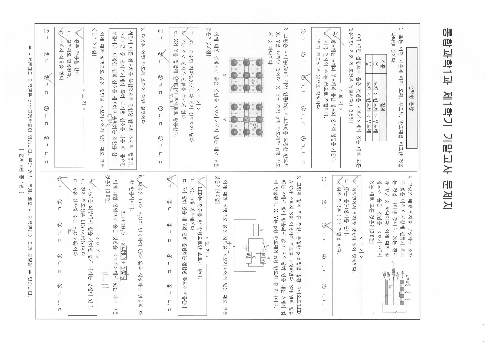
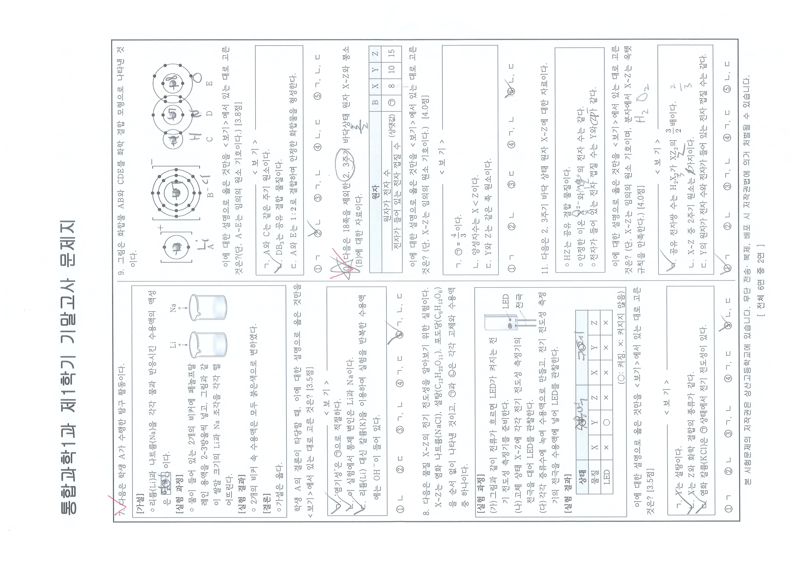
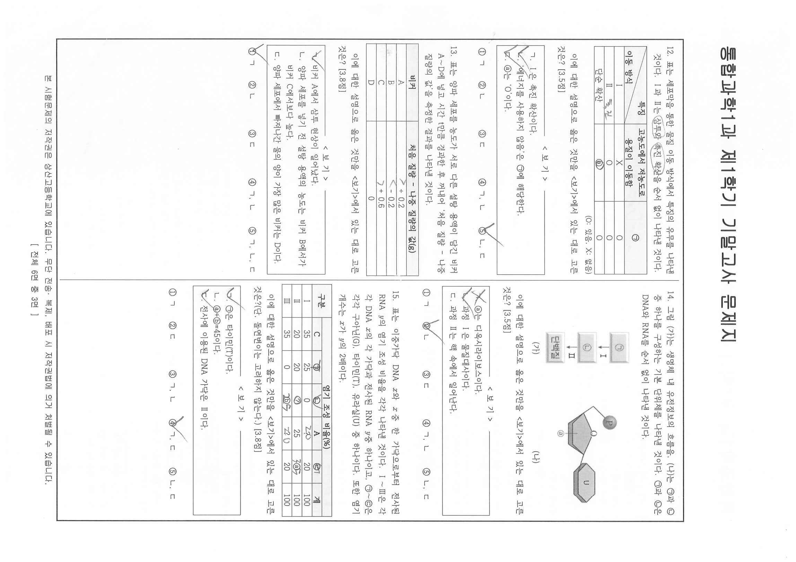
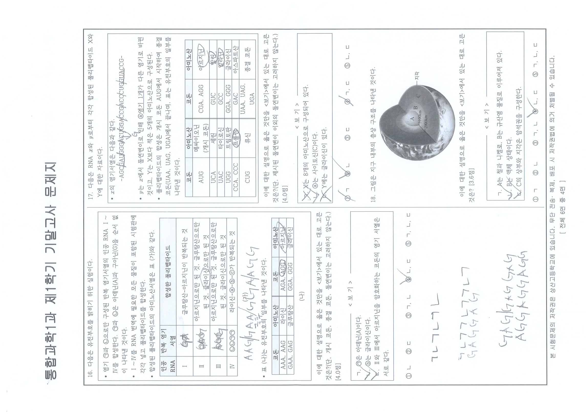
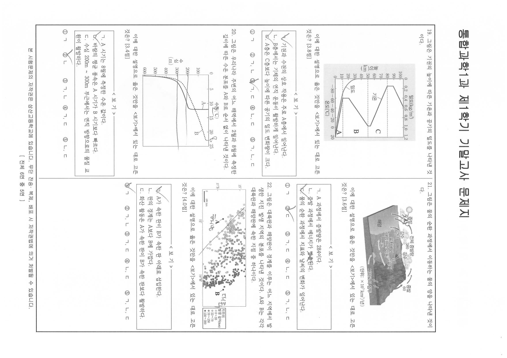
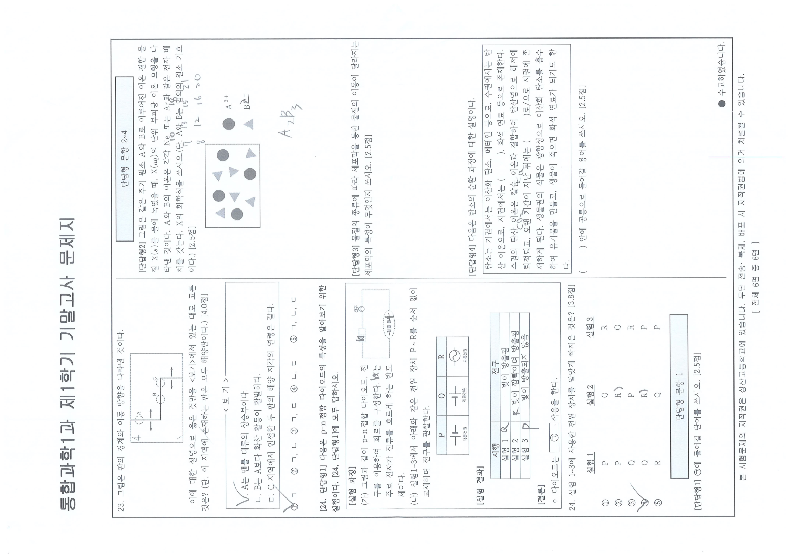

# EX-science-20261F — 2026학년도 1학기 통합과학1 기말고사 문제지 (전사본)

> **1차 정제(REFINE) 산출물 — 전사만.** 유형ID·변형축·함정·Tier는 한 글자도 적지 않는다
> (CLAUDE.md 원칙 1). 분류는 PROPOSE 단계(`type-proposer`)에서 이 문서를 다시 읽어 수행한다.
> **원칙 13 적용(260910)**: 발문의 요구 행동·자극 제시 방식·수식과 식의 구조·선택지 구조·
> 자료 공유 구조·배점대는 확대 판독으로 반드시 복원했고, 개별 수치 한 칸이 판독 불가·인쇄
> 공란인 경우는 그 칸만 관측 행으로 남기고 진행했다(값의 진위 판단은 하지 않는다).

## 원본·렌더 정보

- 원본: `origin_data/EX-science-20261F/1학년1학기_통합과학1_기말.pdf`
  (5,254,867 B / sha256[:16] `368421f6f49ce7fc` / 8쪽 / **텍스트 레이어 0 — 전 쪽**)
- 분모 기준본: `corpus/_images/EX-science-20261F/pNN.png` — PyMuPDF dpi160, **회전 미보정**
- 판독본: `corpus/_images/EX-science-20261F/native/pNN.png` — 임베드 원본(4299×3035 jpeg,
  `rect` 1033.4×729.6 ⇒ 실효 dpi `round(4299×72/1033.4)` = **300**)을 쪽별 실측 회전각으로 정립
- 회전각 실측(유닛별 판정, 전사 착수 전 8쪽 전부): p01 −90° / p02 +90° / p03 −90° / p04 +90° /
  p05 −90° / p06 +90° / p07 −90° / p08 +90°. **전 쪽 홀 −90 / 짝 +90 교대이며 예외가 없다.**
  `page.rotation` 메타데이터는 전 쪽 0을 보고하며 내용 회전과 불일치한다.
- 물리쪽↔인쇄면(꼬리말 `[ 전체 6면 중 N면 ]` 실측): p01=표지(꼬리말 없음), p02=1면, p03=2면,
  p04=3면, p05=4면, p06=5면, p07=6면, **p08=백면(인쇄 없음)** — **정순**이다.
- **p08은 실측 공백 페이지다**: 정립 native 그레이스케일 mean=254.8 · stddev=0.5 · min=71
  (인쇄 있는 다른 7쪽은 stddev 22.3~37.6 · min 0~21). 표지 선언 `총 6쪽`과 정합한다
  (물리 8쪽 = 표지 1 + 인쇄면 6 + 백면 1).
- 판독 방법: 정립 native를 4분할(가로 54% × 세로 55%, 0.846배 리사이즈 ⇒ 2단 조판 기준 약 2배
  확대)해 사분면별로 읽고, 필기가 인쇄 활자를 덮은 자리는 3배 국소 확대로 복원했다.
- 응시본 구분: **학생 응시본**(선택지 번호 필기·단답형 답안란 손글씨 관측). 필기는 전사 대상이
  아니며, 인쇄 활자를 가린 경우에만 확대로 인쇄면을 복원해 적었다.
- 그림·표: 도표·사진·그래프 자극은 문항마다 `` 링크를
  병치하고, 축·라벨·기호를 말로 기술했다.
- **분류 판단 없음**: 유형ID·변형축·함정·Tier 미기재(원칙 1).

---

## 표지 (p01, 꼬리말 없음)

```
2026학년도 1학기

    ( 1 )학년  (  통합과학1  )과 기말고사 문제지


◑ 총( 6 )쪽, 선택형 24문항, 단답형 4문항
◑ 단답 답안 작성 : OMR 카드 뒷면
◑ 고사반영 비율 : 중간고사 30%, 기말고사 30%,  수행평가 40%

┌────────────────────────────────────────────────────────────┐
│ 유의사항                                                    │
│                                                            │
│ 1) 문제지를 받은 후 문제지 쪽수, 인쇄 상태, 문항 수(선택형, 서답형)를 확인하시오. │
│                                                            │
│ 2) 해당 답안지에 학번, 이름, (교과명)을 쓰고 정확히 표기하시오.              │
│                                                            │
│ 3) OMR 카드 작성 시 카드가 훼손되지 않도록 주의하시오.(불이익을 받을 수 있음)   │
│                                                            │
│ 4) 문항에 따라 배점이 다르니, 각 물음의 끝에 표시된 배점을 참고하시오.         │
│                                                            │
│ 5) 단답형 답안지 작성 관련 사항                                   │
│                                                            │
│    ① 답안 작성 지시사항에 따라 해당 답안지에 작성                      │
│                                                            │
│    ② 필기구 : 검정색과 청색 펜으로만 작성(미준수 시 불이익을 받을 수 있음)     │
└────────────────────────────────────────────────────────────┘

▓ ※ 시험이 시작되기 전까지 표지를 넘기지 마시오. ▓

■■ 상 산 고 등 학 교
```

> OBS 표지 대 유의사항 명칭: 표지 첫 줄은 `단답형 4문항` · 셋째 줄은 `단답 답안 작성`,
> 유의사항 5)는 `단답형 답안지 작성 관련 사항`인데 유의사항 1)만 `문항 수(선택형, 서답형)`로
> 적혀 있다. 본문에 서술형 절은 없다. 명칭 불일치는 판단하지 않고 관측만 기록한다(원칙 1).

---

## 각 인쇄면 공통 머리말·꼬리말

```
통합과학1과 제1학기 기말고사 문제지            (머리말, 좌상단)

본 시험문제의 저작권은 상산고등학교에 있습니다. 무단 전송·복제, 배포 시 저작권법에 의거
처벌될 수 있습니다.                                          (꼬리말 좌하단)

[ 전체 6면 중 N면 ]                                          (꼬리말 우하단)
```

---

## 선택형 문항

*(인쇄 1면 = p02. 면 머리에 `선택형 문항` 박스 1회 인쇄.)*

### 1.
표는 어떤 기준에 따라 도체, 부도체, 반도체를 비교한 것을 나타낸 것이다.

| 기준 | 결과 |
|---|---|
| ㉠ | 도체 > 반도체 > 부도체 |
| ㉡ | 도체 < 반도체 < 부도체 |

이에 대한 설명으로 옳은 것만을 <보기>에서 있는 대로 고른 것은?(단, 기준 외 조건은 동일하다.) [3.5점]

```
──────────────── < 보 기 > ────────────────
ㄱ. 반도체는 도체와 부도체의 중간 정도의 전기적 성질을 가진다.
ㄴ. '자유 전자의 수'는 ㉠으로 적절하다.
ㄷ. '전기 전도성'은 ㉡으로 적절하다.
```

① ㄱ　② ㄷ　③ ㄱ, ㄴ　④ ㄴ, ㄷ　⑤ ㄱ, ㄴ, ㄷ

### 2.
그림은 저마늄(Ge)에 각각 인듐(In), 비소(As)를 도핑한 반도체 X, Y를 나타낸 것이다.
X, Y는 각각 p형 반도체와 n형 반도체 중 하나이다.



> 자극: 격자 모형 2개 병치. 왼쪽(X) — `Ge` 원자 격자에 중심 원자 `In` 1개, 그 오른쪽 위에
> `양공` 라벨과 지시선. 오른쪽(Y) — 같은 `Ge` 격자에 중심 원자 `As` 1개, 그 오른쪽 위에
> `전자` 라벨과 지시선. 각 모형 아래에 `X`, `Y` 캡션.

이에 대한 설명으로 옳은 것만을 <보기>에서 있는 대로 고른 것은? [3.8점]

```
──────────────── < 보 기 > ────────────────
ㄱ. X는 순수한 저마늄(Ge)보다 전기 전도도가 낮다.
ㄴ. Y는 주로 전자가 전류를 흐르게 한다.
ㄷ. X와 Y를 접합해 안테나의 주재료로 활용한다.
```

① ㄱ　② ㄴ　③ ㄱ, ㄷ　④ ㄴ, ㄷ　⑤ ㄱ, ㄴ, ㄷ

### 3.
다음은 어떤 반도체 소자에 대한 설명이다.

```
성질이 다른 반도체를 복합적으로 결합한 반도체 소자로, 컴퓨터, 스마트폰 등 전자기기에서
특히 디지털 신호를 다룰 때 중요한 부품이다. 다양한 입력 신호를 제어하고 출력하는 역할을 한다.
```

이에 대한 설명으로 옳은 것만을 <보기>에서 있는 대로 고른 것은? [3.5점]

```
──────────────── < 보 기 > ────────────────
ㄱ. 증폭 작용을 한다.
ㄴ. 절연체로 활용된다.
ㄷ. 스위치 작용을 한다.
```

① ㄱ　② ㄴ　③ ㄱ, ㄷ　④ ㄴ, ㄷ　⑤ ㄱ, ㄴ, ㄷ

### 4.
그림은 태양 전지를 구성하는 소자에 빛을 비추어 저항에 전류가 흐르는 것을 나타낸 것이다.
ⓐ는 전자와 양공 중 하나이다. 이에 대한 설명으로 옳은 것만을 <보기>에서 있는 대로 고른 것은? [3.8점]


> 자극: 태양 전지 단면 모형. 위에서 `단색광`이 물결 화살표 3개로 입사. 층 라벨은 위에서
> 아래로 `전극`(빗금 블록 3개) / `n형` / `p-n 접합면` / `p형` / `전극`이며, 접합면에서
> 아래로 향한 화살표 끝에 `ⓐ`가 붙어 있다. 오른쪽 외부 회로에 지그재그 저항 기호.

```
──────────────── < 보 기 > ────────────────
ㄱ. 접합면에서 전자와 양공의 쌍이 형성된다.
ㄴ. ⓐ는 음(−)전기를 띤다.
ㄷ. 위쪽 전극은 (−)극 역할을 한다.
```

① ㄱ　② ㄴ　③ ㄱ, ㄷ　④ ㄴ, ㄷ　⑤ ㄱ, ㄴ, ㄷ

### 5.
그림과 같이 직류 전원, 동일한 p-n 접합 발광 다이오드(LED) A~C와 스위치 S를 이용하여
회로를 구성하였다. S가 열려 있을 때는 A에서 빛이 방출되지 않고, S가 닫혀 있을 때는
A에서 빛이 방출된다. X, Y는 p형 반도체와 n형 반도체 중 하나이다.


> 자극: 폐회로 1개. 왼쪽 가지에 LED `A`(두 칸으로 분할된 사각형, **두 칸 모두 인쇄 라벨 없음**),
> 오른쪽은 두 가지가 병렬 — 위 가지는 스위치 `S`(열린 접점 기호) 다음에 LED `B`, 아래 가지는
> LED `C`. `B`의 **왼쪽 칸에 인쇄 `X`**, 오른쪽 칸은 인쇄 공란. `C`의 **왼쪽 칸에 인쇄 `Y`**,
> 오른쪽 칸은 인쇄 공란. 회로 하단에 전지 기호(긴 극선·짧은 극선).
> 확대 복원: 자동대비 7배(`zoom_p02_item5BC`) — `X`·`Y`는 검정 활자, 그 위에 겹친 `p`·`n`은
> 회색 연필 필기다.

이에 대한 설명으로 옳은 것만을 <보기>에서 있는 대로 고른 것은? [4.0점]

```
──────────────── < 보 기 > ────────────────
ㄱ. LED는 전류를 한 방향으로만 흐르게 한다.
ㄴ. X는 n형 반도체이다.
ㄷ. S가 닫혀 있을 때 Y의 전하 운반체는 접합면 쪽으로 이동한다.
```

① ㄱ　② ㄴ　③ ㄱ, ㄷ　④ ㄴ, ㄷ　⑤ ㄱ, ㄴ, ㄷ

### 6.
다음은 Li과 H₂O이 반응하여 ㉠과 ㉡을 생성하는 반응의 화학 반응식이다.

```
2Li + 2H₂O  →  2[ ㉠ ]  +  [ ㉡ ]
```

이에 대한 설명으로 옳은 것만을 <보기>에서 있는 대로 고른 것은? [3.8점]

```
──────────────── < 보 기 > ────────────────
ㄱ. Li(s)은 외부에서 힘을 가하면 넓게 퍼지는 성질이 있다.
ㄴ. 전기 전도성은 Li(s) < ㉠(s)이다.
ㄷ. 공유 전자쌍 수는 H₂O > ㉡ 이다.
```

① ㄱ　② ㄴ　③ ㄱ, ㄷ　④ ㄴ, ㄷ　⑤ ㄱ, ㄴ, ㄷ

> OBS 6번 반응식: 두 생성물 자리는 **인쇄 빈 사각형**이고 그 안에 `㉠`·`㉡`만 인쇄돼 있다.
> `㉠` 앞의 계수 `2`는 인쇄, `㉡` 앞에는 인쇄 계수가 없다(4배 확대 `zoom_p02_item6eq`로 확인).
> 사각형 안의 `LiOH`·`H₂` 글자는 회색 연필 필기다.

*(인쇄 2면 = p03.)*

### 7.
다음은 학생 A가 수행한 탐구 활동이다.

```
[가설]
 ○ 리튬(Li)과 나트륨(Na)을 각각 물과 반응시킨 수용액의 액성은 [ ㉠ ] 이다.
[실험 과정]
 ○ 물이 들어 있는 2개의 비커에 페놀프탈레인 용액을 2~3방울씩 넣고, 그림과 같이 쌀알 크기의
   Li과 Na 조각을 각각 떨어뜨린다.
[실험 결과]
 ○ 2개의 비커 속 수용액은 모두 붉은색으로 변하였다.
[결론]
 ○ 가설은 옳다.
```



> 자극: [실험 과정] 오른쪽에 비커 2개 그림. 각 비커 위에 아래를 향한 화살표와 `Li`, `Na` 라벨,
> 비커 안에는 옅은 색 액면이 그려져 있다.

학생 A의 결론이 타당할 때, 이에 대한 설명으로 옳은 것만을 <보기>에서 있는 대로 고른 것은? [3.5점]

```
──────────────── < 보 기 > ────────────────
ㄱ. '염기성'은 ㉠으로 적절하다.
ㄴ. 이 실험에서 통제 변인은 Li과 Na이다.
ㄷ. 리튬(Li) 대신 칼륨(K)을 이용하여 실험을 반복한 수용액에는 OH⁻이 들어 있다.
```

① ㄴ　② ㄷ　③ ㄱ, ㄴ　④ ㄱ, ㄷ　⑤ ㄱ, ㄴ, ㄷ

> OBS 7번 선지 구조: 이 문항의 선지는 `① ㄴ / ② ㄷ / ③ ㄱ,ㄴ / ④ ㄱ,ㄷ / ⑤ ㄱ,ㄴ,ㄷ` 로,
> 1~6번의 `① ㄱ / ② ㄴ|ㄷ …` 배열과 다르다(관측만 기록).

### 8.
다음은 물질 X~Z의 전기 전도성을 알아보기 위한 실험이다. X~Z는 염화 나트륨(NaCl),
설탕(C₁₂H₂₂O₁₁), 포도당(C₆H₁₂O₆)을 순서 없이 나타낸 것이고, ㉠과 ㉡은 각각 고체와
수용액 중 하나이다.

```
[실험 과정]
(가) 그림과 같이 전류가 흐르면 LED가 켜지는 전기 전도성 측정기를 준비한다.
(나) 고체 상태 X~Z에 각각 전기 전도성 측정기의 전극을 대어 LED를 관찰한다.
(다) 각각 증류수에 녹여 수용액으로 만들고, 전기 전도성 측정기의 전극을 수용액에 넣어
     LED를 관찰한다.
[실험 결과]
```

| 상태 | ㉠ | ㉠ | ㉠ | ㉡ | ㉡ | ㉡ |
|---|---|---|---|---|---|---|
| **물질** | X | Y | Z | X | Y | Z |
| **LED** | × | ○ | × | × | × | × |

```
(○: 켜짐, ×: 켜지지 않음)
```

> 표 구조 원문: 머리행은 `상태` 1칸 + `㉠` 3칸 병합 + `㉡` 3칸 병합이며, 위 표는 병합 칸을
> 3칸으로 펼쳐 적은 것이다. `㉠`·`㉡`이 인쇄 활자임을 자동대비 3배 확대(`zoom_p03_item8hdr`)로
> 확인했다 — 그 위에 겹친 `수용액`·`고체`는 회색 연필 필기다.


> 자극: [실험 과정] (가) 오른쪽에 전기 전도성 측정기 그림. 세로 직사각형 몸체에 원형 표시
> 2개와 `+`·`−` 표기, 오른쪽에 `LED`·`전극` 라벨과 지시선, 아래로 나란한 다리 2개.

이에 대한 설명으로 옳은 것만을 <보기>에서 있는 대로 고른 것은? [3.5점]

```
──────────────── < 보 기 > ────────────────
ㄱ. Y는 설탕이다.
ㄴ. X는 Z와 화학 결합의 종류가 같다.
ㄷ. 염화 칼륨(KCl)은 ㉠ 상태에서 전기 전도성이 있다.
```

① ㄱ　② ㄴ　③ ㄱ, ㄴ　④ ㄱ, ㄷ　⑤ ㄴ, ㄷ

### 9.
그림은 화합물 AB와 CDE를 화학 결합 모형으로 나타낸 것이다.


> 자극: 보어 모형 3묶음.
> ① `[ A ]⁺` — 전자 껍질 1개, 껍질 위 전자 2개(위·아래). 캡션 `A⁺`.
> ② `[ B ]⁻` — 전자 껍질 3개, 안쪽부터 전자 2개 / 8개 / 8개. 캡션 `B⁻`.
> ③ 원 3개가 좌우로 겹친 분자 모형. 왼쪽 `C`는 껍질 1개, 가운데 `D`는 껍질 2개, 오른쪽 `E`는
>   껍질 2개. **C-D 겹침 자리에 전자 2개(1쌍), D-E 겹침 자리에 전자 4개(2쌍)**, D의 비공유
>   전자 2개(위·아래), E의 비공유 전자 4개. 캡션은 각 원 아래 `C`, `D`, `E`.
> 확대 복원: 자동대비 2.3배(`zoom_p03_item9dia`) + 캡션 5배(`zoom_p03_item9cap`) —
> `A⁺`·`B⁻`의 어깨 기호는 인쇄 활자이고, 원 안의 `Li`·`Cl`·`H`·`N`·`O` 글자는 회색 연필 필기다.

이에 대한 설명으로 옳은 것만을 <보기>에서 있는 대로 고른 것은?(단, A~E는 임의의 원소 기호이다.) [3.8점]

```
──────────────── < 보 기 > ────────────────
ㄱ. A와 C는 같은 주기 원소이다.
ㄴ. DB₃는 공유 결합 물질이다.
ㄷ. A와 E는 1 : 2로 결합하여 안정한 화합물을 형성한다.
```

① ㄱ　② ㄴ　③ ㄱ, ㄴ　④ ㄴ, ㄷ　⑤ ㄱ, ㄴ, ㄷ

### 10.
다음은 18족을 제외한 2, 3주기 바닥상태 원자 X~Z와 붕소(B)에 대한 자료이다.

| 원자 | B | X | Y | Z |
|---|---|---|---|---|
| (원자가 전자 수) / (전자가 들어 있는 전자 껍질 수)　(상댓값) | ㉠ | 8 | 10 | 15 |

> 표 구조 원문: 첫 열은 분수 꼴로 조판돼 있다 — 분자 `원자가 전자 수`, 분모
> `전자가 들어 있는 전자 껍질 수`, 그 오른쪽에 `(상댓값)`.

이에 대한 설명으로 옳은 것만을 <보기>에서 있는 대로 고른 것은? (단, X~Z는 임의의 원소 기호이다.) [4.0점]

```
──────────────── < 보 기 > ────────────────
ㄱ. ㉠ = 4/3 이다.        (원문은 분수 조판: 분자 4, 분모 3)
ㄴ. 양성자수는 X < Z이다.
ㄷ. Y와 Z는 같은 족 원소이다.
```

① ㄱ　② ㄴ　③ ㄷ　④ ㄱ, ㄴ　⑤ ㄴ, ㄷ

### 11.
다음은 2, 3주기 바닥 상태 원자 X~Z에 대한 자료이다.

```
 ○ HZ는 공유 결합 물질이다.
 ○ 안정한 이온 X²⁻와 Y²⁺의 전자 수는 같다.
 ○ 전자가 들어 있는 전자 껍질 수는 Y와 Z가 같다.
```

이에 대한 설명으로 옳은 것만을 <보기>에서 있는 대로 고른 것은? (단, X~Z는 임의의 원소 기호이며,
분자에서 X~Z는 옥텟 규칙을 만족한다.) [4.0점]

```
──────────────── < 보 기 > ────────────────
ㄱ. 공유 전자쌍 수는 H₂X₂가 XZ₂의 3/2배이다.   (원문은 분수 조판: 분자 3, 분모 2)
ㄴ. X~Z 중 2주기 원소는 2가지이다.
ㄷ. Y의 원자가 전자 수와 전자가 들어 있는 전자 껍질 수는 같다.
```

① ㄱ　② ㄴ　③ ㄱ, ㄴ　④ ㄱ, ㄷ　⑤ ㄴ, ㄷ

> 11번 확대 복원: 자료 박스 2·3행과 보기 ㄴ의 인쇄 문자가 연필 필기에 가려 있어 자동대비
> 3배 확대(`zoom_p03_item11box`·`zoom_p03_item11gi`)로 대조했다 — 인쇄는 `X²⁻`·`Y²⁺`·`Y와 Z`·
> `2가지`이고, 겹친 `M`·`12`·`Cl`·사선은 회색 연필 필기다.

*(인쇄 3면 = p04. 좌단은 13번에서 끝나고 아래쪽 약 1/3이 인쇄 여백이다.)*

### 12.
표는 세포막을 통한 물질 이동 방식에서 특징의 유무를 나타낸 것이다. Ⅰ과 Ⅱ는 삼투와 촉진 확산을
순서 없이 나타낸 것이다.

| 특징 \ 이동 방식 | 고농도에서 저농도로 용질이 이동함 | ㉠ |
|---|---|---|
| Ⅰ | X | O |
| Ⅱ | O | O |
| 단순 확산 | ⓐ | O |

```
(O: 있음, X: 없음)
```

> 표 구조 원문: 좌상단 칸이 대각선으로 나뉘어 위쪽에 `특징`, 아래쪽에 `이동 방식`이 인쇄돼 있다.

이에 대한 설명으로 옳은 것만을 <보기>에서 있는 대로 고른 것은? [3.5점]

```
──────────────── < 보 기 > ────────────────
ㄱ. Ⅰ은 촉진 확산이다.
ㄴ. '에너지를 사용하지 않음'은 ㉠에 해당한다.
ㄷ. ⓐ는 'O'이다.
```

① ㄱ　② ㄴ　③ ㄷ　④ ㄱ, ㄴ　⑤ ㄴ, ㄷ

### 13.
표는 양파 세포를 농도가 서로 다른 설탕 용액이 담긴 비커 A~D에 넣고 시간 t만큼 경과한 후
꺼내어 '처음 질량 − 나중 질량의 값'을 측정한 결과를 나타낸 것이다.

| 비커 | 처음 질량 − 나중 질량의 값(g) |
|---|---|
| A | + 0.2 |
| B | − 0.2 |
| C | + 0.6 |
| D | 0 |

이에 대한 설명으로 옳은 것만을 <보기>에서 있는 대로 고른 것은? [3.8점]

```
──────────────── < 보 기 > ────────────────
ㄱ. 비커 A에서 삼투 현상이 일어났다.
ㄴ. 양파 세포를 넣기 전 설탕 용액의 농도는 비커 B에서가 비커 C에서보다 높다.
ㄷ. 양파 세포에서 빠져나간 물의 양이 가장 많은 비커는 D이다.
```

① ㄱ　② ㄴ　③ ㄷ　④ ㄱ, ㄴ　⑤ ㄱ, ㄴ, ㄷ

### 14.
그림 (가)는 생명체 내 유전정보의 흐름을, (나)는 ㉠과 ㉡ 중 하나를 구성하는 기본 단위체를
나타낸 것이다. ㉠과 ㉡은 DNA와 RNA를 순서 없이 나타낸 것이다.



> 자극 (가): 세로 흐름도. `㉠` 상자 → (화살표 옆 라벨 `Ⅰ`) → `㉡` 상자 → (화살표 옆 라벨 `Ⅱ`)
> → `단백질` 상자. 아래 캡션 `(가)`.
> 자극 (나): 뉴클레오타이드 모형. 왼쪽 위에 원형 `P`, 가운데 오각형 당(꼭대기에 `O` 표기,
> 아래쪽에서 지시선으로 `ⓐ` 라벨), 오른쪽에 육각형 염기 `U`. 아래 캡션 `(나)`.

이에 대한 설명으로 옳은 것만을 <보기>에서 있는 대로 고른 것은? [3.5점]

```
──────────────── < 보 기 > ────────────────
ㄱ. ⓐ는 디옥시라이보스이다.
ㄴ. 과정 Ⅰ은 물질대사이다.
ㄷ. 과정 Ⅱ는 핵 속에서 일어난다.
```

① ㄱ　② ㄴ　③ ㄷ　④ ㄱ, ㄴ　⑤ ㄴ, ㄷ

### 15.
표는 이중가닥 DNA *x*와 *x* 중 한 가닥으로부터 전사된 RNA *y*의 염기 조성 비율을 각각
나타낸 것이다. Ⅰ~Ⅲ은 각각 DNA *x*의 각 가닥과 전사된 RNA *y* 중 하나이고, ㉠~㉢은 각각
구아닌(G), 타이민(T), 유라실(U) 중 하나이다. 또한 염기 개수는 *x*가 *y*의 2배이다.

| 구분 | C | ㉠ | ㉡ | A | ㉢ | 계 |
|---|---|---|---|---|---|---|
| Ⅰ | 35 | 25 | 0 | ? | 20 | 100 |
| Ⅱ | 20 | 20 | ? | 25 | ⓐ | 100 |
| Ⅲ | 35 | 0 | ⓑ | ? | 20 | 100 |

> 표 구조 원문: 머리행은 `구분` 1칸 + `염기 조성 비율(%)` 6칸 병합이고, 그 아래 부머리행이
> `C · ㉠ · ㉡ · A · ㉢ · 계`다.
> 확대 복원(자동대비 2.2배 `zoom_p04_item15tbl` + 4배 `zoom_p04_item15cells`): **`?` 3칸
> (Ⅰ의 A · Ⅱ의 ㉡ · Ⅲ의 A)과 `ⓐ`(Ⅱ의 ㉢) · `ⓑ`(Ⅲ의 ㉡)는 모두 검정 인쇄 활자**이고,
> 그 주위에 겹친 `20`·`35`·`25`는 회색 연필 필기다.

이에 대한 설명으로 옳은 것만을 <보기>에서 있는 대로 고른 것은?(단, 돌연변이는 고려하지 않는다.) [3.8점]

```
──────────────── < 보 기 > ────────────────
ㄱ. ㉠은 타이민(T)이다.
ㄴ. ⓐ+ⓑ=45이다.
ㄷ. 전사에 이용된 DNA 가닥은 Ⅱ이다.
```

① ㄱ　② ㄷ　③ ㄱ, ㄴ　④ ㄱ, ㄷ　⑤ ㄴ, ㄷ

*(인쇄 4면 = p05.)*

### 16.
다음은 유전부호를 밝히기 위한 실험이다.

```
• 염기 ㉠과 ㉡으로만 구성된 반복 염기서열의 인공 RNA Ⅰ~Ⅳ를 합성한다. ㉠과 ㉡은
  아데닌(A)과 구아닌(G)을 순서 없이 나타낸 것이다.
• Ⅰ~Ⅳ를 RNA 번역에 필요한 모든 물질이 포함된 시험관에 각각 넣고 폴리펩타이드를 합성한다.
• 합성된 폴리펩타이드의 아미노산서열은 표 (가)와 같다.
```

| 인공 RNA | 반복 염기서열 | 합성한 폴리펩타이드 |
|---|---|---|
| Ⅰ | ㉠㉡ | 글루탐산−아르지닌이 반복되는 것 |
| Ⅱ | ㉠㉡㉠ | 아르지닌으로만 된 것, 글루탐산으로만 된 것, 글라이신으로만 된 것 |
| Ⅲ | ㉡㉠㉠ | 아르지닌으로만 된 것, 글루탐산으로만 된 것, 글라이신으로만 된 것 |
| Ⅳ | ㉡㉡㉠㉠ | 라이신−ⓐ−ⓑ−ⓒ가 반복되는 것 |

```
                                   (가)
```

> 확대 복원(자동대비 4배 `zoom_p05_item16seq`): `반복 염기서열` 칸의 인쇄 활자는 원 안에 든
> `㉠`·`㉡` 기호이며 Ⅰ=2자, Ⅱ=3자, Ⅲ=3자, Ⅳ=4자다. 그 위에 겹친 `GA`·`GAAG`·`AGG` 등
> 알파벳은 회색 연필 필기다.

```
• 표 (나)는 유전부호의 일부를 나타낸 것이다.
```

| 코돈 | 아미노산 | 코돈 | 아미노산 |
|---|---|---|---|
| AAA, AAG | 라이신 | AGA, AGG | 아르지닌 |
| GAA, GAG | 글루탐산 | GGA, GGG | 글라이신 |

```
                                   (나)
```

이에 대한 설명으로 옳은 것만을 <보기>에서 있는 대로 고른 것은?(단, 개시 코돈, 종결 코돈,
돌연변이는 고려하지 않는다.) [4.0점]

```
──────────────── < 보 기 > ────────────────
ㄱ. ㉠은 아데닌(A)이다.
ㄴ. ⓑ는 글라이신이다.
ㄷ. Ⅱ와 Ⅲ에서 아르지닌을 암호화하는 코돈의 염기 서열은 서로 같다.
```

① ㄴ　② ㄷ　③ ㄱ, ㄴ　④ ㄴ, ㄷ　⑤ ㄱ, ㄴ, ㄷ

### 17.
다음은 RNA *x*와 *y*로부터 각각 합성된 폴리펩타이드 X와 Y에 대한 자료이다.

```
• x의 염기서열은 다음과 같다.
        -AGCGAUGGGACUGGACCGACCCUGGUACCG-
• y는 x에서 돌연변이로 인해 ⓐ염기 1개가 다른 염기로 바뀐 것이고, Y는 X보다 적은 5개의
  아미노산으로 구성된다.
• 폴리펩타이드의 합성은 개시 코돈 AUG에서 시작하여 종결 코돈(UAA, UAG, UGA)에서 끝나며,
  표는 유전부호의 일부를 나타낸 것이다.
```

> 원문 조판: `ⓐ염기 1개`의 `염기 1개`에 밑줄이 인쇄돼 있다.
> 확대 복원(자동대비 3배 `zoom_p05_item17seq`): 염기서열 30자는 검정 인쇄 활자이고
> 그 위의 사선·`V`·`G`는 회색 연필 필기다.

| 코돈 | 아미노산 | 코돈 | 아미노산 |
|---|---|---|---|
| AUG | 메싸이오닌 (개시 코돈) | CGA, AGG | 아르지닌 |
| UCA | 세린 | GUC | 발린 |
| UAC | 타이로신 | GCC | 알라닌 |
| UGG | 트립토판 | GGA, GGG | 글라이신 |
| CCA, CCC | 프롤린 | GAC | 아스파트산 |
| CUG | 류신 | UAA, UAG, UGA | 종결 코돈 |

이에 대한 설명으로 옳은 것만을 <보기>에서 있는 대로 고른 것은?(단, 제시된 돌연변이 이외의
돌연변이는 고려하지 않는다.) [4.0점]

```
──────────────── < 보 기 > ────────────────
ㄱ. X는 8개의 아미노산으로 구성되어 있다.
ㄴ. ⓐ는 사이토신(C)이다.
ㄷ. Y에는 글라이신이 있다.
```

① ㄱ　② ㄴ　③ ㄷ　④ ㄱ, ㄷ　⑤ ㄴ, ㄷ

### 18.
그림은 지구 내부의 층상 구조를 나타낸 것이다.



> 자극: 지구 절개 사진(사분면 절단). 안쪽부터 `A`, `B`, `C` 라벨이 붙고 가장 겉면 오른쪽에
> 지시선과 `지각` 라벨. 절단면 왼쪽 아래로 두 개의 깊이 라벨 `5100km`, `2900km`가 지시선과
> 함께 인쇄돼 있다(위가 `5100km`, 아래가 `2900km`).

이에 대한 설명으로 옳은 것만을 <보기>에서 있는 대로 고른 것은? [3.6점]

```
──────────────── < 보 기 > ────────────────
ㄱ. A는 철과 니켈로, B는 규산염 물질로 이루어져 있다.
ㄴ. B는 액체 상태이다.
ㄷ. C의 상부와 지각은 암석권을 구성한다.
```

① ㄱ　② ㄴ　③ ㄱ, ㄴ　④ ㄴ, ㄷ　⑤ ㄱ, ㄴ, ㄷ

*(인쇄 5면 = p06.)*

### 19.
그림은 기권의 높이에 따른 기온과 공기의 밀도를 나타낸 것이다.



> 자극: 이중 축 그래프. 위쪽 가로축 `밀도(kg/m³)` 눈금 `0 0.2 0.4 0.6 0.8 1.0 1.2`,
> 아래쪽 가로축 `온도(℃)` 눈금 `−80 −60 −40 −20 0 20`, 세로축 `높이(km)` 눈금
> `0 10 20 30 40 50 60 70 80 90 100`. 꺾인 실선에 `기온` 라벨, 완만한 곡선에 `밀도` 라벨.
> 오른쪽에 층 라벨 `A`(아래), `B`(가운데), `C`(위)가 붙고, 층 경계는 약 10km·50km·80km
> 높이에 점선으로 표시돼 있다.

이에 대한 설명으로 옳은 것만을 <보기>에서 있는 대로 고른 것은? [3.8점]

```
──────────────── < 보 기 > ────────────────
ㄱ. 기권과 수권의 상호 작용은 주로 A층에서 일어난다.
ㄴ. B층에서는 기체의 연직 운동이 활발하게 일어난다.
ㄷ. A층은 C층보다 높이에 따른 공기의 밀도 변화량이 크다.
```

① ㄱ　② ㄱ, ㄴ　③ ㄱ, ㄷ　④ ㄴ, ㄷ　⑤ ㄱ, ㄴ, ㄷ

### 20.
그림은 우리나라 주변의 어느 해역에서 2월과 8월에 측정한 깊이에 따른 수온 분포를 A와 B로
순서 없이 나타낸 것이다.


> 자극: 그래프. 위쪽 가로축 `수온(℃)` 눈금 `0 5 10 15 20 25`, 세로축 `수심(m)` 눈금
> `0 100 200 300 400 500 600`(아래로 증가). 실선에 `A` 라벨(표층부터 약 200m까지 수온이
> 거의 일정한 수직선 형태), 점선에 `B` 라벨(표층 수온이 25에 가깝고 깊이가 커질수록 급감).
> 두 곡선은 약 300m 이하에서 겹친다.

이에 대한 설명으로 옳은 것만을 <보기>에서 있는 대로 고른 것은? [3.4점]

```
──────────────── < 보 기 > ────────────────
ㄱ. A 시기는 8월에 측정한 수온 값이다.
ㄴ. 바람의 평균 풍속은 A 시기가 B 시기보다 빠르다.
ㄷ. 수심 200m ~ 300m 부근에서는 연직 방향으로의 물질 교환이 활발하다.
```

① ㄱ　② ㄴ　③ ㄱ, ㄴ　④ ㄱ, ㄷ　⑤ ㄴ, ㄷ

### 21.
그림은 물의 순환 과정에서 이동하는 물의 양을 나타낸 것이다.


> 자극: 물의 순환 입체 모형(왼쪽 `해양`, 오른쪽 `육지`). 화살표와 인쇄 라벨·수치는
> `증발`(해양 쪽, 화살표에 `A` 표기) · `전체 증발량 380` · `강수 284`(해양 쪽) ·
> `강수 96`(육지 쪽) · `증발 60`(육지 쪽) · `육지에서 해양으로 이동 36` · `지하로의 침투`
> (수치 없음). 그림 오른쪽 아래에 `(단위: ×10³ km³/년)`.

이에 대한 설명으로 옳은 것만을 <보기>에서 있는 대로 고른 것은? [3.6점]

```
──────────────── < 보 기 > ────────────────
ㄱ. A 과정에서 증발량은 284이다.
ㄴ. 증발 과정에서 에너지가 방출된다.
ㄷ. 물의 순환 과정에서 지표와 날씨의 변화가 일어난다.
```

① ㄱ　② ㄷ　③ ㄱ, ㄷ　④ ㄴ, ㄷ　⑤ ㄱ, ㄴ, ㄷ

### 22.
그림은 대륙판과 해양판이 경계를 이루는 어느 지역에서 발생한 지진 발생 지역의 분포를 나타낸
것이다. A와 B는 각각 대륙판과 해양판에 속한 지점 중 하나이다.


> 자극: 지진 진앙 분포도. 세로축 위도 눈금 `15°`, `17°S`, 가로축 경도 눈금 `75°`, `70°W`,
> 왼쪽 아래에 축척 막대 `0 ─ 100 km`. 지도면 왼쪽에 사선(판 경계선)이 그려져 있고 점 두 개에
> `A`(왼쪽 아래), `B`(오른쪽)가 표기돼 있다. 오른쪽 아래 범례는 `지진의 발생 깊이(km)`이며
> 원 크기·농도별로 `0~33` / `33~70` / `70~150` / `150~300` 4단계다.

이에 대한 설명으로 옳은 것만을 <보기>에서 있는 대로 고른 것은? [4.0점]

```
──────────────── < 보 기 > ────────────────
ㄱ. A가 속한 판이 B가 속한 판 아래로 섭입한다.
ㄴ. 판의 경계는 A보다 B에 가깝다.
ㄷ. 화산 활동은 A가 속한 판이 B가 속한 판보다 활발하다.
```

① ㄱ　② ㄱ, ㄴ　③ ㄱ, ㄷ　④ ㄴ, ㄷ　⑤ ㄱ, ㄴ, ㄷ

*(인쇄 6면 = p07. **선택형 23·24와 단답형 1~4가 같은 인쇄면을 공유**한다 — 좌단에 23번,
`[24, 단답형1]` 공유 자료, 24번, `단답형 문항 1` 전환 박스, 단답형1이 실리고, 우단에
`단답형 문항 2~4` 전환 박스와 단답형2·3·4가 실린다.)*

### 23.
그림은 판의 경계와 이동 방향을 나타낸 것이다.



> 자극: 판 경계 모식도(직사각형 틀). 굵은 실선이 ㄱ자로 두 번 꺾여 있고, 점선 원 3개에
> 각각 `A`(위), `B`(가운데), `C`(오른쪽) 라벨. `A` 아래에 좌우 반대 방향 화살표 한 쌍,
> 오른쪽 아래에도 좌우 반대 방향 화살표 한 쌍이 인쇄돼 있다.

이에 대한 설명으로 옳은 것만을 <보기>에서 있는 대로 고른 것은? (단, 이 지역에 존재하는 판은
모두 해양판이다.) [4.0점]

```
──────────────── < 보 기 > ────────────────
ㄱ. A는 맨틀 대류의 상승부이다.
ㄴ. B는 A보다 화산 활동이 활발하다.
ㄷ. C 지역에서 인접한 두 판의 해양 지각의 연령은 같다.
```

① ㄱ　② ㄱ, ㄴ　③ ㄱ, ㄷ　④ ㄴ, ㄷ　⑤ ㄱ, ㄴ, ㄷ

### [24, 단답형1] 다음은 p-n 접합 다이오드의 특성을 알아보기 위한 실험이다. [24, 단답형1]에 모두 답하시오.

```
[실험 과정]
(가) 그림과 같이 p-n 접합 다이오드, 전구를 이용하여 회로를 구성한다. X는 주로 전자가
     전류를 흐르게 하는 반도체이다.
(나) 실험1~3에서 아래와 같은 전원 장치 P~R를 순서 없이 교체하며 전구를 관찰한다.
```


> 자극 (가): 폐회로 1개. 위쪽 변에 두 칸으로 나뉜 다이오드 기호(**왼쪽 칸에 인쇄 `X`**)와
> 원형 `전구`(지시선·라벨 인쇄), 아래쪽 변에 점선 타원으로 표시된 `전원 장치` 라벨.
> 자극 (나): 3칸 표. 각 칸에 머리 라벨 `P` / `Q` / `R`, 그 아래 기호와 캡션이
> `P` = 전지 기호 · `직류전원`, `Q` = 전지 기호(극선 방향이 P와 반대) · `직류전원`,
> `R` = 원 안 사인파 기호 · `교류전원`.

| 시행 | 전구 |
|---|---|
| 실험 1 | 빛이 방출됨 |
| 실험 2 | 빛이 깜빡이며 방출됨 |
| 실험 3 | 빛이 방출되지 않음 |

```
[결론]
 ○ 다이오드는 [ ㉠ ] 작용을 한다.
```

> 원문 조판: `[실험 결과]` 표는 위 2열 표이며, `[결론]`의 `㉠`은 인쇄 빈 사각형 안에 들어 있다.
> `실험 1`·`실험 2`·`실험 3` 칸 오른쪽에 겹친 `Q`·`R`·`P` 글자는 회색 연필 필기다.

### 24.
실험 1~3에 사용한 전원 장치를 알맞게 짝지은 것은? [3.8점]

```
        실험 1        실험 2        실험 3
  ①       P            Q            R
  ②       P            R            Q
  ③       Q            P            R
  ④       Q            R            P
  ⑤       R            Q            P
```

> OBS 24번 선지 구조: 이 문항만 **3열 짝짓기형**이고, 1~23번의 `<보기>` ㄱㄴㄷ 합답형이
> 아니다(관측만 기록).

## 단답형 문항

*(인쇄면 좌단 중간에 `단답형 문항 1` 박스, 우단 머리에 `단답형 문항 2~4` 박스가 각각 1회
인쇄돼 있다.)*

### [단답형1]
㉠에 들어갈 단어를 쓰시오. [2.5점]

> 자료는 위 `[24, 단답형1]` 공유 발문의 실험 과정·실험 결과·결론이다.

### [단답형2]
그림은 같은 주기 원소 A와 B로 이루어진 이온 결합 물질 X(*s*)를 물에 녹였을 때, X(*aq*)의
단위 부피당 이온 모형을 나타낸 것이다. A와 B의 이온은 각각 Ne 또는 Ar과 같은 전자 배치를
갖는다. X의 화학식을 쓰시오.(단, A와 B는 임의의 원소 기호이다.) [2.5점]


> 자극: 직사각형 틀 안에 짙은 원 **4개**와 옅은 삼각형 **6개**가 흩어져 그려져 있고,
> 틀 오른쪽 범례가 `● A³⁺` / `▲ Bᵐ⁻`다.
> 확대 복원(자동대비 2.2배 `zoom_p07_sod2fig` + 10배 `zoom_p07_sod2legend`):
> **범례의 인쇄 활자는 `A³⁺`와 `Bᵐ⁻`이며, `m`은 얇은 이탤릭 인쇄체다.** 그 위에 겹친 굵은
> `2`는 회색 연필 필기다 — 즉 **인쇄 문면에서 B의 전하수는 미지수 `m`으로 주어져 있다.**

### [단답형3]
물질의 종류에 따라 세포막을 통한 물질의 이동이 달라지는 세포막의 특성이 무엇인지 쓰시오. [2.5점]

### [단답형4]
다음은 탄소의 순환 과정에 대한 설명이다.

```
탄소는 기권에서는 이산화 탄소, 메테인 등으로, 수권에서는 탄산 이온으로, 지권에서는
(       ), 화석 연료 등으로 존재한다. 수권의 탄산 이온은 칼슘 이온과 결합하여 탄산염으로
해저에 퇴적되고, 오랜 기간이 지난 뒤에는 (       )로/으로 지권에 존재하게 된다. 생물권의
식물은 광합성으로 이산화 탄소를 흡수하여 유기물을 만들고, 생물이 죽으면 화석 연료가 되기도
한다.
```

(       ) 안에 공통으로 들어갈 용어를 쓰시오. [2.5점]

```
● 수고하였습니다.
```

---

## 판독 상태 총괄

- **문항 수**: 표지 인쇄 선언 `선택형 24문항, 단답형 4문항` = 28문항. 전사 실측 선택형 24
  (1~24) · 단답형 4 ([단답형1]~[단답형4]) = **28. 차 0.**
- `###` 머리 실측 **30개** = 선택형 24 + **공유 발문 1**(`[24, 단답형1]`) + 단답형 4 +
  **비문항 소절 1**(`### 판단 보류 관측`). 공유 발문은 문항이 아니라 자료 머리이므로 문항 수에
  넣지 않는다.
- **완결 판독 28/28**, 부분판독 0, 미발견 0, `unreadable` 0건.
- **배점**: 선택형 24문항 합계 **90.0점**(구간 3.4~4.0), 단답형 4문항 합계 **10.0점**
  (전건 2.5점), 총 **100.0점**. 인쇄 배점 표식 실측 28개(= 문항 수)와 일치한다.
- 자체 열거 선언(자 대조용): 선택형 합계 90.0점 · 단답형 합계 10.0점 · 총 100.0점
- **선택형 배점 열거**: 1:3.5 2:3.8 3:3.5 4:3.8 5:4.0 6:3.8 7:3.5 8:3.5 9:3.8 10:4.0
  11:4.0 12:3.5 13:3.8 14:3.5 15:3.8 16:4.0 17:4.0 18:3.6 19:3.8 20:3.4 21:3.6 22:4.0
  23:4.0 24:3.8
- **지면 배치**: 인쇄 1면 1~6번 / 2면 7~11번 / 3면 12~15번 / 4면 16~18번 / 5면 19~22번 /
  6면 23~24번 + 단답형 1~4. **선택형과 단답형이 인쇄 6면을 공유한다.**
- **그림·그래프·사진 자극 보유 문항 12건**: 2, 4, 5, 7, 8, 9, 14, 18, 19, 20, 21, 22,
  [24, 단답형1], [단답형2] — 공유 자료 `[24, 단답형1]`은 1건으로 셈하고 그 하위 문항
  24·단답형1은 중복 계상하지 않는다(그래서 열거 항목 14개, 계상 12건).
- **표 자극 보유 문항 8건**: 1, 8(실험 결과표), 10, 12, 13, 15, 16(표 (가)·(나)),
  17(유전부호표), [24, 단답형1](전원 장치표·실험 결과표) — 같은 규칙으로 계상 8건.
- **확대 복원 8건**(필기가 인쇄 활자를 덮은 자리 — 원칙 13 (a)에 따라 전건 복원):
  2번 보기 ㄷ / 5번 회로 B·C 라벨 / 6번 반응식 / 8번 표 머리행 / 9번 보어 모형·캡션 /
  11번 자료 박스·보기 ㄴ / 15번 결과표 / 16번 반복 염기서열 / 17번 염기서열 /
  [단답형2] 범례. 복원 실패 0건.
- **분류 판단 없음**: 유형ID·변형축·함정·Tier 미기재(원칙 1).

### 판단 보류 관측(원칙 1 — 관측만 기록, 판정은 PROPOSE 단계)

> OBS-1 표지·유의사항 명칭 불일치: 표지는 `단답형 4문항`·`단답 답안 작성`이고 유의사항 5)는
> `단답형 답안지 작성 관련 사항`인데, 유의사항 1)만 `문항 수(선택형, 서답형)`로 적혀 있다.
> 본문에 서술형 절은 없다.

> OBS-2 선지 배열이 문항마다 다르다: 1~6·8~18·21은 `① ㄱ` 계열로 시작하지만 7번은
> `① ㄴ`, 16번도 `① ㄴ`, 19·22·23번은 `② ㄱ, ㄴ`형 2지 조합부터 나열되며, **24번은
> `<보기>`가 없는 3열 짝짓기형**이다.

> OBS-3 `[단답형2]` 범례의 B 전하수는 **인쇄 문면에서 미지수 `m`**(`Bᵐ⁻`)이다. 10배 확대로
> 인쇄 이탤릭 `m`과 연필 `2`를 분리해 확인했다. 이 미지수를 값으로 볼지 기호로 볼지는
> 판단하지 않는다.

> OBS-4 물리 8쪽 중 **p08은 인쇄가 전혀 없는 백면**이다(그레이스케일 stddev 0.5).
> 표지 선언 `총 6쪽`과 인쇄면 6면은 일치하므로 결번은 아니다.
