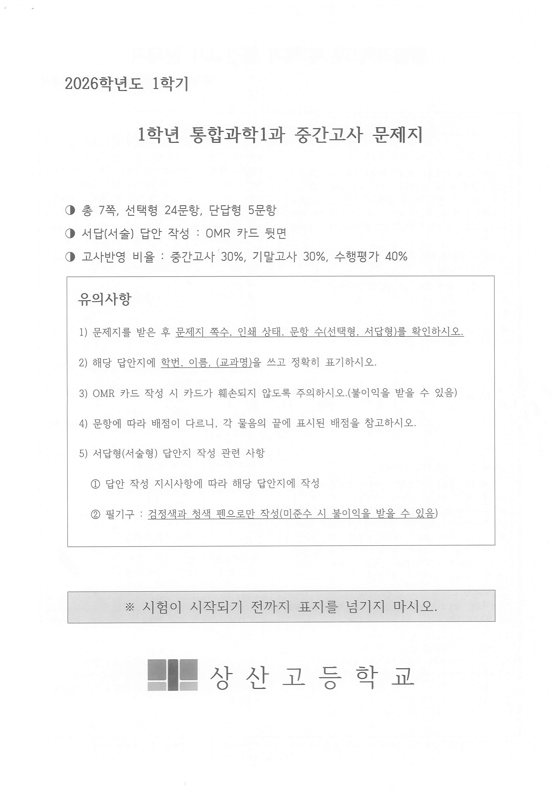
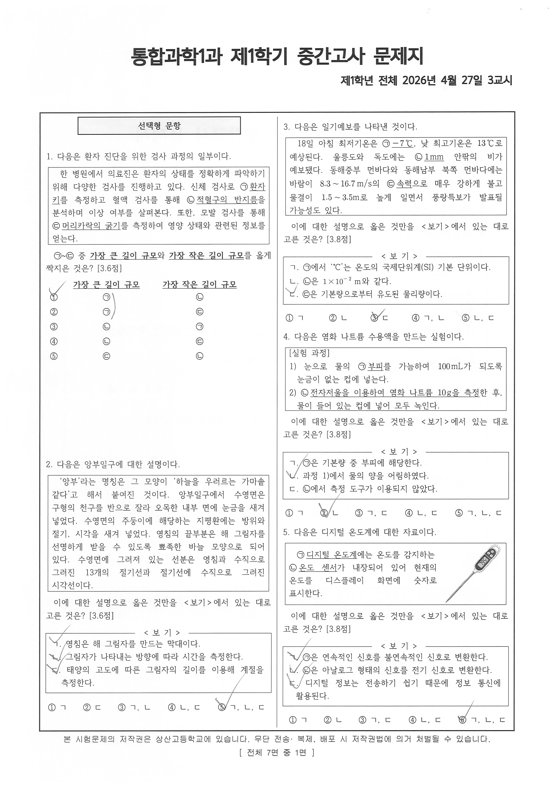
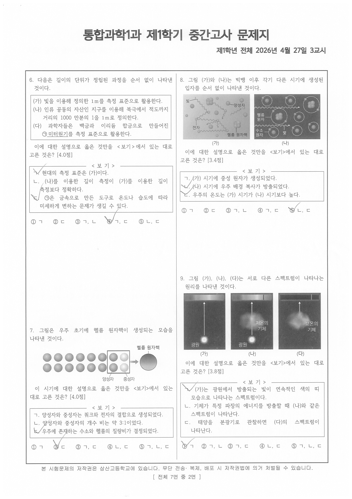
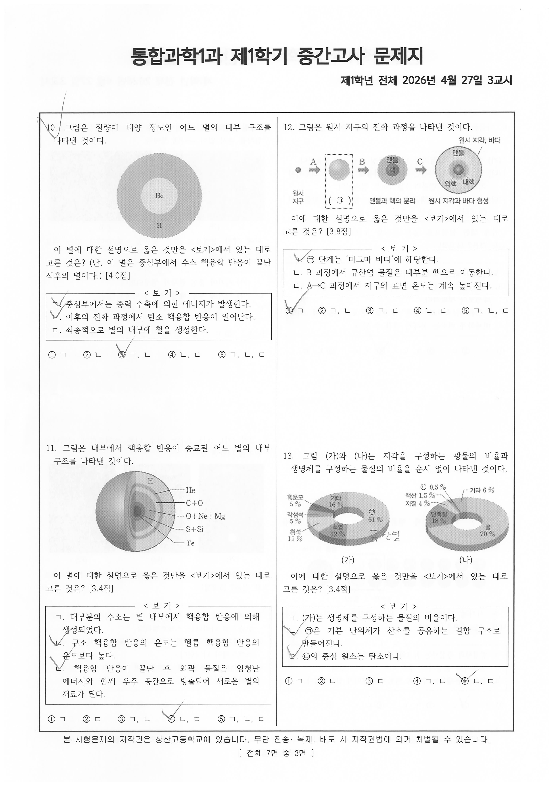
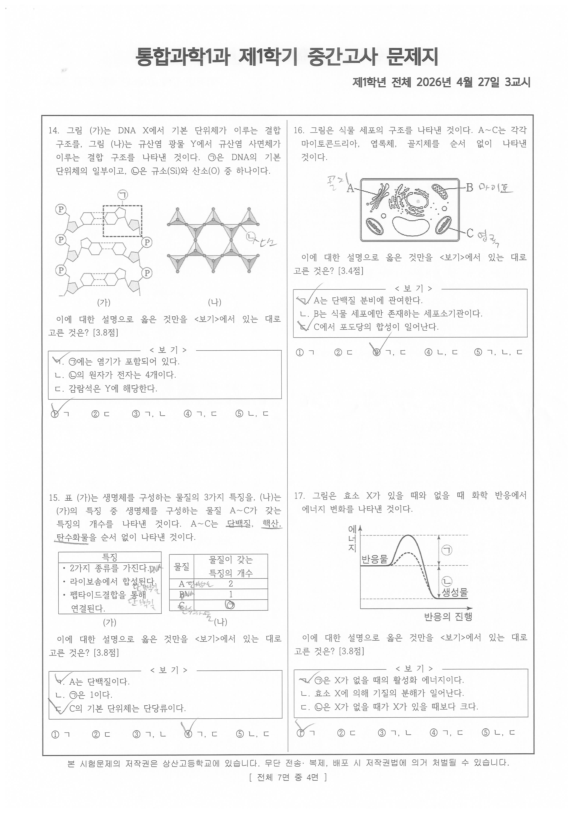
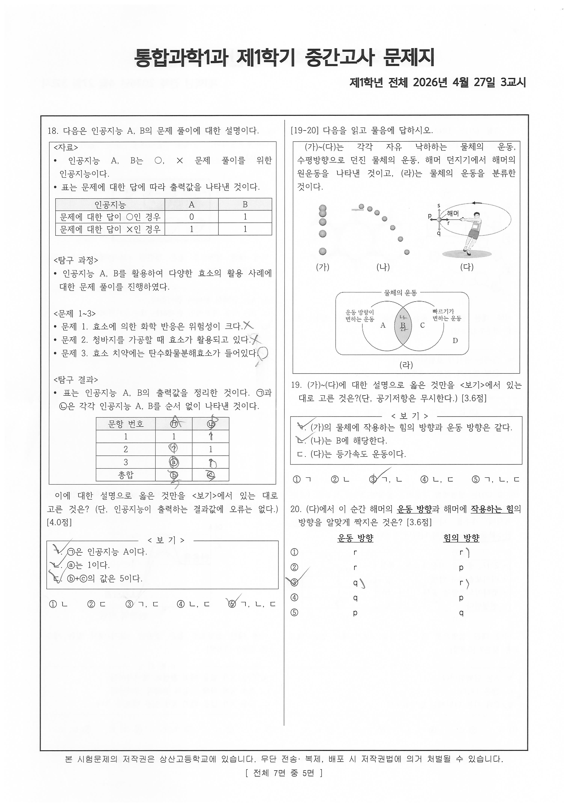
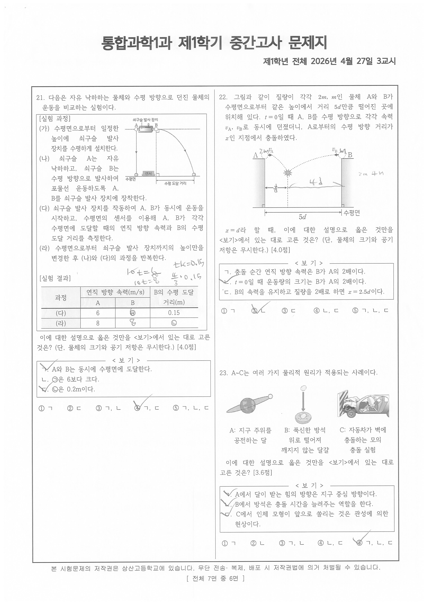
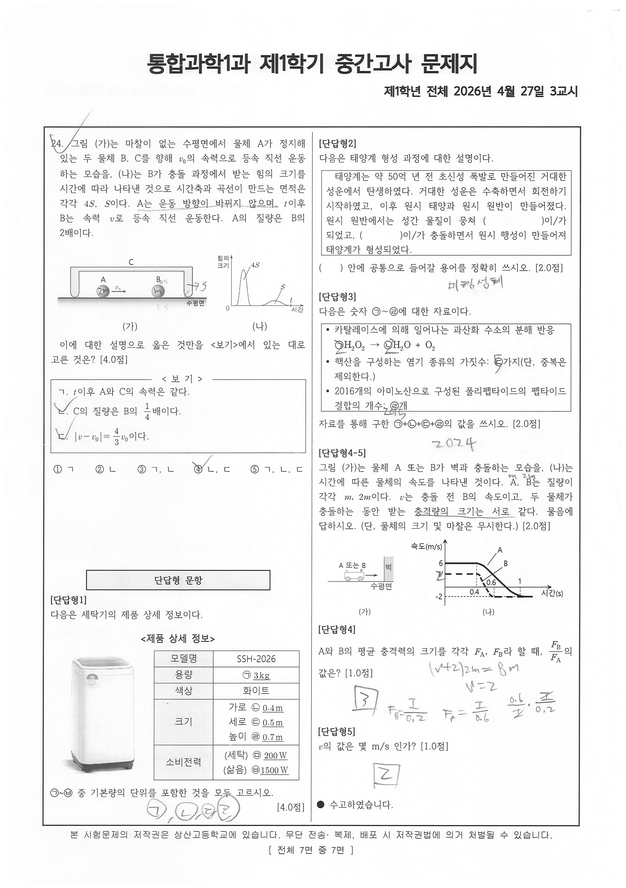

# EX-science-20261M — 1차 정제 전사본

## 원본·판독 조건

- 원본: `origin_data/EX-science-20261M/1학년1학기_통합과학1_중간.pdf`
  (5,671,090 B / sha256[:16] `1d04c7726d4ab838` / 8쪽 / 텍스트 레이어 0 전 쪽)
- 분모 기준 렌더: `corpus/_images/EX-science-20261M/pNN.png` (PyMuPDF, dpi 160, 회전 미보정)
- 판독 렌더: `corpus/_images/EX-science-20261M/native/pNN.png` — 임베드 원본(4299×3035 jpeg,
  `rect` 1033.4×729.6 → 실효 dpi = round(4299×72/1033.4) = **300**)을 쪽별 회전각으로 정립한 것.
  4분할(가로 54% × 세로 55%, 84.6% 리사이즈 ≈ 2배 확대) 크롭으로 판독했다.
- 회전각 실측(유닛별 판정, C-A1-3): p01 −90° / p02 +90° / p03 −90° / p04 +90° / p05 −90° / p06 +90° / p07 −90° / p08 +90°.
  **전 쪽 홀 −90 / 짝 +90 교대**이며 예외가 없다(EX-math1-20261F에서 p07·p08 교대가 깨졌으므로
  이 유닛은 전사 착수 전에 8쪽 전부를 실측해 확정했다). `page.rotation` 메타데이터는 전 쪽 0을
  보고하며 내용 회전과 불일치한다.
- 물리쪽↔인쇄면(꼬리말 `[ 전체 7면 중 N면 ]` 실측): p01=표지(꼬리말 없음), p02=1면, p03=2면,
  p04=3면, p05=4면, p06=5면, p07=6면, p08=7면 — **정순**이다(EX-history-20261M의 전면 역순,
  EX-math1-20261F의 끝 2장 역순과 다르다).
- 응시본(variant: student): 선택지 번호 위 체크 필기와 <보기> 항목 옆 체크 필기가 관측된다.
  **필기는 전사 대상이 아니다.** 인쇄 활자와 겹치는 경우만 ANNOT 줄로 별기한다.
- 도표·그림·사진 문항: 이미지로만 제시된 자극은 재현하지 않고 `` 링크 + 구조 사실로 적는다.
- **분류 판단 없음** — 유형ID·변형축·함정·Tier는 한 글자도 적지 않는다(CLAUDE.md 원칙 1).

## 표지 (물리쪽 p01)



```
2026학년도 1학기

            1학년 통합과학1과 중간고사 문제지

◑ 총 7쪽, 선택형 24문항, 단답형 5문항
◑ 서답(서술) 답안 작성 : OMR 카드 뒷면
◑ 고사반영 비율 : 중간고사 30%, 기말고사 30%, 수행평가 40%

┌─────────────────────────────────────────────────────────────┐
│ 유의사항                                                     │
│                                                             │
│ 1) 문제지를 받은 후 문제지 쪽수, 인쇄 상태, 문항 수(선택형, 서답형)를 확인하시오. │
│                                                             │
│ 2) 해당 답안지에 학번, 이름, (교과명)을 쓰고 정확히 표기하시오.          │
│                                                             │
│ 3) OMR 카드 작성 시 카드가 훼손되지 않도록 주의하시오.(불이익을 받을 수 있음) │
│                                                             │
│ 4) 문항에 따라 배점이 다르니, 각 물음의 끝에 표시된 배점을 참고하시오.      │
│                                                             │
│ 5) 서답형(서술형) 답안지 작성 관련 사항                            │
│                                                             │
│   ① 답안 작성 지시사항에 따라 해당 답안지에 작성                     │
│                                                             │
│   ② 필기구 : 검정색과 청색 펜으로만 작성(미준수 시 불이익을 받을 수 있음)  │
└─────────────────────────────────────────────────────────────┘

▓ ※ 시험이 시작되기 전까지 표지를 넘기지 마시오. ▓

■■ 상산고등학교
```

> 표지 선언은 `선택형 24문항, 단답형 5문항`(합 29)인데, 유의사항 1)은 「문항 수(선택형, **서답형**)」,
> 5)는 「**서답형(서술형)** 답안지 작성 관련 사항」으로 적는다. 표지 셋째 줄도 `서답(서술) 답안 작성`이다.
> 표지 선언의 명칭(`단답형`)과 유의사항의 명칭(`서답형`·`서술형`)이 문면에서 다르다 — 관측만 기록하고
> 어느 쪽이 옳은지는 판단하지 않는다(원칙 1).

## 지면 머리·꼬리 (인쇄면 공통, 물리쪽 p02~p08)

```
통합과학1과 제1학기 중간고사 문제지
       제1학년 전체 2026년 4월 27일 3교시
...
본 시험문제의 저작권은 상산고등학교에 있습니다. 무단 전송·복제, 배포 시 저작권법에 의거 처벌될 수 있습니다.
                                          [ 전체 7면 중 N면 ]
```

---

## 선택형 문항

*(인쇄1면 = 물리쪽 p02, 좌단 1~2번 / 우단 3~5번)*



```
┌────────────────┐
│   선택형 문항    │
└────────────────┘
```

### 1.

다음은 환자 진단을 위한 검사 과정의 일부이다.

```
  한 병원에서 의료진은 환자의 상태를 정확하게 파악하기 위해 다양한 검사를
진행하고 있다. 신체 검사로 ㉠환자 키를 측정하고 혈액 검사를 통해 ㉡적혈구의
반지름을 분석하며 이상 여부를 살펴본다. 또한, 모발 검사를 통해 ㉢머리카락의
굵기를 측정하여 영양 상태와 관련된 정보를 얻는다.
```

㉠~㉢ 중 **가장 큰 길이 규모**와 **가장 작은 길이 규모**를 옳게 짝지은 것은? [3.6점]

```
        가장 큰 길이 규모        가장 작은 길이 규모
   ①         ㉠                      ㉡
   ②         ㉠                      ㉢
   ③         ㉡                      ㉠
   ④         ㉡                      ㉢
   ⑤         ㉢                      ㉡
```

### 2.

다음은 앙부일구에 대한 설명이다.

```
  '앙부'라는 명칭은 그 모양이 '하늘을 우러르는 가마솥 같다'고 해서 붙여진 것이다.
앙부일구에서 수영면은 구형의 천구를 반으로 잘라 오목한 내부 면에 눈금을 새겨
넣었다. 수영면의 주둥이에 해당하는 지평환에는 방위와 절기, 시각을 새겨 넣었다.
영침의 끝부분은 해 그림자를 선명하게 받을 수 있도록 뾰족한 바늘 모양으로 되어
있다. 수영면에 그려져 있는 선분은 영침과 수직으로 그려진 13개의 절기선과
절기선에 수직으로 그려진 시각선이다.
```

이에 대한 설명으로 옳은 것만을 <보기>에서 있는 대로 고른 것은? [3.6점]

```
──────────────── < 보 기 > ────────────────
 ㄱ. 영침은 해 그림자를 만드는 막대이다.
 ㄴ. 그림자가 나타내는 방향에 따라 시간을 측정한다.
 ㄷ. 태양의 고도에 따른 그림자의 길이를 이용해 계절을 측정한다.
───────────────────────────────────────────
```

```
 ① ㄱ    ② ㄷ    ③ ㄱ, ㄴ    ④ ㄴ, ㄷ    ⑤ ㄱ, ㄴ, ㄷ
```

### 3.

다음은 일기예보를 나타낸 것이다.

```
  18일 아침 최저기온은 ㉠−7℃, 낮 최고기온은 13℃로 예상된다. 울릉도와 독도에는
㉡1mm 안팎의 비가 예보됐다. 동해중부 먼바다와 동해남부 북쪽 먼바다에는 바람이
8.3~16.7 m/s의 ㉢속력으로 매우 강하게 불고 물결이 1.5~3.5m로 높게 일면서
풍랑특보가 발표될 가능성도 있다.
```

이에 대한 설명으로 옳은 것만을 <보기>에서 있는 대로 고른 것은? [3.8점]

```
──────────────── < 보 기 > ────────────────
 ㄱ. ㉠에서 '℃'는 온도의 국제단위계(SI) 기본 단위이다.
 ㄴ. ㉡은 1×10^−2 m와 같다.
 ㄷ. ㉢은 기본량으로부터 유도된 물리량이다.
───────────────────────────────────────────
```

```
 ① ㄱ    ② ㄴ    ③ ㄷ    ④ ㄱ, ㄴ    ⑤ ㄴ, ㄷ
```

### 4.

다음은 염화 나트륨 수용액을 만드는 실험이다.

```
[실험 과정]
 1) 눈으로 물의 ㉠부피를 가늠하여 100mL가 되도록 눈금이 없는 컵에 넣는다.
 2) ㉡전자저울을 이용하여 염화 나트륨 10g을 측정한 후, 물이 들어 있는 컵에 넣어
    모두 녹인다.
```

이에 대한 설명으로 옳은 것만을 <보기>에서 있는 대로 고른 것은? [3.8점]

```
──────────────── < 보 기 > ────────────────
 ㄱ. ㉠은 기본량 중 부피에 해당한다.
 ㄴ. 과정 1)에서 물의 양을 어림하였다.
 ㄷ. ㉡에서 측정 도구가 이용되지 않았다.
───────────────────────────────────────────
```

```
 ① ㄱ    ② ㄴ    ③ ㄱ, ㄷ    ④ ㄴ, ㄷ    ⑤ ㄱ, ㄴ, ㄷ
```

### 5.

다음은 디지털 온도계에 대한 자료이다.

```
  ㉠디지털 온도계에는 온도를 감지하는 ㉡온도 센서가 내장되어 있어 현재의 온도를
디스플레이 화면에 숫자로 표시한다.
                                        [디지털 온도계 사진 — 탐침형 본체,
                                         디스플레이에 '35.5' 표시]
```

이에 대한 설명으로 옳은 것만을 <보기>에서 있는 대로 고른 것은? [3.8점]

```
──────────────── < 보 기 > ────────────────
 ㄱ. ㉠은 연속적인 신호를 불연속적인 신호로 변환한다.
 ㄴ. ㉡은 아날로그 형태의 신호를 전기 신호로 변환한다.
 ㄷ. 디지털 정보는 전송하기 쉽기 때문에 정보 통신에 활용된다.
───────────────────────────────────────────
```

```
 ① ㄱ    ② ㄴ    ③ ㄱ, ㄷ    ④ ㄴ, ㄷ    ⑤ ㄱ, ㄴ, ㄷ
```

> FIG 5번: 자극에 디지털 온도계 사진 1점이 인쇄되어 있다(제시문 우측). 이미지는 재현하지 않고
> 원본 링크로 대체한다 — 

*(인쇄2면 = 물리쪽 p03, 좌단 6~7번 / 우단 8~9번)*



### 6.

다음은 길이의 단위가 정립된 과정을 순서 없이 나타낸 것이다.

```
(가) 빛을 이용해 정의한 1m를 측정 표준으로 활용한다.
(나) 인류 공동의 자산인 지구를 이용해 북극에서 적도까지 거리의 1000 만분의 1을
     1m로 정의한다.
(다) 과학자들은 백금과 이리듐 합금으로 만들어진 ㉠미터원기를 측정 표준으로
     활용한다.
```

이에 대한 설명으로 옳은 것만을 <보기>에서 있는 대로 고른 것은? [4.0점]

```
──────────────── < 보 기 > ────────────────
 ㄱ. 현대의 측정 표준은 (가)이다.
 ㄴ. (나)를 이용한 길이 측정이 (가)를 이용한 길이 측정보다 정확하다.
 ㄷ. ㉠은 금속으로 만든 도구로 온도나 습도에 따라 미세하게 변하는 문제가 생길 수
    있다.
───────────────────────────────────────────
```

```
 ① ㄱ    ② ㄷ    ③ ㄱ, ㄴ    ④ ㄱ, ㄷ    ⑤ ㄴ, ㄷ
```

### 7.

그림은 우주 초기에 헬륨 원자핵이 생성되는 모습을 나타낸 것이다.

```
[그림] 좌측에 동일한 크기의 원 14개(2행×7열)가 배열되고, 그 중 우측 끝
2×2 = 4개가 사각 테두리로 묶여 있다. 묶인 4개 중 좌측 2개는 진한 음영
(라벨 '양성자'), 우측 2개는 밝은 음영(라벨 '중성자')이다. 사각 테두리에서
우향 화살표가 나가 오른쪽의 큰 원(라벨 '헬륨 원자핵')으로 이어진다.
```

이 시기에 대한 설명으로 옳은 것만을 <보기>에서 있는 대로 고른 것은? [4.0점]

```
──────────────── < 보 기 > ────────────────
 ㄱ. 양성자와 중성자는 쿼크와 전자의 결합으로 생성되었다.
 ㄴ. 양성자와 중성자의 개수 비는 약 3:1이었다.
 ㄷ. 우주에 존재하는 수소와 헬륨의 질량비가 결정되었다.
───────────────────────────────────────────
```

```
 ① ㄱ    ② ㄷ    ③ ㄱ, ㄷ    ④ ㄴ, ㄷ    ⑤ ㄱ, ㄴ, ㄷ
```

> FIG 7번: 위 자극은 인쇄 그림이며 위 서술은 구조 사실 기록이다. 원본 이미지는
>  좌단 하단.

### 8.

그림 (가)와 (나)는 빅뱅 이후 각기 다른 시기에 생성된 입자를 순서 없이 나타낸 것이다.

```
[그림 (가)] 밝은 바탕. 물결선(라벨 '빛')이 여러 방향으로 진행하고, 작은 구
(라벨 '전자'), 중간 구(라벨 '양성자'), 4개 구가 뭉친 덩어리(라벨 '헬륨 원자핵')가
흩어져 있다. 물결선이 입자와 부딪히며 꺾여 있다.
[그림 (나)] 어두운 바탕. 궤도 위에 전자가 도는 원자 6개가 배열되어 있고,
4개 구 덩어리를 가진 것에 '헬륨 원자', 단일 구를 가진 것에 '수소 원자' 라벨이
붙는다. 물결선(라벨 '빛')이 좌→우로 직진하며 꺾이지 않는다.
```

이에 대한 설명으로 옳은 것만을 <보기>에서 있는 대로 고른 것은? [3.4점]

```
──────────────── < 보 기 > ────────────────
 ㄱ. (가) 시기에 중성 원자가 생성되었다.
 ㄴ. (나) 시기에 우주 배경 복사가 방출되었다.
 ㄷ. 우주의 온도는 (가) 시기가 (나) 시기보다 높다.
───────────────────────────────────────────
```

```
 ① ㄱ    ② ㄷ    ③ ㄱ, ㄴ    ④ ㄱ, ㄷ    ⑤ ㄴ, ㄷ
```

> FIG 8번: (가)·(나) 2점의 인쇄 그림. 원본은  우단 상단.

### 9.

그림 (가), (나), (다)는 서로 다른 스펙트럼이 나타나는 원리를 나타낸 것이다.

```
[그림 (가)] 하단에 밝은 점(라벨 '광원'), 상향 화살표, 상단 띠는 좌→우로 색이
연속적으로 이어진 띠.
[그림 (나)] 하단에 밝은 점(라벨 '광원'), 중간에 확산된 밝은 영역(라벨 '저온의
기체'), 상향 화살표, 상단 띠는 연속 띠에 검은 선이 끼어 있는 모습.
[그림 (다)] 하단 광원 표시 없이 중간에 확산된 밝은 영역(라벨 '고온의 기체'),
상향 화살표, 상단 띠는 검은 바탕에 밝은 선 몇 개만 나타난 모습.
```

이에 대한 설명으로 옳은 것만을 <보기>에서 있는 대로 고른 것은? [3.8점]

```
──────────────── < 보 기 > ────────────────
 ㄱ. (가)는 광원에서 방출되는 빛이 연속적인 색의 띠 모습으로 나타나는
    스펙트럼이다.
 ㄴ. 기체가 특정 파장의 에너지를 방출할 때 (나)와 같은 스펙트럼이 나타난다.
 ㄷ. 태양을 분광기로 관찰하면 (다)의 스펙트럼이 나타난다.
───────────────────────────────────────────
```

```
 ① ㄱ    ② ㄱ, ㄴ    ③ ㄱ, ㄷ    ④ ㄴ, ㄷ    ⑤ ㄱ, ㄴ, ㄷ
```

> FIG 9번: (가)·(나)·(다) 3점의 인쇄 그림. 원본은  우단 하단.

*(인쇄3면 = 물리쪽 p04, 좌단 10~11번 / 우단 12~13번)*



### 10.

그림은 질량이 태양 정도인 어느 별의 내부 구조를 나타낸 것이다.

```
[그림] 큰 원(음영) 안에 작은 원(밝은 음영)이 동심으로 그려져 있다.
내부 원 안에 'He', 외부 원의 아래쪽에 'H' 라벨이 인쇄되어 있다.
```

이 별에 대한 설명으로 옳은 것만을 <보기>에서 있는 대로 고른 것은?
(단, 이 별은 중심부에서 수소 핵융합 반응이 끝난 직후의 별이다.) [4.0점]

```
──────────────── < 보 기 > ────────────────
 ㄱ. 중심부에서는 중력 수축에 의한 에너지가 발생한다.
 ㄴ. 이후의 진화 과정에서 탄소 핵융합 반응이 일어난다.
 ㄷ. 최종적으로 별의 내부에 철을 생성한다.
───────────────────────────────────────────
```

```
 ① ㄱ    ② ㄴ    ③ ㄱ, ㄴ    ④ ㄴ, ㄷ    ⑤ ㄱ, ㄴ, ㄷ
```

### 11.

그림은 내부에서 핵융합 반응이 종료된 어느 별의 내부 구조를 나타낸 것이다.

```
[그림] 구를 절단해 동심 껍질 구조를 드러낸 입체 그림. 바깥에서 중심으로
지시선 라벨이 차례로 'H', 'He', 'C+O', 'O+Ne+Mg', 'S+Si', 'Fe'.
```

이 별에 대한 설명으로 옳은 것만을 <보기>에서 있는 대로 고른 것은? [3.4점]

```
──────────────── < 보 기 > ────────────────
 ㄱ. 대부분의 수소는 별 내부에서 핵융합 반응에 의해 생성되었다.
 ㄴ. 규소 핵융합 반응의 온도는 헬륨 핵융합 반응의 온도보다 높다.
 ㄷ. 핵융합 반응이 끝난 후 외곽 물질은 엄청난 에너지와 함께 우주 공간으로
    방출되어 새로운 별의 재료가 된다.
───────────────────────────────────────────
```

```
 ① ㄱ    ② ㄷ    ③ ㄱ, ㄴ    ④ ㄴ, ㄷ    ⑤ ㄱ, ㄴ, ㄷ
```

### 12.

그림은 원시 지구의 진화 과정을 나타낸 것이다.

```
[그림] 좌→우 4단 흐름도, 단계 사이에 굵은 우향 화살표와 라벨 A·B·C.
 · 1단: 작은 점 — 하단 라벨 '원시 지구'
 · (A) → 2단: 균질한 구 — 하단 라벨이 점선 사각 박스 안 '( ㉠ )'
 · (B) → 3단: 구 안에 '맨틀'·'핵' 2층 — 하단 라벨 '맨틀과 핵의 분리'
 · (C) → 4단: 구 안에 '맨틀'·'외핵'·'내핵' 층과 지시선 라벨 '원시 지각, 바다'
        — 하단 라벨 '원시 지각과 바다 형성'
```

이에 대한 설명으로 옳은 것만을 <보기>에서 있는 대로 고른 것은? [3.8점]

```
──────────────── < 보 기 > ────────────────
 ㄱ. ㉠ 단계는 '마그마 바다'에 해당한다.
 ㄴ. B 과정에서 규산염 물질은 대부분 핵으로 이동한다.
 ㄷ. A→C 과정에서 지구의 표면 온도는 계속 높아진다.
───────────────────────────────────────────
```

```
 ① ㄱ    ② ㄱ, ㄴ    ③ ㄱ, ㄷ    ④ ㄴ, ㄷ    ⑤ ㄱ, ㄴ, ㄷ
```

### 13.

그림 (가)와 (나)는 지각을 구성하는 광물의 비율과 생명체를 구성하는 물질의 비율을
순서 없이 나타낸 것이다.

```
[그림 (가)] 도넛형 원그래프. 지시선 라벨과 값:
   흑운모 5% / 각섬석 5% / 휘석 11% / 석영 12% / 기타 16% / ㉠ 51%
[그림 (나)] 도넛형 원그래프. 지시선 라벨과 값:
   ㉡ 0.5% / 핵산 1.5% / 지질 4% / 기타 6% / 단백질 18% / 물 70%
```

이에 대한 설명으로 옳은 것만을 <보기>에서 있는 대로 고른 것은? [3.4점]

```
──────────────── < 보 기 > ────────────────
 ㄱ. (가)는 생명체를 구성하는 물질의 비율이다.
 ㄴ. ㉠은 기본 단위체가 산소를 공유하는 결합 구조로 만들어진다.
 ㄷ. ㉡의 중심 원소는 탄소이다.
───────────────────────────────────────────
```

```
 ① ㄱ    ② ㄴ    ③ ㄷ    ④ ㄱ, ㄴ    ⑤ ㄴ, ㄷ
```

> ANNOT 13번: (가) 그래프 우하단 여백에 학생 필기 `규산염`이 겹쳐 적혀 있다. 인쇄 활자를 가리지는
> 않는다 — 필기는 전사 대상이 아니다.
> FIG 10·11·12·13번: 모두 인쇄 그림·그래프이며 위 서술은 구조 사실 기록이다. 원본은
> .

*(인쇄4면 = 물리쪽 p05, 좌단 14~15번 / 우단 16~17번)*



### 14.

그림 (가)는 DNA X에서 기본 단위체가 이루는 결합 구조를, 그림 (나)는 규산염 광물 Y에서
규산염 사면체가 이루는 결합 구조를 나타낸 것이다. ㉠은 DNA의 기본 단위체의 일부이고,
㉡은 규소(Si)와 산소(O) 중 하나이다.

```
[그림 (가)] DNA 이중나선의 평면 모식도. 좌·우 골격에 원 안 'P' 기호가 3개씩
배치되고, 5각형(당)과 6각형·5각형 조합(염기)이 사슬로 이어지며 두 가닥이
점선(수소 결합)으로 마주 붙어 있다. 상단 한 단위가 굵은 점선 사각 박스로
묶이고 그 위에 원 안 '㉠' 라벨이 지시선으로 연결된다.
[그림 (나)] 규산염 사면체 그물 구조. 삼각형(사면체) 여러 개가 꼭짓점을 공유해
6각 고리를 이루며 상·하 2열로 배열된다. 사면체 꼭짓점의 한 구에서 지시선이
나와 원 안 '㉡' 라벨로 연결된다.
```

이에 대한 설명으로 옳은 것만을 <보기>에서 있는 대로 고른 것은? [3.8점]

```
──────────────── < 보 기 > ────────────────
 ㄱ. ㉠에는 염기가 포함되어 있다.
 ㄴ. ㉡의 원자가 전자는 4개이다.
 ㄷ. 감람석은 Y에 해당한다.
───────────────────────────────────────────
```

```
 ① ㄱ    ② ㄷ    ③ ㄱ, ㄴ    ④ ㄱ, ㄷ    ⑤ ㄴ, ㄷ
```

> ANNOT 14번: (나) 그림의 ㉡ 라벨 오른쪽 여백에 학생 필기 `산소`가 적혀 있다. 인쇄 활자를
> 가리지 않는다.

### 15.

표 (가)는 생명체를 구성하는 물질의 3가지 특징을, (나)는 (가)의 특징 중 생명체를 구성하는
물질 A~C가 갖는 특징의 개수를 나타낸 것이다. A~C는 단백질, 핵산, 탄수화물을 순서 없이
나타낸 것이다.

```
        (가)                              (나)
┌──────────────────────┐    ┌──────┬────────────────┐
│         특징          │    │ 물질  │ 물질이 갖는     │
│ · 2가지 종류를 가진다.  │    │      │ 특징의 개수     │
│ · 라이보솜에서 합성된다.│    ├──────┼────────────────┤
│ · 펩타이드결합을 통해   │    │  A   │       2        │
│   연결된다.            │    │  B   │       1        │
└──────────────────────┘    │  C   │       ㉠        │
                             └──────┴────────────────┘
```

이에 대한 설명으로 옳은 것만을 <보기>에서 있는 대로 고른 것은? [3.8점]

```
──────────────── < 보 기 > ────────────────
 ㄱ. A는 단백질이다.
 ㄴ. ㉠은 1이다.
 ㄷ. C의 기본 단위체는 단당류이다.
───────────────────────────────────────────
```

```
 ① ㄱ    ② ㄷ    ③ ㄱ, ㄴ    ④ ㄱ, ㄷ    ⑤ ㄴ, ㄷ
```

> ANNOT 15번: (가) 표의 특징 3줄 옆에 학생 필기 `DNA`·`단백질`·`단백질`, (나) 표의 A·B·C 행에
> 학생 필기 `단백질`·`DNA`·`탄수화물`이 겹쳐 적혀 있다. 필기가 인쇄 활자 `B`·`C`에 겹치므로
> 300dpi 3배 확대(`zoom_p05_item15b`)로 인쇄 문자열이 `A / B / C`, 개수 열이 `2 / 1 / ㉠`임을
> 확인했다 — 필기는 전사 대상이 아니다.
> 표 (가) 둘째 줄의 인쇄 표기는 `라이보솜`이다(원문 그대로 적었고 표기 적부는 판단하지 않는다).

### 16.

그림은 식물 세포의 구조를 나타낸 것이다. A~C는 각각 마이토콘드리아, 엽록체, 골지체를
순서 없이 나타낸 것이다.

```
[그림] 둥근 사각 테두리(세포벽·세포막) 안에 핵, 소포체, 액포, 리보솜 점,
납작한 주머니가 겹친 소기관, 타원형 소기관 등이 배치되어 있다. 지시선 라벨은
좌상 'A'(납작한 주머니가 겹친 소기관), 우상 'B'(내부에 주름이 있는 타원형
소기관), 우하 'C'(내부에 진한 막대 구조가 있는 타원형 소기관).
```

이에 대한 설명으로 옳은 것만을 <보기>에서 있는 대로 고른 것은? [3.4점]

```
──────────────── < 보 기 > ────────────────
 ㄱ. A는 단백질 분비에 관여한다.
 ㄴ. B는 식물 세포에만 존재하는 세포소기관이다.
 ㄷ. C에서 포도당의 합성이 일어난다.
───────────────────────────────────────────
```

```
 ① ㄱ    ② ㄷ    ③ ㄱ, ㄷ    ④ ㄴ, ㄷ    ⑤ ㄱ, ㄴ, ㄷ
```

> ANNOT 16번: A·B·C 라벨 옆에 학생 필기 `골지`·`마이토`·`엽록`이 적혀 있다. 인쇄 라벨을
> 가리지 않는다.

### 17.

그림은 효소 X가 있을 때와 없을 때 화학 반응에서 에너지 변화를 나타낸 것이다.

```
[그래프] 세로축 '에너지', 가로축 '반응의 진행'. 좌측 수평선에 '반응물' 라벨,
우측 낮은 수평선에 '생성물' 라벨. 반응물에서 출발해 봉우리를 넘어 생성물로
내려가는 곡선이 2개 — 실선(높은 봉우리)과 굵은 점선(낮은 봉우리). 우측에
양방향 화살표 2개와 원 안 라벨: 위쪽 화살표(반응물 준위 ↔ 실선 봉우리 정점)에
'㉠', 아래쪽 화살표(반응물 준위 ↔ 생성물 준위)에 '㉡'.
```

이에 대한 설명으로 옳은 것만을 <보기>에서 있는 대로 고른 것은? [3.8점]

```
──────────────── < 보 기 > ────────────────
 ㄱ. ㉠은 X가 없을 때의 활성화 에너지이다.
 ㄴ. 효소 X에 의해 기질의 분해가 일어난다.
 ㄷ. ㉡은 X가 없을 때가 X가 있을 때보다 크다.
───────────────────────────────────────────
```

```
 ① ㄱ    ② ㄷ    ③ ㄱ, ㄴ    ④ ㄱ, ㄷ    ⑤ ㄴ, ㄷ
```

*(인쇄5면 = 물리쪽 p06, 좌단 18번 / 우단 [19-20] 공유 자료 + 19~20번)*



### 18.

다음은 인공지능 A, B의 문제 풀이에 대한 설명이다.

```
<자료>
 • 인공지능 A, B는 ○, × 문제 풀이를 위한 인공지능이다.
 • 표는 문제에 대한 답에 따라 출력값을 나타낸 것이다.

  ┌────────────────────────┬─────┬─────┐
  │        인공지능          │  A  │  B  │
  ├────────────────────────┼─────┼─────┤
  │ 문제에 대한 답이 ○인 경우 │  0  │  1  │
  │ 문제에 대한 답이 ×인 경우 │  1  │  1  │
  └────────────────────────┴─────┴─────┘

<탐구 과정>
 • 인공지능 A, B를 활용하여 다양한 효소의 활용 사례에 대한 문제 풀이를 진행하였다.

<문제 1~3>
 • 문제 1. 효소에 의한 화학 반응은 위험성이 크다.
 • 문제 2. 청바지를 가공할 때 효소가 활용되고 있다.
 • 문제 3. 효소 치약에는 탄수화물분해효소가 들어있다.

<탐구 결과>
 • 표는 인공지능 A, B의 출력값을 정리한 것이다. ㉠과 ㉡은 각각 인공지능 A, B를
   순서 없이 나타낸 것이다.

  ┌───────────┬─────┬─────┐
  │  문항 번호  │  ㉠  │  ㉡  │
  ├───────────┼─────┼─────┤
  │     1      │  1  │  ?  │
  │     2      │  ?  │  1  │
  │     3      │  ⓐ  │  ?  │
  │    총합     │  ⓑ  │  ⓒ  │
  └───────────┴─────┴─────┘
```

이에 대한 설명으로 옳은 것만을 <보기>에서 있는 대로 고른 것은?
(단, 인공지능이 출력하는 결과값에 오류는 없다.) [4.0점]

```
──────────────── < 보 기 > ────────────────
 ㄱ. ㉠은 인공지능 A이다.
 ㄴ. ⓐ는 1이다.
 ㄷ. ⓑ+ⓒ의 값은 5이다.
───────────────────────────────────────────
```

```
 ① ㄴ    ② ㄷ    ③ ㄱ, ㄷ    ④ ㄴ, ㄷ    ⑤ ㄱ, ㄴ, ㄷ
```

> ANNOT 18번: <문제 1~3> 각 줄 끝에 학생 필기 `×`·`×`·`○`가, <탐구 결과> 표의 ㉠·㉡ 열
> 머리에 `A`·`B`가, 각 셀에 동그라미·숫자 필기가 겹쳐 있다. 인쇄 셀 값이 필기에 가려지므로
> 300dpi 3배 확대(`zoom_p06_item18`·`zoom_p06_item18b`)로 인쇄값이
> `1/? · ?/1 · ⓐ/? · ⓑ/ⓒ` 임을 확인했다 — 필기는 전사 대상이 아니다.

### [19-20] 다음을 읽고 물음에 답하시오.

(가)~(다)는 각각 자유 낙하하는 물체의 운동, 수평방향으로 던진 물체의 운동, 해머 던지기에서
해머의 원운동을 나타낸 것이고, (라)는 물체의 운동을 분류한 것이다.

```
[그림 (가)] 같은 크기의 구가 수직 일렬로 5개, 위로 갈수록 간격이 좁아진다
   (위쪽 2개는 거의 붙어 있음).
[그림 (나)] 좌측 상단의 짧은 수평 지지대에서 출발해 우하향 포물선 궤적을 이루는
   구 7개. 수평 간격은 일정하고 수직 간격이 아래로 갈수록 커진다.
[그림 (다)] 해머 던지기 선수가 원 궤도(점선 타원, 진행 방향 좌향 화살표) 위의
   해머를 줄로 잡고 회전하는 그림. 해머 위치에 십자 화살표 4개와 라벨:
   위 's', 아래 'q', 좌 'p', 우(줄 방향, 선수 쪽) 'r'. 해머 자체에 '해머' 라벨.
[그림 (라)] 벤 다이어그램. 바깥 둥근 사각 테두리 라벨 '물체의 운동',
   좌측 원 라벨 '운동 방향이 변하는 운동', 우측 원 라벨 '빠르기가 변하는 운동'.
   영역 라벨: 좌측 원 단독 'A', 두 원 교집합(음영) 'B', 우측 원 단독 'C',
   두 원 밖 사각 안 'D'.
```

### 19.

(가)~(다)에 대한 설명으로 옳은 것만을 <보기>에서 있는 대로 고른 것은?
(단, 공기저항은 무시한다.) [3.6점]

```
──────────────── < 보 기 > ────────────────
 ㄱ. (가)의 물체에 작용하는 힘의 방향과 운동 방향은 같다.
 ㄴ. (나)는 B에 해당한다.
 ㄷ. (다)는 등가속도 운동이다.
───────────────────────────────────────────
```

```
 ① ㄱ    ② ㄴ    ③ ㄱ, ㄴ    ④ ㄴ, ㄷ    ⑤ ㄱ, ㄴ, ㄷ
```

### 20.

(다)에서 이 순간 해머의 **운동 방향**과 해머에 **작용하는 힘**의 방향을 알맞게 짝지은
것은? [3.6점]

```
        운동 방향              힘의 방향
   ①       r                     r
   ②       r                     p
   ③       q                     r
   ④       q                     p
   ⑤       p                     q
```

> ANNOT 19번: (라) 벤 다이어그램의 교집합 영역 인쇄 라벨 `B` 위에 학생 필기 `나`가 겹쳐 있다.
> 인쇄 활자 `B`는 확대 대조로 확인했다.

*(인쇄6면 = 물리쪽 p07, 좌단 21번 / 우단 22~23번)*



### 21.

다음은 자유 낙하하는 물체와 수평 방향으로 던진 물체의 운동을 비교하는 실험이다.

```
[실험 과정]
(가) 수평면으로부터 일정한 높이에 쇠구슬 발사 장치를 수평하게 설치한다.
(나) 쇠구슬 A는 자유 낙하하고, 쇠구슬 B는 수평 방향으로 발사하여 포물선 운동하도록
     A, B를 쇠구슬 발사 장치에 장착한다.
(다) 쇠구슬 발사 장치를 작동하여 A, B가 동시에 운동을 시작하고, 수평면의 센서를
     이용해 A, B가 각각 수평면에 도달할 때의 연직 방향 속력과 B의 수평 도달 거리를
     측정한다.
(라) 수평면으로부터 쇠구슬 발사 장치까지의 높이만을 변경한 후 (나)와 (다)의 과정을
     반복한다.

[그림] 상단에 '쇠구슬 발사 장치'(가로로 놓인 상자), 그 좌단에 라벨 'A',
우단에 라벨 'B'. A에서 아래로 직선 화살표(자유 낙하), B에서 우하향 포물선
화살표. 하단에 '수평면' 라벨의 수평선과 그 위 '센서' 박스. B의 착지점까지
양방향 화살표 '수평 도달 거리'.

[실험 결과]
  ┌────────┬──────────────────────┬────────────────┐
  │        │  연직 방향 속력(m/s)   │  B의 수평 도달  │
  │  과정   ├───────────┬──────────┤    거리(m)     │
  │        │     A     │    B     │                │
  ├────────┼───────────┼──────────┼────────────────┤
  │  (다)   │     6     │    ㉠    │      0.15      │
  │  (라)   │     8     │  (공란)  │       ㉡       │
  └────────┴───────────┴──────────┴────────────────┘
```

이에 대한 설명으로 옳은 것만을 <보기>에서 있는 대로 고른 것은?
(단, 물체의 크기와 공기 저항은 무시한다.) [4.0점]

```
──────────────── < 보 기 > ────────────────
 ㄱ. A와 B는 동시에 수평면에 도달한다.
 ㄴ. ㉠은 6보다 크다.
 ㄷ. ㉡은 0.2m이다.
───────────────────────────────────────────
```

```
 ① ㄱ    ② ㄷ    ③ ㄱ, ㄴ    ④ ㄱ, ㄷ    ⑤ ㄱ, ㄴ, ㄷ
```

> OBS 21번: [실험 결과] 표 `(라)` 행의 `B` 열 칸에 **인쇄 문자가 없다**. 자동대비 6배 확대
> (`zoom_p07_cellB`)로 대조했고, 그 칸에 보이는 `8`은 회색 연필 필기다(다른 인쇄 숫자
> `6`·`8`·`0.15`는 검정 활자). 인쇄 공란인지 인쇄 누락인지는 판단하지 않고 관측만 기록한다(원칙 1).
> ANNOT 21번: [실험 결과] 표 위 여백에 학생 계산 필기(`10t=…`, `t=0.15` 등)가 있고,
> `(다)`행 `B` 칸의 인쇄 `㉠` 위에 연필 동그라미가 겹쳐 있다.

### 22.

그림과 같이 질량이 각각 2m, m인 물체 A와 B가 수평면으로부터 같은 높이에서 거리 5d만큼
떨어진 곳에 위치해 있다. t = 0일 때 A, B를 수평 방향으로 각각 속력 v_A, v_B로 동시에
던졌더니, A로부터의 수평 방향 거리가 x인 지점에서 충돌하였다.

```
[그림] 좌·우에 같은 높이의 기둥 2개. 좌측 기둥 위 라벨 'A', 그 옆 우향 화살표
'v_A'; 우측 기둥 위 라벨 'B', 그 옆 좌향 화살표 'v_B'. 두 점선 포물선 궤적이
중간의 별 모양 충돌 표시에서 만난다. 충돌점에서 아래로 내린 점선과 좌측 기둥
사이에 양방향 화살표 'x'. 하단 수평선(라벨 '수평면')에 두 기둥 사이 폭을 나타내는
양방향 화살표 '5d'.
```

x = d라 할 때, 이에 대한 설명으로 옳은 것만을 <보기>에서 있는 대로 고른 것은?
(단, 물체의 크기와 공기 저항은 무시한다.) [4.0점]

```
──────────────── < 보 기 > ────────────────
 ㄱ. 충돌 순간 연직 방향 속력은 B가 A의 2배이다.
 ㄴ. t = 0일 때 운동량의 크기는 B가 A의 2배이다.
 ㄷ. B의 속력을 유지하고 질량을 2배로 하면 x = 2.5d이다.
───────────────────────────────────────────
```

```
 ① ㄱ    ② ㄴ    ③ ㄷ    ④ ㄴ, ㄷ    ⑤ ㄱ, ㄴ, ㄷ
```

> ANNOT 22번: 그림 위에 학생 필기 `2m`·`m`·`2m 4m`·`4d`와 보조선이 겹쳐 있다. 인쇄 라벨
> `A`·`v_A`·`v_B`·`B`·`x`·`5d`·`수평면`은 확대 대조로 확인했다.

### 23.

A~C는 여러 가지 물리적 원리가 적용되는 사례이다.

```
[그림 A] 지구(구)와 그 주위를 도는 달(작은 구), 궤도를 나타내는 타원 띠.
   하단 캡션 'A: 지구 주위를 공전하는 달'
[그림 B] 위쪽 달걀에서 아래 방석으로 향하는 굵은 하향 화살표, 방석 위에 놓인 달걀.
   하단 캡션 'B: 푹신한 방석 위로 떨어져 깨지지 않는 달걀'
[그림 C] 벽(사선 무늬)에 앞부분이 찌그러진 자동차, 실내에 에어백과 인체 모형.
   하단 캡션 'C: 자동차가 벽에 충돌하는 모의 충돌 실험'
```

이에 대한 설명으로 옳은 것만을 <보기>에서 있는 대로 고른 것은? [3.6점]

```
──────────────── < 보 기 > ────────────────
 ㄱ. A에서 달이 받는 힘의 방향은 지구 중심 방향이다.
 ㄴ. B에서 방석은 충돌 시간을 늘려주는 역할을 한다.
 ㄷ. C에서 인체 모형이 앞으로 쏠리는 것은 관성에 의한 현상이다.
───────────────────────────────────────────
```

```
 ① ㄱ    ② ㄴ    ③ ㄱ, ㄴ    ④ ㄴ, ㄷ    ⑤ ㄱ, ㄴ, ㄷ
```

*(인쇄7면 = 물리쪽 p08, 좌단 24번 + 단답형 안내 + 단답형1 / 우단 단답형2~5)*



### 24.

그림 (가)는 마찰이 없는 수평면에서 물체 A가 정지해 있는 두 물체 B, C를 향해 v_0의
속력으로 등속 직선 운동하는 모습을, (나)는 B가 충돌 과정에서 받는 힘의 크기를 시간에
따라 나타낸 것으로 시간축과 곡선이 만드는 면적은 각각 4S, S이다. A는 운동 방향이
바뀌지 않으며, t 이후 B는 속력 v로 등속 직선 운동한다. A의 질량은 B의 2배이다.

```
[그림 (가)] 수평면 위에 아래로 열린 'ㄷ'자를 뒤집은 모양의 큰 물체(상단 라벨 'C')
가 놓이고, 그 안쪽에 구 2개가 있다. 좌측 구에 라벨 'A'와 우향 화살표 'v_0',
우측 구에 라벨 'B'. 하단 수평선에 '수평면' 라벨.
[그래프 (나)] 세로축 '힘의 크기', 가로축 '시간', 원점 '0'. 좌측에 높고 좁은
봉우리(라벨 '4S'), 우측에 낮고 넓은 봉우리(라벨 'S'). 가로축에 눈금 't'.
```

이에 대한 설명으로 옳은 것만을 <보기>에서 있는 대로 고른 것은? [4.0점]

```
──────────────── < 보 기 > ────────────────
 ㄱ. t 이후 A와 C의 속력은 같다.
 ㄴ. C의 질량은 B의 1/4배이다.
 ㄷ. |v − v_0| = (4/3)v_0 이다.
───────────────────────────────────────────
```

```
 ① ㄱ    ② ㄴ    ③ ㄱ, ㄴ    ④ ㄴ, ㄷ    ⑤ ㄱ, ㄴ, ㄷ
```

> ANNOT 24번: (가) 그림의 A·B 구 위에 학생 필기 `2m`·`m`, C 우측에 `7S`, 수평면 아래에
> `7S`가 겹쳐 있다. 인쇄 라벨 `A`·`B`·`C`·`v_0`·`수평면`과 (나)의 `4S`·`S`·`t`는 확대 대조로
> 확인했다.

---

## 단답형 문항

```
┌────────────────┐
│   단답형 문항    │
└────────────────┘
```

### [단답형1]

다음은 세탁기의 제품 상세 정보이다.

```
                  <제품 상세 정보>

  [세탁기 사진 — 통돌이형 본체]

  ┌──────────┬────────────────────────┐
  │  모델명   │  SSH-2026              │
  ├──────────┼────────────────────────┤
  │  용량     │  ㉠ 3kg                │
  ├──────────┼────────────────────────┤
  │  색상     │  화이트                 │
  ├──────────┼────────────────────────┤
  │          │  가로 ㉡ 0.4m           │
  │  크기     │  세로 ㉢ 0.5m           │
  │          │  높이 ㉣ 0.7m           │
  ├──────────┼────────────────────────┤
  │  소비전력 │  (세탁) ㉤ 200W         │
  │          │  (삶음) ㉥ 1500W        │
  └──────────┴────────────────────────┘
```

㉠~㉥ 중 기본량의 단위를 포함한 것을 모두 고르시오. [4.0점]

### [단답형2]

다음은 태양계 형성 과정에 대한 설명이다.

```
  태양계는 약 50억 년 전 초신성 폭발로 만들어진 거대한 성운에서 탄생하였다. 거대한
성운은 수축하면서 회전하기 시작하였고, 이후 원시 태양과 원시 원반이 만들어졌다.
원시 원반에서는 성간 물질이 뭉쳐 (            )이/가 되었고, (        )이/가
충돌하면서 원시 행성이 만들어져 태양계가 형성되었다.
```

(   ) 안에 공통으로 들어갈 용어를 정확히 쓰시오. [2.0점]

### [단답형3]

다음은 숫자 ㉠~㉣에 대한 자료이다.

```
 • 카탈레이스에 의해 일어나는 과산화 수소의 분해 반응
   ㉠H₂O₂ → ㉡H₂O + O₂
 • 핵산을 구성하는 염기 종류의 가짓수: ㉢가지(단, 중복은 제외한다.)
 • 2016개의 아미노산으로 구성된 폴리펩타이드의 펩타이드 결합의 개수: ㉣개
```

자료를 통해 구한 ㉠+㉡+㉢+㉣의 값을 쓰시오. [2.0점]

### [단답형4-5]

그림 (가)는 물체 A 또는 B가 벽과 충돌하는 모습을, (나)는 시간에 따른 물체의 속도를
나타낸 것이다. A, B는 질량이 각각 m, 2m이다. v는 충돌 전 B의 속도이고, 두 물체가
충돌하는 동안 받는 충격량의 크기는 서로 같다. 물음에 답하시오.
(단, 물체의 크기 및 마찰은 무시한다.) [2.0점]

```
[그림 (가)] 수평면 위 수레(라벨 'A 또는 B')가 우향 화살표 방향으로 진행하고,
   우측에 음영 기둥(라벨 '벽')이 서 있다. 하단 수평선 라벨 '수평면'.
[그래프 (나)] 세로축 '속도(m/s)' — 표시 눈금 6, v, −2. 가로축 '시간(s)' —
   표시 눈금 0.4, 0.6, 1. 실선(라벨 'A')은 6에서 출발해 0.4까지 일정하다가
   내려가 1에서 −2에 도달한 뒤 일정. 굵은 점선(라벨 'B')은 v에서 출발해 0.4까지
   일정하다가 더 급하게 내려가 0.6에서 −2에 도달한 뒤 일정.
```

### [단답형4]

A와 B의 평균 충격력의 크기를 각각 F_A, F_B라 할 때, F_B / F_A 의 값은? [1.0점]

### [단답형5]

v의 값은 몇 m/s 인가? [1.0점]

```
● 수고하였습니다.
```

> OBS 단답형4-5: 공유 자료 발문 끝에 `[2.0점]`이 인쇄되어 있고, 하위 문항 단답형4·5에
> 각각 `[1.0점]`이 인쇄되어 있다. 1.0 + 1.0 = 2.0이므로 공유 자료의 `[2.0점]`은 하위 두
> 문항의 합계 표기이며 별도 배점이 아니다 — 합계 산정에서 중복 계상하지 않았다.
> ANNOT 단답형2·3·4·5: 각 문항 아래 여백에 학생 답안·계산 필기(`미행성체`, `2024`,
> `3`, `2`, `(v+2)2m = 8m` 등)가 있다. 필기는 전사 대상이 아니다.

---

## 판독 상태 총괄

- 자체 열거 선언(자 대조용): 선택형 합계 90.0점 · 단답형 합계 10.0점 · 총 100.0점
- **선택형 24문항** (1~24) — 완결 24 / 부분판독 0 / 미발견 0. 표지 인쇄 선언 `선택형 24문항`과 차 0.
  배점 합계: 3.6+3.6+3.8+3.8+3.8 + 4.0+4.0+3.4+3.8 + 4.0+3.4+3.8+3.4 + 3.8+3.8+3.4+3.8
  + 4.0+3.6+3.6 + 4.0+4.0+3.6 + 4.0 = **90.0**
- **단답형 5문항** ([단답형1]~[단답형5]) — 완결 5 / 부분판독 0 / 미발견 0. 표지 인쇄 선언
  `단답형 5문항`과 차 0. 배점 합계: 4.0+2.0+2.0+1.0+1.0 = **10.0**
- **선택형 90.0 + 단답형 10.0 = 100.0**
- `unreadable` 0건. 인쇄 활자가 학생 필기에 가려진 3곳(15번 (나)표, 18번 탐구결과표,
  21번 실험결과표)은 300dpi 확대 대조로 복원했다.
- 지면 배치: 인쇄1면~7면 중 **7면 좌단 하단**에 `단답형 문항` 전환 박스가 있고, 선택형 24번이
  같은 면 좌단 상단에 인쇄된다 — 선택형·단답형이 같은 인쇄면을 공유한다.
- 문항 간 자료 공유 2건: `[19-20]`(인쇄5면 우단), `[단답형4-5]`(인쇄7면 우단).
- 그림·그래프·사진 자극 보유 문항 **18건**(공유 자료 2건은 각 1건으로 셈):
  5, 7, 8, 9, 10, 11, 12, 13, 14, 16, 17, [19-20], 21, 22, 23, 24, 단답형1, [단답형4-5].
- 표 자극 보유 문항 **4건**: 15(표 (가)·(나)), 18(자료표·탐구결과표), 21(실험결과표), 단답형1(제품 상세 정보표).
- **분류 판단 없음** — 유형ID·변형축·함정·Tier 미기재(원칙 1).
