# SUP-math2-2026 전사본 (1차 정제) — 스무년 고1-2.pdf

> **ID**: SUP-math2-2026 | **원본**: `origin_data/SUP-math2-2026/스무년 고1-2.pdf` (18쪽, 93문항) | **렌더**: PyMuPDF dpi160 → `corpus/_images/SUP-math2-2026/p01.png`~`p18.png` | **전사**: 2026-09-01, Sol (Codex/OMX, type-extractor) | **방법**: 이미지 판독, 계수 byte-equal, 분류 판단 없음 | **검증**: `verify_log.tsv` transcribe 행 참조
> **게이트**: 이 파일 + `_images/pNN.png` 18장 + `verify_log` + `meta.yml` 4필드 완성 전 분류 진입 금지. 이후 모든 검증은 이 정제물로 수행, 원본 재열람은 3중 축 소급 증거로만.

---

## #1 단원: I-1. 평면좌표 — 15문항 (p01~p04)

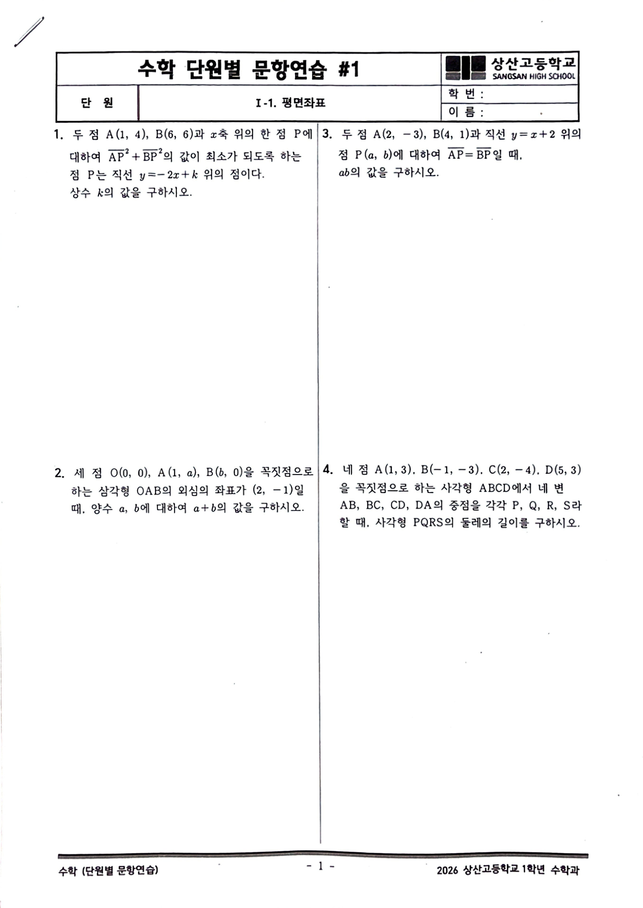
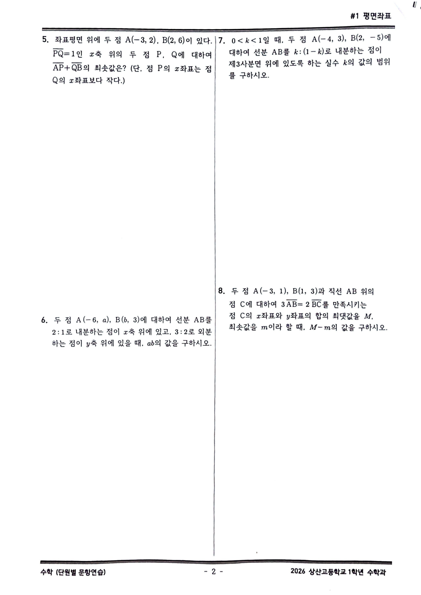
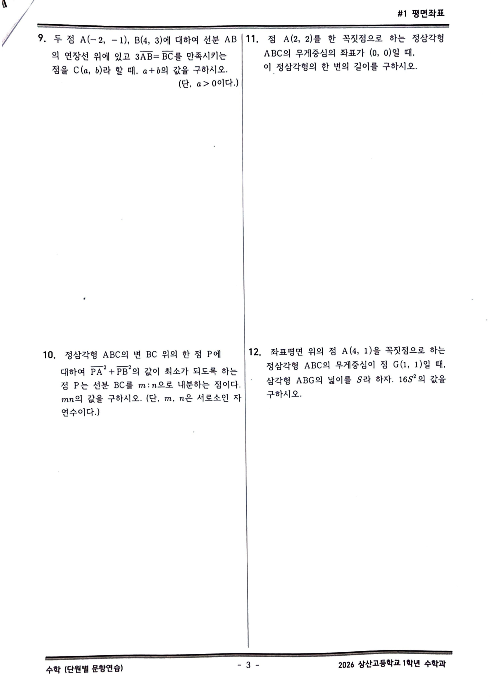
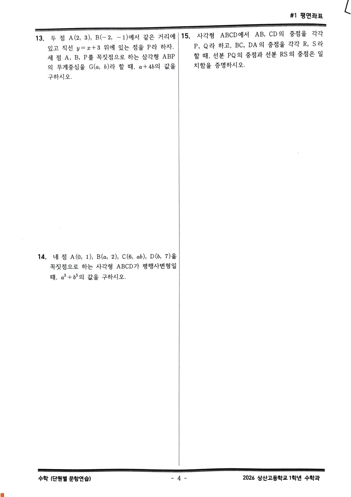

**1.** 두 점 $A(1, 4)$, $B(6, 6)$과 $x$축 위의 한 점 $P$에 대하여 $\overline{AP}^2 + \overline{BP}^2$의 값이 최소가 되도록 하는 점 $P$는 직선 $y = -2x + k$ 위의 점이다. 상수 $k$의 값을 구하시오. (p01 좌상)

**2.** 세 점 $O(0,0)$, $A(1, a)$, $B(b, 0)$을 꼭짓점으로 하는 삼각형 $OAB$의 외심의 좌표가 $(2, -1)$일 때, 양수 $a$, $b$에 대하여 $a+b$의 값을 구하시오. (p01 좌하)

**3.** 두 점 $A(2, -3)$, $B(4, 1)$과 직선 $y = x+2$ 위의 점 $P(a, b)$에 대하여 $\overline{AP} = \overline{BP}$일 때, $ab$의 값을 구하시오. (p01 우상)

**4.** 네 점 $A(1, 3)$, $B(-1, -3)$, $C(2, -4)$, $D(5, 3)$을 꼭짓점으로 하는 사각형 $ABCD$에서 네 변 $AB$, $BC$, $CD$, $DA$의 중점을 각각 $P$, $Q$, $R$, $S$라 할 때, 사각형 $PQRS$의 둘레의 길이를 구하시오. (p01 우하)

**5.** 좌표평면 위에 두 점 $A(-3, 2)$, $B(2, 6)$이 있다. $\overline{PQ}=1$인 $x$축 위의 두 점 $P$, $Q$에 대하여 $\overline{AP} + \overline{QB}$의 최솟값은? (단, 점 $P$의 $x$좌표는 점 $Q$의 $x$좌표보다 작다.) (p02 좌상)

**6.** 두 점 $A(-6, a)$, $B(b, 3)$에 대하여 선분 $AB$를 $2:1$로 내분하는 점이 $x$축 위에 있고, $3:2$로 외분하는 점이 $y$축 위에 있을 때, $ab$의 값을 구하시오. (p02 좌하)

**7.** $0 < k < 1$일 때, 두 점 $A(-4, 3)$, $B(2, -5)$에 대하여 선분 $AB$를 $k:(1-k)$로 내분하는 점이 제3사분면 위에 있도록 하는 실수 $k$의 값의 범위를 구하시오. (p02 우상)

**8.** 두 점 $A(-3, 1)$, $B(1, 3)$과 직선 $AB$ 위의 점 $C$에 대하여 $3\overline{AB} = 2\overline{BC}$를 만족시키는 점 $C$의 $x$좌표와 $y$좌표의 합의 최댓값을 $M$, 최솟값을 $m$이라 할 때, $M-m$의 값을 구하시오. (p02 우하)

**9.** 두 점 $A(-2, -1)$, $B(4, 3)$에 대하여 선분 $AB$의 연장선 위에 있고 $3\overline{AB} = \overline{BC}$를 만족시키는 점을 $C(a, b)$라 할 때, $a+b$의 값을 구하시오. (단, $a>0$이다.) (p03 좌상)

**10.** 정삼각형 $ABC$의 변 $BC$ 위의 한 점 $P$에 대하여 $\overline{PA}^2 + \overline{PB}^2$의 값이 최소가 되도록 하는 점 $P$는 선분 $BC$를 $m:n$으로 내분하는 점이다. $mn$의 값을 구하시오. (단, $m$, $n$은 서로소인 자연수이다.) (p03 좌하)

**11.** 점 $A(2, 2)$를 한 꼭짓점으로 하는 정삼각형 $ABC$의 무게중심의 좌표가 $(0, 0)$일 때, 이 정삼각형의 한 변의 길이를 구하시오. (p03 우상)

**12.** 좌표평면 위의 점 $A(4, 1)$을 꼭짓점으로 하는 정삼각형 $ABC$의 무게중심이 점 $G(1, 1)$일 때, 삼각형 $ABG$의 넓이를 $S$라 하자. $16S^2$의 값을 구하시오. (p03 우하)

**13.** 두 점 $A(2, 3)$, $B(-2, -1)$에서 같은 거리에 있고 직선 $y = x + 3$ 위에 있는 점을 $P$라 하자. 세 점 $A$, $B$, $P$를 꼭짓점으로 하는 삼각형 $ABP$의 무게중심을 $G(a, b)$라 할 때, $a+4b$의 값을 구하시오. (p04 좌상)

**14.** 네 점 $A(0, 1)$, $B(a, 2)$, $C(6, ab)$, $D(b, 7)$을 꼭짓점으로 하는 사각형 $ABCD$가 평행사변형일 때, $a^3 + b^3$의 값을 구하시오. (p04 좌하)

**15.** 사각형 $ABCD$에서 $AB$, $CD$의 중점을 각각 $P$, $Q$라 하고, $BC$, $DA$의 중점을 각각 $R$, $S$라 할 때, 선분 $PQ$의 중점과 선분 $RS$의 중점은 일치함을 증명하시오. (p04 우, 증명)

---

## #2 단원: I-2. 직선의 방정식 — 23문항 (p05~p08)

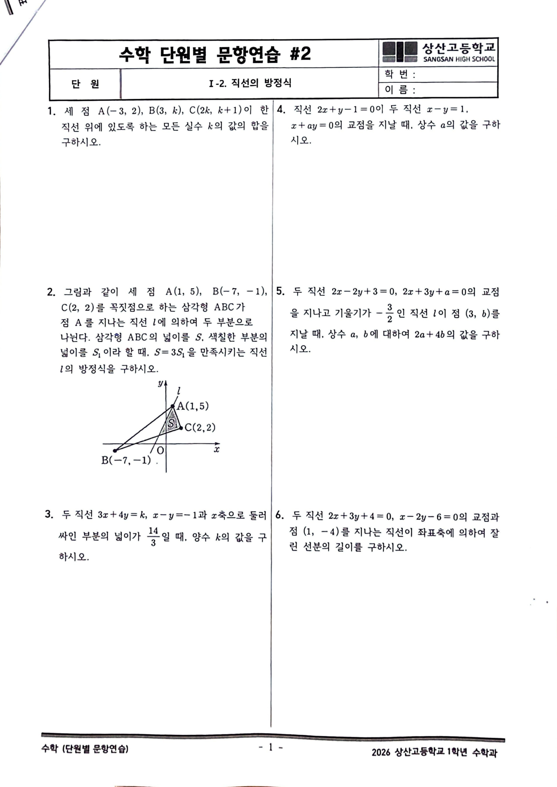
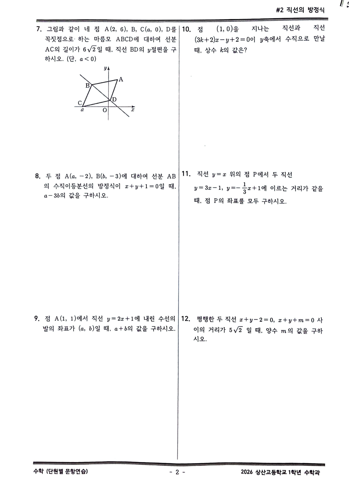
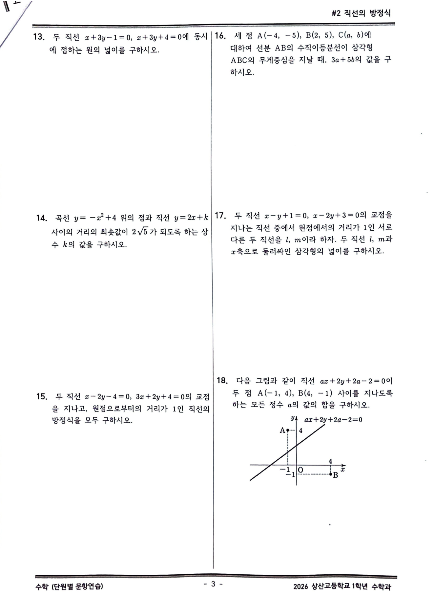
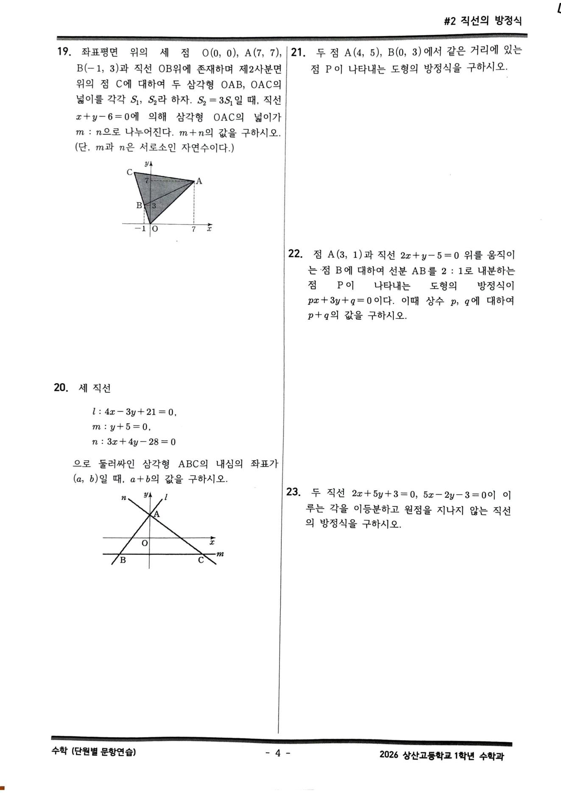

**1.** 세 점 $A(-3, 2)$, $B(3, k)$, $C(2k, k+1)$이 한 직선 위에 있도록 하는 모든 실수 $k$의 값의 합을 구하시오. (p05 좌상)

**2.** 그림과 같이 세 점 $A(1,5)$, $B(-7,-1)$, $C(2,2)$를 꼭짓점으로 하는 삼각형 $ABC$가 점 $A$를 지나는 직선 $l$에 의하여 두 부분으로 나뉜다. 삼각형 $ABC$의 넓이를 $S$, 색칠한 부분의 넓이를 $S_1$이라 할 때, $S=3S_1$을 만족시키는 직선 $l$의 방정식을 구하시오. — *도표: $y$축, $x$축, $A(1,5)$, $C(2,2)$, $B(-7,-1)$, $S_1$ 음영, 직선 $l$*  (p05 좌하, 도표 문항)

**3.** 두 직선 $3x+4y=k$, $x-y=-1$과 $x$축으로 둘러싸인 부분의 넓이가 $\frac{14}{3}$일 때, 양수 $k$의 값을 구하시오. (p05 좌하)

**4.** 직선 $2x+y-1=0$이 두 직선 $x-y=1$, $x+ay=0$의 교점을 지날 때, 상수 $a$의 값을 구하시오. (p05 우상)

**5.** 두 직선 $2x-2y+3=0$, $2x+3y+a=0$의 교점을 지나고 기울기가 $-\frac{3}{2}$인 직선 $l$이 점 $(3, b)$를 지날 때, 상수 $a$, $b$에 대하여 $2a+4b$의 값을 구하시오. (p05 우하)

**6.** 두 직선 $2x+3y+4=0$, $x-2y-6=0$의 교점과 점 $(1, -4)$를 지나는 직선이 좌표축에 의하여 잘린 선분의 길이를 구하시오. (p05 우하-하)

**7.** 그림과 같이 네 점 $A(2, 6)$, $B$, $C(a,0)$, $D$를 꼭짓점으로 하는 마름모 $ABCD$에 대하여 선분 $AC$의 길이가 $6\sqrt{2}$일 때, 직선 $BD$의 $y$절편을 구하시오. (단, $a<0$) — *도표: 마름모 $ABCD$, 점 $C(a,0)$이 $x$축 음수, $D$ 원점 근처, 대각선 $AC$와 $BD$ 교차*  (p06 좌상, 도표 문항)

**8.** 두 점 $A(a, -2)$, $B(b, -3)$에 대하여 선분 $AB$의 수직이등분선의 방정식이 $x+y+1=0$일 때, $a-3b$의 값을 구하시오. (p06 좌중)

**9.** 점 $A(1, 1)$에서 직선 $y=2x+1$에 내린 수선의 발의 좌표가 $(a, b)$일 때, $a+b$의 값을 구하시오. (p06 좌하)

**10.** 점 $(1, 0)$을 지나는 직선과 직선 $(3k+2)x - y + 2 =0$이 $y$축에서 수직으로 만날 때, 상수 $k$의 값은? (p06 우상)

**11.** 직선 $y=x$ 위의 점 $P$에서 두 직선 $y=3x-1$, $y=-\frac13x+1$에 이르는 거리가 같을 때, 점 $P$의 좌표를 모두 구하시오. (p06 우중)

**12.** 평행한 두 직선 $x+y-2=0$, $x+y+m=0$ 사이의 거리가 $5\sqrt{2}$일 때, 양수 $m$의 값을 구하시오. (p06 우하)

**13.** 두 직선 $x+3y-1=0$, $x+3y+4=0$에 동시에 접하는 원의 넓이를 구하시오. (p07 좌상)

**14.** 곡선 $y=-x^2+4$ 위의 점과 직선 $y=2x+k$ 사이의 거리의 최솟값이 $2\sqrt{5}$가 되도록 하는 상수 $k$의 값을 구하시오. (p07 좌중)

**15.** 두 직선 $x-2y-4=0$, $3x+2y+4=0$의 교점을 지나고, 원점으로부터의 거리가 $1$인 직선의 방정식을 모두 구하시오. (p07 좌하)

**16.** 세 점 $A(-4, -5)$, $B(2, 5)$, $C(a, b)$에 대하여 선분 $AB$의 수직이등분선이 삼각형 $ABC$의 무게중심을 지날 때, $3a+5b$의 값을 구하시오. (p07 우상)

**17.** 두 직선 $x-y+1=0$, $x-2y+3=0$의 교점을 지나는 직선 중에서 원점에서의 거리가 $1$인 서로 다른 두 직선을 $l$, $m$이라 하자. 두 직선 $l$, $m$과 $x$축으로 둘러싸인 삼각형의 넓이를 구하시오. (p07 우중)

**18.** 다음 그림과 같이 직선 $ax+2y+2a-2=0$이 두 점 $A(-1, 4)$, $B(4, -1)$ 사이를 지나도록 하는 모든 정수 $a$의 값의 합을 구하시오. — *도표: $A(-1,4)$ 수직 점선, $B(4,-1)$ 수평 점선, 직선 $ax+2y+2a-2=0$이 사이를 통과*  (p07 우하, 도표 문항)

**19.** 좌표평면 위의 세 점 $O(0,0)$, $A(7,7)$, $B(-1, 3)$과 직선 $OB$ 위에 존재하며 제2사분면 위의 점 $C$에 대하여 두 삼각형 $OAB$, $OAC$의 넓이를 각각 $S_1$, $S_2$라 하자. $S_2=3S_1$일 때, 직선 $x+y-6=0$에 의해 삼각형 $OAC$의 넓이가 $m:n$으로 나누어진다. $m+n$의 값을 구하시오. (단, $m$과 $n$은 서로소인 자연수이다.) — *도표: $O(0,0)$, $A(7,7)$, $C$ 제2사분면, $B(-1,3)$이 $OC$ 위*  (p08 좌상, 도표 문항)

**20.** 세 직선 $l:4x-3y+21=0$, $m:y+5=0$, $n:3x+4y-28=0$으로 둘러싸인 삼각형 $ABC$의 내심의 좌표가 $(a, b)$일 때, $a+b$의 값을 구하시오. — *도표: 세 직선 $l$, $m$, $n$으로 만든 삼각형, $m$은 $y=-5$, $l$과 $n$이 $y$축 근처에서 교차*  (p08 좌하, 도표 문항)

**21.** 두 점 $A(4, 5)$, $B(0, 3)$에서 같은 거리에 있는 점 $P$가 나타내는 도형의 방정식을 구하시오. (p08 우상)

**22.** 점 $A(3, 1)$과 직선 $2x+y-5=0$ 위를 움직이는 점 $B$에 대하여 선분 $AB$를 $2:1$로 내분하는 점 $P$가 나타내는 도형의 방정식이 $px+3y+q=0$이다. 이때 상수 $p$, $q$에 대하여 $p+q$의 값을 구하시오. (p08 우중)

**23.** 두 직선 $2x+5y+3=0$, $5x-2y-3=0$이 이루는 각을 이등분하고 원점을 지나지 않는 직선의 방정식을 구하시오. (p08 우하)

---

## #3 단원: I-3. 원의 방정식 — 32문항 (p09~p14)

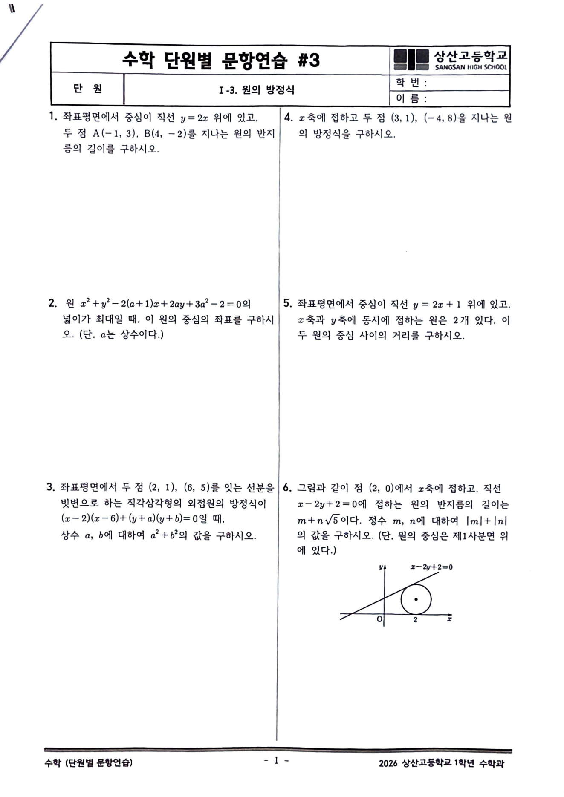
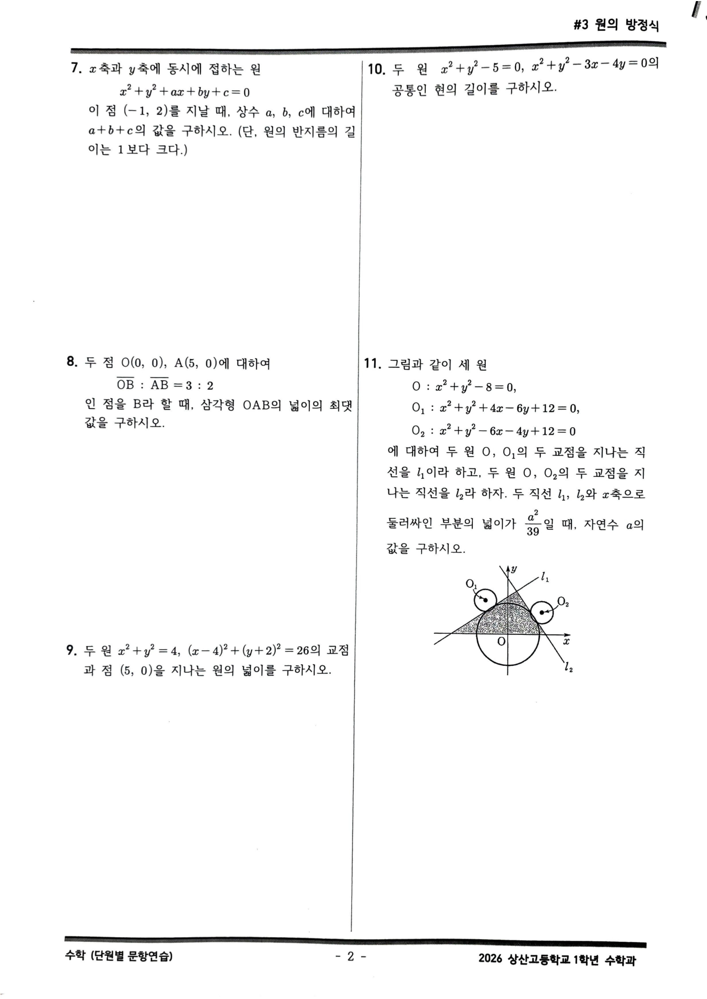
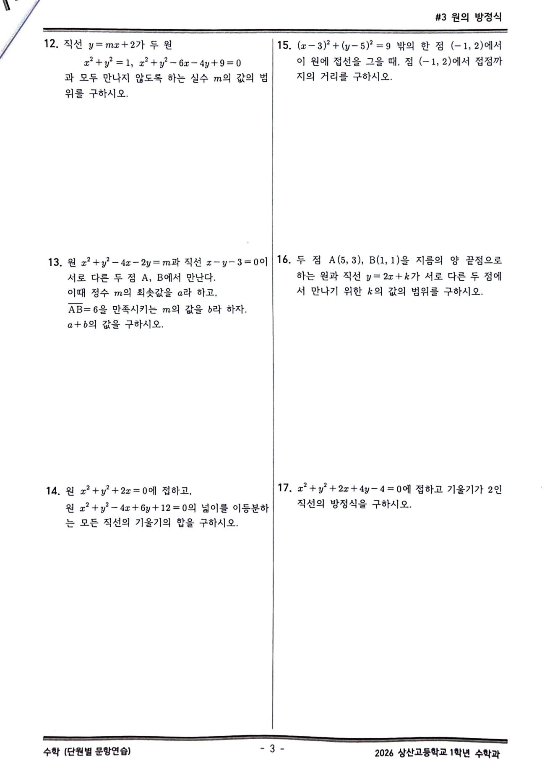
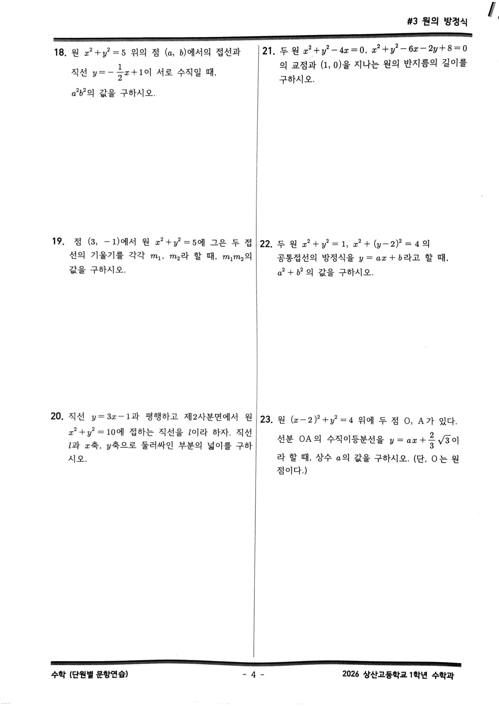
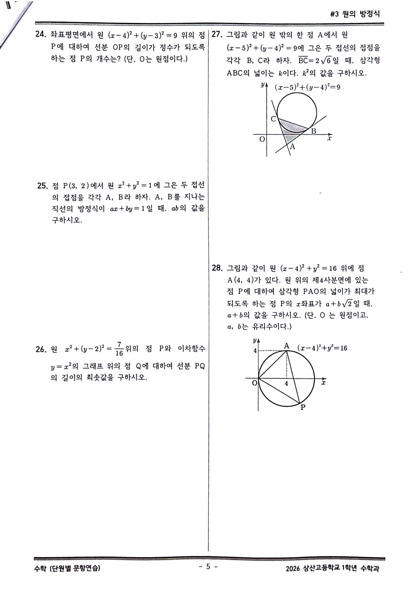
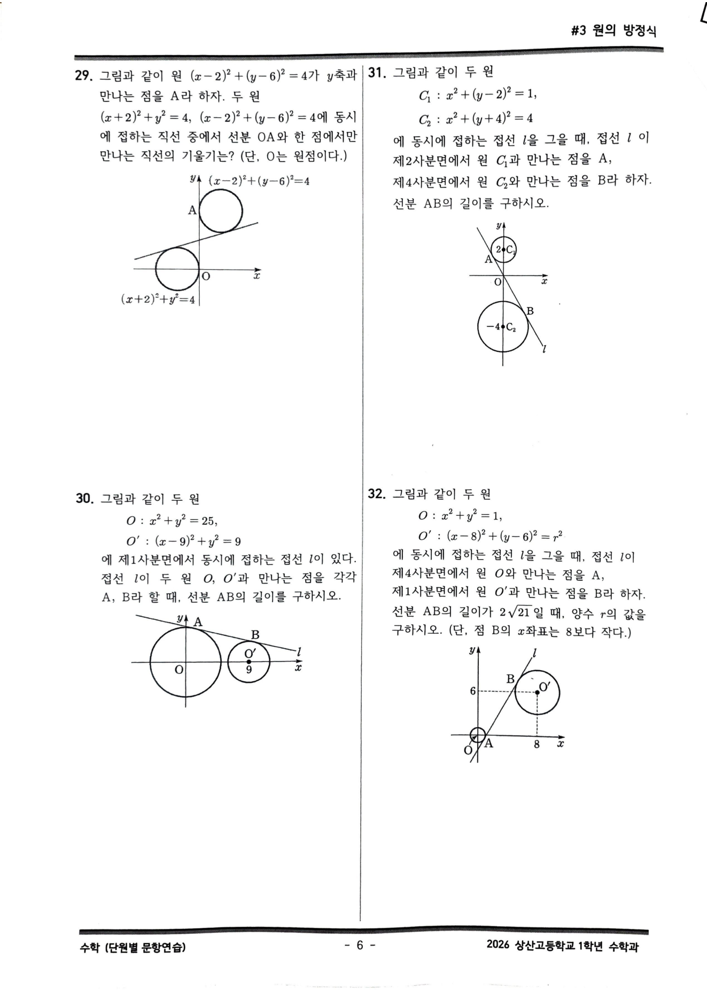

**1.** 좌표평면에서 중심이 직선 $y=2x$ 위에 있고, 두 점 $A(-1, 3)$, $B(4, -2)$를 지나는 원의 반지름의 길이를 구하시오. (p09 좌상)

**2.** 원 $x^2+y^2-2(a+1)x+2ay+3a^2-2=0$의 넓이가 최대일 때, 이 원의 중심의 좌표를 구하시오. (단, $a$는 상수이다.) (p09 좌중)

**3.** 좌표평면에서 두 점 $(2,1)$, $(6,5)$를 잇는 선분을 빗변으로 하는 직각삼각형의 외접원의 방정식이 $(x-2)(x-6)+(y+a)(y+b)=0$일 때, 상수 $a$, $b$에 대하여 $a^2+b^2$의 값을 구하시오. (p09 좌하)

**4.** $x$축에 접하고 두 점 $(3,1)$, $(-4,8)$을 지나는 원의 방정식을 구하시오. (p09 우상)

**5.** 좌표평면에서 중심이 직선 $y=2x+1$ 위에 있고, $x$축과 $y$축에 동시에 접하는 원은 2개 있다. 이 두 원의 중심 사이의 거리를 구하시오. (p09 우중)

**6.** 그림과 같이 점 $(2,0)$에서 $x$축에 접하고, 직선 $x-2y+2=0$에 접하는 원의 반지름의 길이는 $m+n\sqrt{5}$이다. 정수 $m$, $n$에 대하여 $|m|+|n|$의 값을 구하시오. (단, 원의 중심은 제1사분면 위에 있다.) — *도표: $x$축 접점 $(2,0)$, 직선 $x-2y+2=0$이 원에 접함*  (p09 우하, 도표 문항)

**7.** $x$축과 $y$축에 동시에 접하는 원 $x^2+y^2+ax+by+c=0$이 점 $(-1,2)$를 지날 때, 상수 $a$, $b$, $c$에 대하여 $a+b+c$의 값을 구하시오. (단, 원의 반지름의 길이는 $1$보다 크다.) (p10 좌상)

**8.** 두 점 $O(0,0)$, $A(5,0)$에 대하여 $\overline{OB}:\overline{AB}=3:2$인 점을 $B$라 할 때, 삼각형 $OAB$의 넓이의 최댓값을 구하시오. (p10 좌중)

**9.** 두 원 $x^2+y^2=4$, $(x-4)^2+(y+2)^2=26$의 교점과 점 $(5,0)$을 지나는 원의 넓이를 구하시오. (p10 좌하)

**10.** 두 원 $x^2+y^2-5=0$, $x^2+y^2-3x-4y=0$의 공통인 현의 길이를 구하시오. (p10 우상)

**11.** 그림과 같이 세 원 $O:x^2+y^2-8=0$, $O_1:x^2+y^2+4x-6y+12=0$, $O_2:x^2+y^2-6x-4y+12=0$에 대하여 두 원 $O$, $O_1$의 두 교점을 지나는 직선을 $l_1$이라 하고, 두 원 $O$, $O_2$의 두 교점을 지나는 직선을 $l_2$라 하자. 두 직선 $l_1$, $l_2$와 $x$축으로 둘러싸인 부분의 넓이가 $\frac{a^2}{39}$일 때, 자연수 $a$의 값을 구하시오. — *도표: 큰 원 $O$, 위 작은 원 $O_1$, 오른쪽 작은 원 $O_2$, 직선 $l_1$, $l_2$와 음영*  (p10 우하, 도표 문항)

**12.** 직선 $y=mx+2$가 두 원 $x^2+y^2=1$, $x^2+y^2-6x-4y+9=0$과 모두 만나지 않도록 하는 실수 $m$의 값의 범위를 구하시오. (p11 좌상)

**13.** 원 $x^2+y^2-4x-2y=m$과 직선 $x-y-3=0$이 서로 다른 두 점 $A$, $B$에서 만난다. 이때 정수 $m$의 최솟값을 $a$라 하고, $\overline{AB}=6$을 만족시키는 $m$의 값을 $b$라 하자. $a+b$의 값을 구하시오. (p11 좌중)

**14.** 원 $x^2+y^2+2x=0$에 접하고, 원 $x^2+y^2-4x+6y+12=0$의 넓이를 이등분하는 모든 직선의 기울기의 합을 구하시오. (p11 좌하)

**15.** $(x-3)^2+(y-5)^2=9$ 밖의 한 점 $(-1,2)$에서 이 원에 접선을 그을 때, 점 $(-1,2)$에서 접점까지의 거리를 구하시오. (p11 우상)

**16.** 두 점 $A(5,3)$, $B(1,1)$을 지름의 양 끝점으로 하는 원과 직선 $y=2x+k$가 서로 다른 두 점에서 만나기 위한 $k$의 값의 범위를 구하시오. (p11 우중)

**17.** $x^2+y^2+2x+4y-4=0$에 접하고 기울기가 $2$인 직선의 방정식을 구하시오. (p11 우하)

**18.** 원 $x^2+y^2=5$ 위의 점 $(a, b)$에서의 접선과 직선 $y=-\frac12x+1$이 서로 수직일 때, $a^2b^2$의 값을 구하시오. (p12 좌상)

**19.** 점 $(3,-1)$에서 원 $x^2+y^2=5$에 그은 두 접선의 기울기를 각각 $m_1$, $m_2$라 할 때, $m_1m_2$의 값을 구하시오. (p12 좌중)

**20.** 직선 $y=3x-1$과 평행하고 제2사분면에서 원 $x^2+y^2=10$에 접하는 직선을 $l$이라 하자. 직선 $l$과 $x$축, $y$축으로 둘러싸인 부분의 넓이를 구하시오. (p12 좌하)

**21.** 두 원 $x^2+y^2-4x=0$, $x^2+y^2-6x-2y+8=0$의 교점과 $(1,0)$을 지나는 원의 반지름의 길이를 구하시오. (p12 우상)

**22.** 두 원 $x^2+y^2=1$, $x^2+(y-2)^2=4$의 공통접선의 방정식을 $y=ax+b$라고 할 때, $a^2+b^2$의 값을 구하시오. (p12 우중)

**23.** 원 $(x-2)^2+y^2=4$ 위에 두 점 $O$, $A$가 있다. 선분 $OA$의 수직이등분선을 $y=ax+\frac23\sqrt{3}$이라 할 때, 상수 $a$의 값을 구하시오. (단, $O$는 원점이다.) (p12 우하)

**24.** 좌표평면에서 원 $(x-4)^2+(y-3)^2=9$ 위의 점 $P$에 대하여 선분 $OP$의 길이가 정수가 되도록 하는 점 $P$의 개수는? (단, $O$는 원점이다.) (p13 좌상)

**25.** 점 $P(3,2)$에서 원 $x^2+y^2=1$에 그은 두 접선의 접점을 각각 $A$, $B$라 하자. $A$, $B$를 지나는 직선의 방정식이 $ax+by=1$일 때, $ab$의 값을 구하시오. (p13 좌중)

**26.** 원 $x^2+(y-2)^2=\frac{7}{16}$ 위의 점 $P$와 이차함수 $y=x^2$의 그래프 위의 점 $Q$에 대하여 선분 $PQ$의 길이의 최솟값을 구하시오. (p13 좌하)

**27.** 그림과 같이 원 밖의 한 점 $A$에서 원 $(x-5)^2+(y-4)^2=9$에 그은 두 접선의 접점을 각각 $B$, $C$라 하자. $\overline{BC}=2\sqrt{6}$일 때, 삼각형 $ABC$의 넓이는 $k$이다. $k^2$의 값을 구하시오. — *도표: 원 $(x-5)^2+(y-4)^2=9$, 외부 점 $A$에서 두 접선, 삼각형 $ABC$ 음영*  (p13 우상, 도표 문항)

**28.** 그림과 같이 원 $(x-4)^2+y^2=16$ 위에 점 $A(4,4)$가 있다. 원 위의 제4사분면에 있는 점 $P$에 대하여 삼각형 $PAO$의 넓이가 최대가 되도록 하는 점 $P$의 $x$좌표가 $a+b\sqrt{2}$일 때, $a+b$의 값을 구하시오. (단, $O$는 원점이고, $a$, $b$는 유리수이다.) — *도표: 원 $(x-4)^2+y^2=16$, $A(4,4)$, $P$ 제4사분면, 삼각형 $PAO$*  (p13 우하, 도표 문항)

**29.** 그림과 같이 원 $(x-2)^2+(y-6)^2=4$가 $y$축과 만나는 점을 $A$라 하자. 두 원 $(x+2)^2+y^2=4$, $(x-2)^2+(y-6)^2=4$에 동시에 접하는 직선 중에서 선분 $OA$와 한 점에서만 만나는 직선의 기울기는? (단, $O$는 원점이다.) — *도표: 상단 원 $C_1$, 하단 원 $C_2$, $y$축과 만나는 점 $A$, 공통접선*  (p14 좌상, 도표 문항)

**30.** 그림과 같이 두 원 $O:x^2+y^2=25$, $O':(x-9)^2+y^2=9$에 제1사분면에서 동시에 접하는 접선 $l$이 있다. 접선 $l$이 두 원 $O$, $O'$과 만나는 점을 각각 $A$, $B$라 할 때, 선분 $AB$의 길이를 구하시오. — *도표: 큰 원 $O$, 작은 원 $O'(9,0)$, 공통접선 $l$이 상단에서 접함, 접점 $A$, $B$*  (p14 좌하, 도표 문항)

**31.** 그림과 같이 두 원 $C_1:x^2+(y-2)^2=1$, $C_2:x^2+(y+4)^2=4$에 동시에 접하는 접선 $l$을 그을 때, 접선 $l$이 제2사분면에서 원 $C_1$과 만나는 점을 $A$, 제4사분면에서 원 $C_2$와 만나는 점을 $B$라 하자. 선분 $AB$의 길이를 구하시오. — *도표: $C_1(0,2)$ 반지름1, $C_2(0,-4)$ 반지름2, 접선 $l$, 점 $A$ 제2사분면, 점 $B$ 제4사분면*  (p14 우상, 도표 문항)

**32.** 그림과 같이 두 원 $O:x^2+y^2=1$, $O':(x-8)^2+(y-6)^2=r^2$에 동시에 접하는 접선 $l$을 그을 때, 접선 $l$이 제4사분면에서 원 $O$와 만나는 점을 $A$, 제1사분면에서 원 $O'$과 만나는 점을 $B$라 하자. 선분 $AB$의 길이가 $2\sqrt{21}$일 때, 양수 $r$의 값을 구하시오. (단, 점 $B$의 $x$좌표는 $8$보다 작다.) — *도표: 작은 원 $O$, 큰 원 $O'(8,6)$, 접선 $l$, 점 $A$ 하단, 점 $B$ 상단*  (p14 우하, 도표 문항)

---

## #4 단원: I-4. 도형의 이동 — 23문항 (p15~p18)

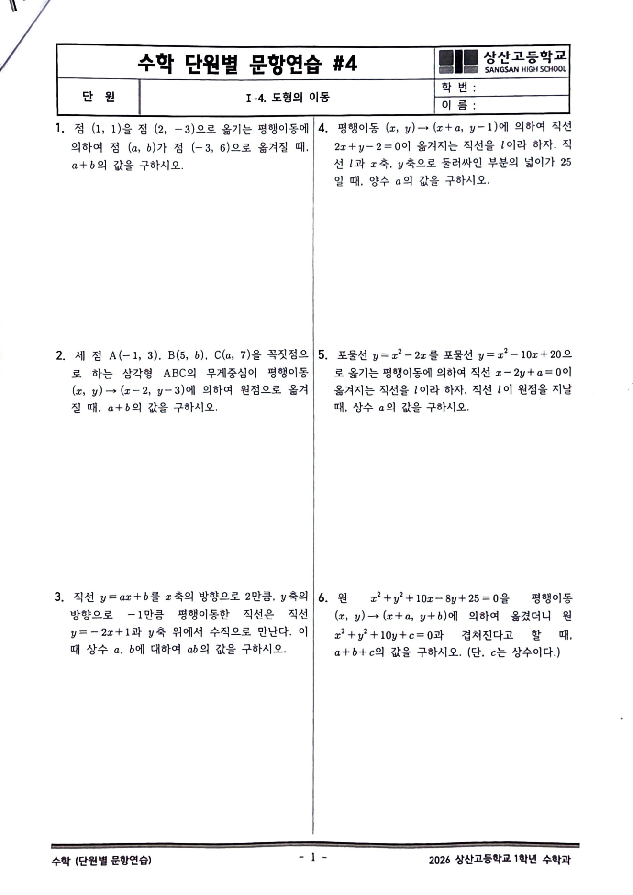
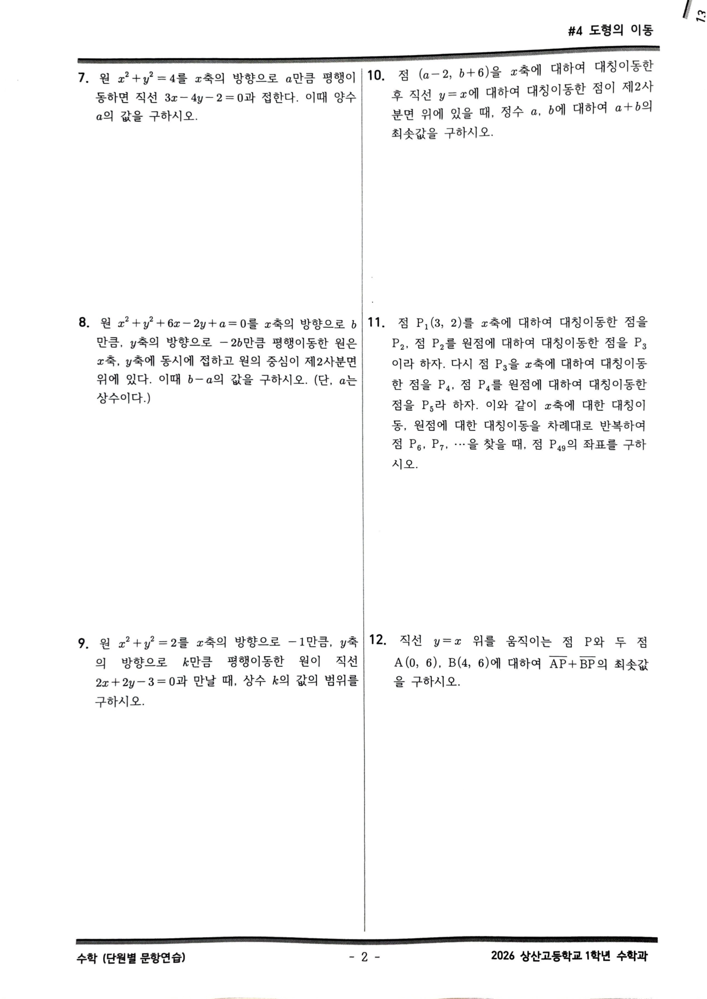
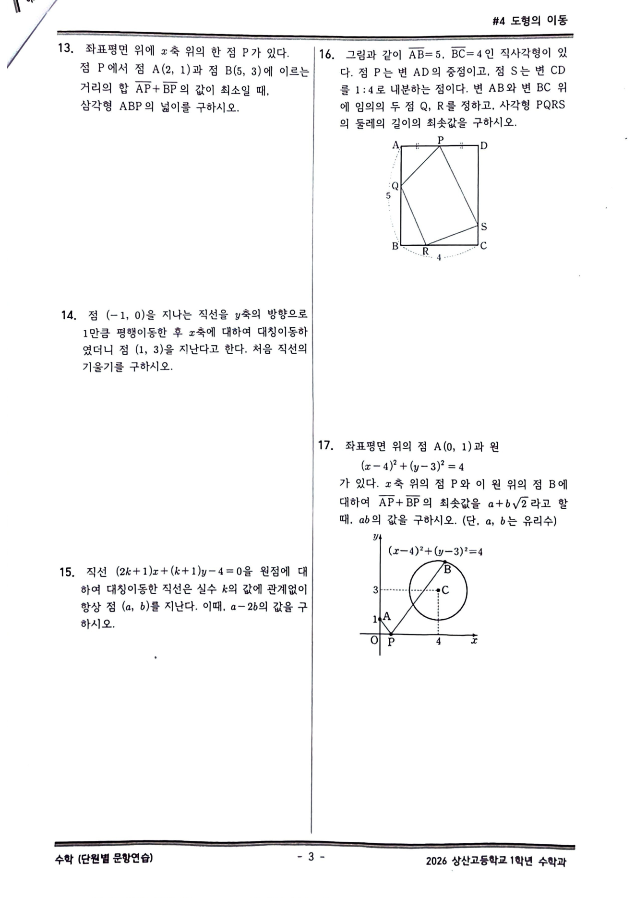
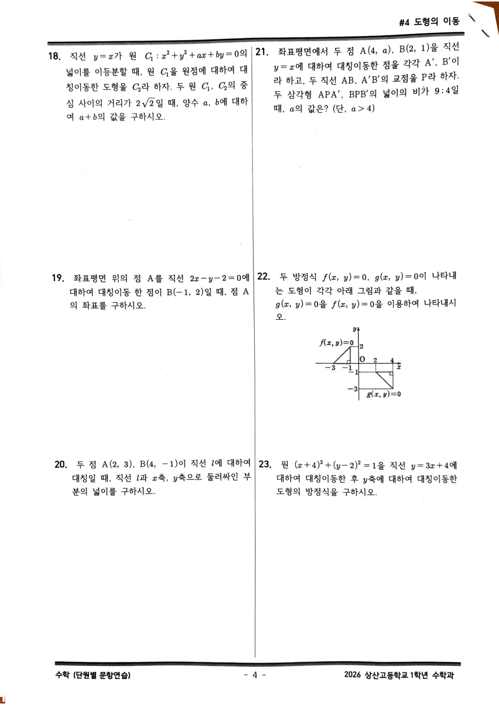

**1.** 점 $(1,1)$을 점 $(2,-3)$으로 옮기는 평행이동에 의하여 점 $(a,b)$가 점 $(-3,6)$으로 옮겨질 때, $a+b$의 값을 구하시오. (p15 좌상)

**2.** 세 점 $A(-1,3)$, $B(5,b)$, $C(a,7)$을 꼭짓점으로 하는 삼각형 $ABC$의 무게중심이 평행이동 $(x,y)\to(x-2,y-3)$에 의하여 원점으로 옮겨질 때, $a+b$의 값을 구하시오. (p15 좌중)

**3.** 직선 $y=ax+b$를 $x$축의 방향으로 $2$만큼, $y$축의 방향으로 $-1$만큼 평행이동한 직선은 직선 $y=-2x+1$과 $y$축 위에서 수직으로 만난다. 이때 상수 $a$, $b$에 대하여 $ab$의 값을 구하시오. (p15 좌하)

**4.** 평행이동 $(x,y)\to(x+a,y-1)$에 의하여 직선 $2x+y-2=0$이 옮겨지는 직선을 $l$이라 하자. 직선 $l$과 $x$축, $y$축으로 둘러싸인 부분의 넓이가 $25$일 때, 양수 $a$의 값을 구하시오. (p15 우상)

**5.** 포물선 $y=x^2-2x$를 포물선 $y=x^2-10x+20$으로 옮기는 평행이동에 의하여 직선 $x-2y+a=0$이 옮겨지는 직선을 $l$이라 하자. 직선 $l$이 원점을 지날 때, 상수 $a$의 값을 구하시오. (p15 우중)

**6.** 원 $x^2+y^2+10x-8y+25=0$을 평행이동 $(x,y)\to(x+a,y+b)$에 의하여 옮겼더니 원 $x^2+y^2+10y+c=0$과 겹쳐진다고 할 때, $a+b+c$의 값을 구하시오. (단, $c$는 상수이다.) (p15 우하)

**7.** 원 $x^2+y^2=4$를 $x$축의 방향으로 $a$만큼 평행이동하면 직선 $3x-4y-2=0$과 접한다. 이때 양수 $a$의 값을 구하시오. (p16 좌상)

**8.** 원 $x^2+y^2+6x-2y+a=0$을 $x$축의 방향으로 $b$만큼, $y$축의 방향으로 $-2b$만큼 평행이동한 원은 $x$축, $y$축에 동시에 접하고 원의 중심이 제2사분면 위에 있다. 이때 $b-a$의 값을 구하시오. (단, $a$는 상수이다.) (p16 좌중)

**9.** 원 $x^2+y^2=2$를 $x$축의 방향으로 $-1$만큼, $y$축의 방향으로 $k$만큼 평행이동한 원이 직선 $2x+2y-3=0$과 만날 때, 상수 $k$의 값의 범위를 구하시오. (p16 좌하)

**10.** 점 $(a-2,b+6)$을 $x$축에 대하여 대칭이동한 후 직선 $y=x$에 대하여 대칭이동한 점이 제2사분면 위에 있을 때, 정수 $a$, $b$에 대하여 $a+b$의 최솟값을 구하시오. (p16 우상)

**11.** 점 $P_1(3,2)$를 $x$축에 대하여 대칭이동한 점을 $P_2$, 점 $P_2$를 원점에 대하여 대칭이동한 점을 $P_3$이라 하자. 다시 점 $P_3$을 $x$축에 대하여 대칭이동한 점을 $P_4$, 점 $P_4$를 원점에 대하여 대칭이동한 점을 $P_5$라 하자. 이와 같이 $x$축에 대한 대칭이동, 원점에 대한 대칭이동을 차례대로 반복하여 점 $P_6$, $P_7$, $\cdots$을 찾을 때, 점 $P_{49}$의 좌표를 구하시오. (p16 우중)

**12.** 직선 $y=x$ 위를 움직이는 점 $P$와 두 점 $A(0,6)$, $B(4,6)$에 대하여 $\overline{AP}+\overline{BP}$의 최솟값을 구하시오. (p16 우하)

**13.** 좌표평면 위에 $x$축 위의 한 점 $P$가 있다. 점 $P$에서 점 $A(2,1)$과 점 $B(5,3)$에 이르는 거리의 합 $\overline{AP}+\overline{BP}$의 값이 최소일 때, 삼각형 $ABP$의 넓이를 구하시오. (p17 좌상)

**14.** 점 $(-1,0)$을 지나는 직선을 $y$축의 방향으로 $1$만큼 평행이동한 후 $x$축에 대하여 대칭이동하였더니 점 $(1,3)$을 지난다고 한다. 처음 직선의 기울기를 구하시오. (p17 좌중)

**15.** 직선 $(2k+1)x+(k+1)y-4=0$을 원점에 대하여 대칭이동한 직선은 실수 $k$의 값에 관계없이 항상 점 $(a,b)$를 지닌다. 이때, $a-2b$의 값을 구하시오. (p17 좌하)

**16.** 그림과 같이 $\overline{AB}=5$, $\overline{BC}=4$인 직사각형이 있다. 점 $P$는 변 $AD$의 중점이고, 점 $S$는 변 $CD$를 $1:4$로 내분하는 점이다. 변 $AB$와 변 $BC$ 위에 임의의 두 점 $Q$, $R$를 정하고, 사각형 $PQRS$의 둘레의 길이의 최솟값을 구하시오. — *도표: 직사각형 $ABCD$, $P$는 $AD$ 중점, $S$는 $CD$ $1:4$, 점 $Q$는 $AB$ 위, $R$은 $BC$ 위, 사각형 $PQRS$*  (p17 우상, 도표 문항)

**17.** 좌표평면 위의 점 $A(0,1)$과 원 $(x-4)^2+(y-3)^2=4$가 있다. $x$축 위의 점 $P$와 이 원 위의 점 $B$에 대하여 $\overline{AP}+\overline{BP}$의 최솟값을 $a+b\sqrt{2}$라고 할 때, $ab$의 값을 구하시오. (단, $a$, $b$는 유리수) — *도표: $A(0,1)$, 원 $C(4,3)$ 반지름2, $P$는 $x$축 위, 삼각형 $APB$*  (p17 우하, 도표 문항)

**18.** 직선 $y=x$가 원 $C_1:x^2+y^2+ax+by=0$의 넓이를 이등분할 때, 원 $C_1$을 원점에 대하여 대칭이동한 도형을 $C_2$라 하자. 두 원 $C_1$, $C_2$의 중심 사이의 거리가 $2\sqrt{2}$일 때, 양수 $a$, $b$에 대하여 $a+b$의 값을 구하시오. (p18 좌상)

**19.** 좌표평면 위의 점 $A$를 직선 $2x-y-2=0$에 대하여 대칭이동한 점이 $B(-1,2)$일 때, 점 $A$의 좌표를 구하시오. (p18 좌중)

**20.** 두 점 $A(2,3)$, $B(4,-1)$이 직선 $l$에 대하여 대칭일 때, 직선 $l$과 $x$축, $y$축으로 둘러싸인 부분의 넓이를 구하시오. (p18 좌하)

**21.** 좌표평면에서 두 점 $A(4,a)$, $B(2,1)$을 직선 $y=x$에 대하여 대칭이동한 점을 각각 $A'$, $B'$이라 하고, 두 직선 $AB$, $A'B'$의 교점을 $P$라 하자. 두 삼각형 $APA'$, $BPB'$의 넓이의 비가 $9:4$일 때, $a$의 값은? (단, $a>4$) (p18 우상)

**22.** 두 방정식 $f(x,y)=0$, $g(x,y)=0$이 나타내는 도형이 각각 아래 그림과 같을 때, $g(x,y)=0$을 $f(x,y)=0$을 이용하여 나타내시오. — *도표: $f$는 $(-3,0)$-$(-1,0)$-$(-1,2)$ 직각삼각형, $g$는 $(2,-1)$-$(4,-1)$-$(4,-3)$ 직각삼각형으로 평행/대칭 이동*  (p18 우중, 도표 문항)

**23.** 원 $(x+4)^2+(y-2)^2=1$을 직선 $y=3x+4$에 대하여 대칭이동한 후 $y$축에 대하여 대칭이동한 도형의 방정식을 구하시오. (p18 우하)

---

## 검증 메모

- 총계 15+23+32+23 = **93문항** 일치 (`meta.yml: items 93`, `HARVEST_LOG` 93문항 표기).
- 도표 문항 13건은 원문 이미지를 ``로 병치하여 판독 가능하도록 보존 — 이후 분류 시에는 이 이미지와 본 전사본으로만 검증, 원본 PDF 재열람 불필요.
- p02의 5번 $\overline{AP}+\overline{QB}$는 벡터합 표기 원문 그대로 전사 (해석 분기는 답지에서 주석).
- p08의 19번은 기존 검수에서 $B(-1,3)$이 제2사분면으로 보고되었던 것과 동일 — 전사도 원문대로 $B(-1,3)$ 유지.
- p06의 7번 $a<0$ 조건, p09의 6번 제1사분면 조건 등 단서 모두 보존.

